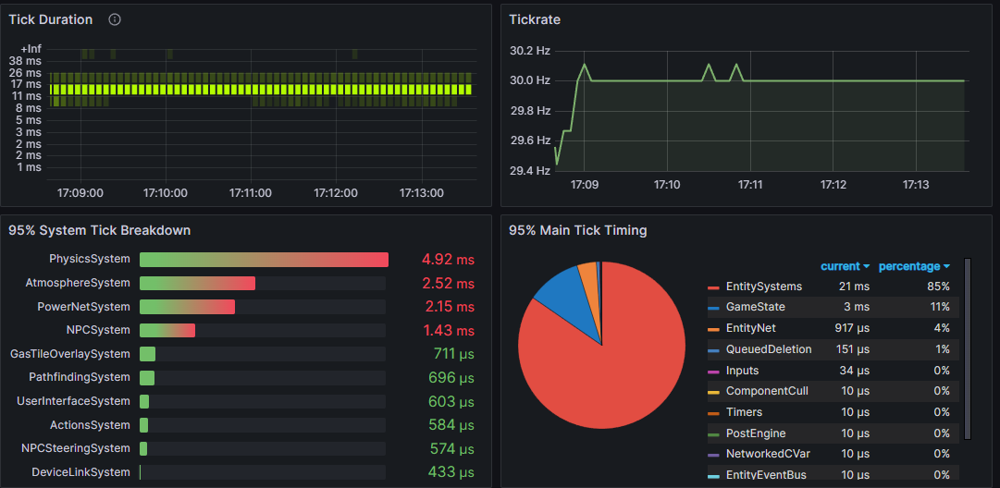
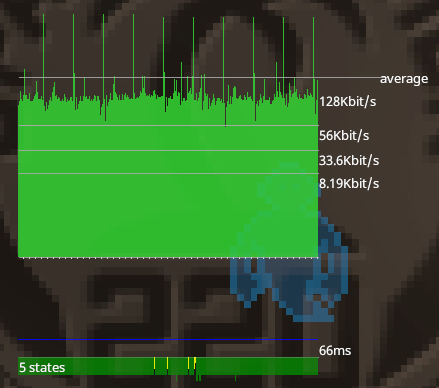
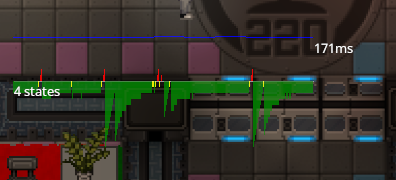
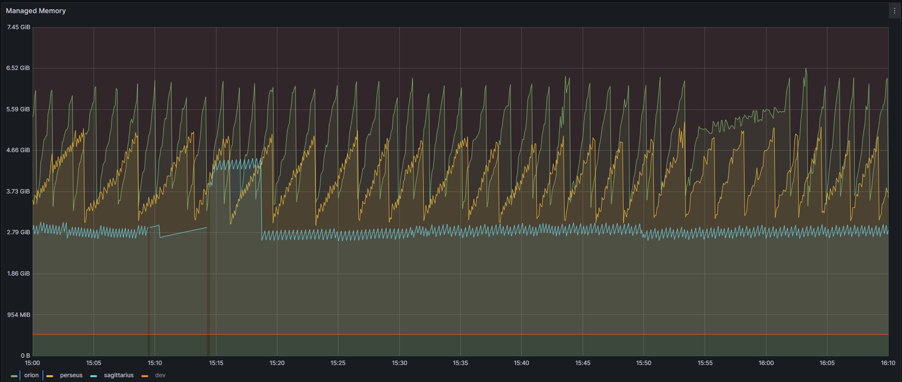
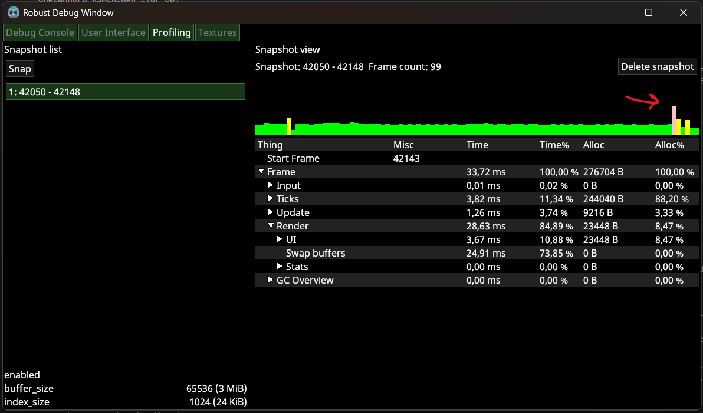
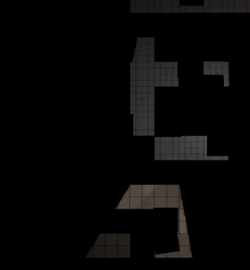

# Локализация проблем производительности

!!! note ""
	***Эта страница не претендует на исчерпывающее описание всех возможностей поиска проблем производительности и тем более чёткого их определения. Используйте эту страницу как знакомство с вероятными причинами и косвенными способами их определить***

В данной статье я познакомлю вас со способами определения проблем именно с производительностью, как на примере реально произошедших случаев на SS220, так и теоретически возможных, но в природе невиданных.

SS14 является многопользовательской онлайн игрой, поэтому разделение на серверную и клиентскую часть является неотъемлемой её частью. Статья будет разделена по трём возможным частям: серверной части, клиентской части, predicted (предсказываемой, работающей как и на клиентах, так и на сервере). Для понимания дальнейшего разговора я сначала поясню как устроена та самая "многопользовательская онлайн игра" с точки зрения клиента и сервера.

Сервер - является доверенным (в том смысле, что его версию состояния мира мы считаем правильной), тогда как клиент лишь отображает состояние мира и отправляет на сервер действия игрока. При таком простом разделении разработчик достаточно быстро встретится со следующими проблемами: чем больше entity (привыкайте, что в моих статьях появляются англицизмы) существует, тем больше пакетов состояния мира нужно сделать и отправить с севера на клиент; чем больше клиентов, тем больше пропускной способности сети нам потребуется, чтобы отправлять всем пакеты. 

Решение этих проблем несколько, начнём с "простого": ограничим знания клиентов о мире каким-то образом и случайно назовём это решение [Potentially Visible Set (PVS)](https://docs.spacestation14.com/en/ss14-by-example/basic-networking-and-you.html?highlight=pvs#potentially-visible-set-pvs). Концептуально - мы отправляем данные о состоянии мира только в каком-то радиусе от конкретного клиента (вы можете это увидеть в SS14 если сделаете достаточно большой зум), несмотря на то, что это требует дополнительного времени на вычисления, мы значительно уменьшаем требуемую пропускную способность сети.

Удивительным образом никто не писал подробно про predicted часть. Сделаю вид, что я единственный кто про неё что-то знает, очень волнительно! Идея в следующем - некоторые действия имеют предсказуемые и локальные последствия. Представим 3 ситуации: 

1. Мы стоим рядом с коллегой инженером и он выключил лкп.
2. Мы стоим рядом с лкп и выключаем его.
3. Мы пробегаем половину станции (это такой намёк, что лкп не было в нашем PVS, а потом стало в нём) и видим, что кто-то выключил этот лкп.

Во всех трёх случаях мы получим с сервера пакет состояния мира, в котором у лкп состояние ВЫКЛ, во все трёх случаях мы получим его с задержкой, связанной со скоростью передачи пакетов информации по сети. Но для нас (игрока) есть отличие случаев 1 и 3 от случая 2. Случай 2 - игрок сам выключил лкп и чтобы увидеть как игровой мир отреагировал на это он должен: подождать пока пакет дойдёт до сервера, потом подождать пока сервер отправит ему пакет с новым состоянием и только тогда он увидит результаты своего действия. 

В случае 2 клиент может предугадать (to make a prediction) каково будет состояние мира на сервере, это даст игроку своевременную обратную связь, создаст иллюзию бесшовной отзывчивости игрового мира на его действия, хотя на самом деле его действия ещё не подтверждены. Наилучшим решением для prediction части является одновременная имплементация логики как на сервере, так и на клиенте. Код для таких целей помещается в папку Content.Shared и он будет работать как на сервере, так и на клиенте. 

Таким образом, я подвёл к тому, какую именно часть проблемы с производительностью будем подробно рассматривать - отзывчивость или что мешает игре быть отзывчивым по причинам, не связанным с пропускной способностью сети или блокировки трафика.

## Серверная часть

### Тик симуляции идёт слишком долго

Сервер имеет такой параметр как tickrate он же количество обновлений в секунду. Чем больше тикрейт, тем чаще пакеты будут приходить клиентам и тем чаще сервер будет вызывать `Update(float deltaTime)` у систем. Если обновление всех систем в срок не удалось, то это будет вызывать неприятные ощущения прерывистых изменений мира, вплоть до неприятного обновления раз в секунду (буду честным, тикрейт 30, который является стандартным для SS14, тоже не самый плавный для игроков). Пожалуй это самый простой случай для локализации проблемы, Вам стоит вооружиться:

1. Коллегой, который имеет доступ к [Prometheus](https://prometheus.io/) с информацией с игровых серверов
2. Здравым смыслом

Рассмотрим чем Вам поможет пункт 1. Он (коллега, не пункт) Вам может передать вот такой скриншот:

<figure markdown>
  
  <figcaption>Пример визуализации данных работы игрового сервера</figcaption>
</figure>

Это характерный вид диаграммы, описывающей сколько времени какая система заняла при обработке тика симуляции (вызова `Update(float deltaTime)` у всех систем). Достаточно просто, например, сравнив вид этой диаграммы в состояние сервера "лагает" и "не лагает" вы легко можете локализовать систему, которая ответственна за задерживание общего update. Да, о слоне в комнате - нет, физика всегда будет столько времени занимать. А также не стоит думать, что проблема именно в системе, возможно в update методе системы поднимается ивент, обработка которого подписанным методом из другой системы занимает много времени. Проявите дотошность при поиске проблемы.

А зачем же нам здравый смысл? Во-первых - очевидно. Во-вторых - когда обнаруживаются системы, update которых занимает слишком много времени, то стоит преступить к оптимизации кода (рано Вы мне медаль капитана очевидности выдаёте), что ой как нечасто сводится к тому, что Вы красиво перепишите пару строчек и будете счастливы (вот теперь можете выдать медаль). Не бойтесь, если оптимизация потребует от Вас в корне изменить логику систему, рассматриваете это как новую возможность научиться чему-то. Очень плохо если Вы не знакомы с, например, O-нотацией, или не представляете сложность поиска по сортированным коллекциям, потому что при оптимизации очень кстати приходится опыт, но это ли не повод начать учиться с этим работать? Конечно это повод! 

### Всё хорошо, но что-то переодически лагает

Дальше сложнее. Вооружаемся всё тем же коллегой и всё также не теряем здравый смысл. Если так случилось, что тик симуляции игрового мира не выходит за границы по времени, но всё ещё лаги присутствуют, то Вам стоит удостоверится, что лаги вызваны именно серверной частью, даже если речь о сетевом соединении.

Для этого нужно зайти на сервер и прописать в консоль `net_graph`. После этой команды на игровой экран наложится оверлей:

<figure markdown>
  
  <figcaption>Пример оверлея net_graph</figcaption>
</figure>

Оказывается про `net_graph` тоже нету в известных мне открытых источниках! Оверлей может быть разделён на 2 части: верхняя, где показывается интенсивность общения с сервером в kbit/s, и на нижнюю где показывается сколько пакетов состояний мира (state) клиент получает. Для понимание цветового обозначения обратимся к cvar `net.buffer_size`, к нему подписано следующее пояснение `The target number of game states to keep buffered up to smooth out network inconsistency`. Соответственно чем больше размер буфера, тем больше пакетов от сервера мы будет ждать перед их применением к клиентскому миру. Зелёный - целевое количество, жёлтый - стейтов пришло меньше целевого, красный - стейты почти не приходили. Теперь посмотрим весь (3) спектр цветов:

<figure markdown>
  
  <figcaption>Пример возможного вида нижней части оверлея во время лагов</figcaption>
</figure>

Как мы видим значит проблема лагов заключается в том, что клиент какое-то время не получает пакеты, а потом на него сваливается целый мир, который он должен успеть обработать и показать игроку! Как Вы верно поняли, он не успел. Причины этого могут быть разные, от проблемы в соединении, до неожиданного "засыпания" нашего сервера! А как же наш сервер может уснуть?.. Добро пожаловать в передачу невыдуманные истории, о которых невозможно молчать, наш выпуск называется "**Языки программирования с автоматическим управлением памятью**"!

Удивительно как я угадал (мечтал бы я тогда так быстро угадать!), но проблема, а точнее причина отсутствия пакетов кроется в работе [GC C#](https://habr.com/ru/articles/590475/)! Что же такое этот ваш Garbage Collector? Для нашего случая важно знать, что он управляет памятью и решает когда отчищать выделенную память от уже неиспользуемых объектов. Скрывать ответ долго не буду, поэтому покажу Вам картинку:

<figure markdown>
  
  <figcaption>Визуализация занимаемой оперативной памяти при работе игровых серверов. Так быть не должно.</figcaption>
</figure>

Процитирую коллегу - "Из такого частокола я бы давно уже мог себе забор на даче построить!" Важно не забываться и действительно проверить, что частота лагов совпадает с частотой пилообразного графика выделенной памяти, не надо полагаться на "Ну точно виноват N зуб даю!", всегда проверяйте правы Вы или нет... Зубов не хватит ошибаться.

Действительно проблемой лагов может быть слишком частая работа GC на сервере, которая, очевидно, прерывает выполнение программы. Это решается достаточно просто: не все вызовы отчистки мусора так критично сказываются на производительности, важно следить чтобы создаваемые Вами объекты не попадали в LOH (Large Object Heap), отчистка или перемещение которых происходит долго. 

## Predicted часть

Идём к более коварным и менее требовательным к коллегам проблемам. Как известно predicted часть кода отвечает за уменьшение задержки между действиями игрока и откликом игрового мира на них. Здесь существуют два фундаментальных типа проблемы:

- Код, который должен быть в predicted написано только в серверной части
- Predict на клиенте не совпадает с серверной частью 

По понятным мне, но, возможно, непонятным Вам причинам я буду обсуждать только вторую часть. Естественно у меня есть пример, но начнём с галлюцинирования: какие же могут быть проблемы?! Наш код одинаковый как на клиенте, так и на сервере, как он может не работать?! 

Действительно, не нужно терять здравый смысл, код одинаковый и при одинаковых условиях результат его выполнения одинаков (кто в predict использует random тот опасный человек, я бы его обходил по дуге случайного радиуса). Ага, какой молодец этот здравый смысл - а одинаковые ли у нас условия выполнения? Конечно нет! 

**SPEED RUN FIX PREDICTION BUG ANY%** 

1. Открываем репо в VSC VS или где-то ещё 
2. Вешаем точку остановы на shared часть кода 
3. Смотрим какие поля компонентов клиента отличаются от серверных (напомню, что сервер - доверенный, а не клиент) 
4. Находим место где изменяется это поле 
5. Подтверждаем свои догадки тем, что не находим вызова прокси метода `Dirty(entity)` 
6. Вписываем его
7. СТОП ТАЙМЕР!

## Клиентская часть

Минуем простой случай, когда проблема проявляется сразу же, когда Вы запускаете debug сборку. Обсудим что же делать когда все попытки найти проблему простым локальным запуском не удаётся. Вероятно, в таком случае проблема может возникать случайно, либо быть связана с происходящим на сервере (например, большая нагрузка игроков/гридов/entity, одновременные взаимодействия нескольких игроков). В таком случае можно заняться локализацией проблемы на самом игровом сервере. Закрываем глаза на то что мы далеко уже от debug сборки проекта и открываем консоль клиента, вписываем туда

```sh
cvar prof.enabled true
cvar prof.buffer_size 65536
cvar prof.index_size 1024
```

После этого Вы сможете написать в консоль (на самом деле могли и до этого, попробуйте, кстати, на досуге повторить всё то же самое, но без выше описанного изменения cvar'ов)

```sh
devwindow
```

И Вам откроется, надеюсь, привычное окно разработки, где вы можете посмотреть древо интерфейса, хотя должны смотреть на вкладку profiling. В нём Вы можете делать snapshot, красным или жёлтым показываются кадры, которые заняли слишком много времени по сравнению с другими. Если всё зелёное, но fps мал, то стоит глянуть что постоянно требует много времени в каждом кадре. 

<figure markdown>
  
  <figcaption>Devwindow на вкладке profiling.</figcaption>
</figure>

По нажатию кнопки `snap` сделает снапшот (детальная информация о нескольких кадрах). После этого справа Вы увидите гистограмму занятого времени на кадр. 

<figure markdown>
  
  <figcaption>Как выглядит окно просмотра snapshot, а также разбиение кадра на системы по занятому времени и аллоцированной памяти. Стрелка показывает на то куда я нажал.</figcaption>
</figure>

Несмотря на общую осмысленность происходящего я хочу предостеречь от полного доверия этой информации. Есть одно важное отличие между debug версией и release (не буду врать, версия на который вы играете на самом деле FULL_RELEASE). Существует много оптимизаций, которые делают такой профайлинг некорректным и даже часто лживым. Однако, это лучше, чем теряться в догадках кто же виноват.

### Малевичеподобный экран (местами чёрный)

Вариантов может быть много: при разработке такая проблема может быть связана с ошибок при переборе ентити для рендеринга, такие ошибки обычно пишутся в консоль клиента и обнаружить их труда не составит, также это может произойти от неправильной обработки чанков клиентом (это вроде пофиксили уже в RobustToolbox), и проблем внутри самого рендера. Про третье подробнее:

Если проблемы до этого не было, а потом игроки стали жаловаться и абсолютно случайно вы недавно трогали шейдеры, то нужно проверить их на совместимость со старыми, но не очень старыми видеокартами. Чтобы протестить шейдер на совместимость со старыми видеокартами: в транслированном glsl шейдере меняем версию с 140 на 300 es в файле, прогоняем через https://github.com/KhronosGroup/glslang если ошибок нет -- будет работать на старых видеокартах.

Если шейдеры не трогали, а человек вообще новенький и пришёл к Вам, показывает какой-нибудь такой скриншот:

<figure markdown>
  
  <figcaption>Малевичеподобный экран</figcaption>
</figure>

То посоветуйте ему открыть настройки лаунчера и поставить галочку у строки Compatibility mode, что скорее всего решит проблемы. Это может и не помочь с его проблемой, тогда нужно подробно изучить вывод консоли клиента. К сожалению, просто это не будет, но я в Вас верю!

----
Гайд by AlvyR (alwayswannahunt), если афтор где-то неправ, то Вы всегда знаете, где его найти. Удачи!