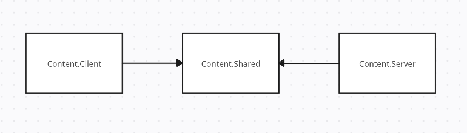

# Базовый неткод в Robust Toolbox

Как мы знаем, SS14 - мультиплеерная игра. Соответственно, информация должна синхронизироваться между сервером и клиентами.

## Сетевая структура Robust Toolbox

Весь код игры делиться на три структуры: ***Server, Client и Shared***.
<figure markdown>
  
  <figcaption>Организация сетевого кода</figcaption>
</figure>
Соответственно:

- Код, находящийся в `Content.Server`, обрабатывается ***только*** сервером;
- Код, находящийся в `Content.Client`, обрабатывается ***только*** клиентом;
- Код, находящийся в `Content.Shared`, обрабатывается ***обоими*** сторонами (prediction, о нём позже).

Помещая тот или иной класс в какой-то из этих папок он становится частью той стороны.  
Так становится понятно, что, например, расчёты урона **не должны** быть на клиенте, как и код, связанный с интерфейсом, не должен находится на сервере.

На клиенте можно распологать: код UI, код визуала (шейдеры, спрайты, эффекты) и т.д.  
На сервере можно распологать: расчеты урона, механики, взаимодействия, работу с БД и т.д.

Но существует и `Content.Shared`.

## Prediction

Prediction (дословно - предсказание, предугадывание) - это методика разработки неткода в мультиплеерных играх. Она заключается в том, что при отправке запроса клиентом он, не дожидаясь сервера, производит вычисления локально и создаёт иллюзию игры без задержки.

Однако, когда вычисления после отправки клиентом запроса на сервер дойдут обратно на клиент, происходит сравнение: насколько правильно клиент "предсказал" результат обработки инпутов. Если разница нулевая или практически незначимая, то всё остаётся как есть. Но если разница становится существенной, то игрока насильно возвращает к тому состоянию, которое просчитал сервер.  
Если был выполнен инпут на передвижение, то при неправильных расчетах клиентом игрока откинет к тому месту, где он должен быть по расчету сервера.

Код, помещаемый в `Content.Shared`, становится **предугадываемым**, т. е. работает механизм prediction'а. Доступ к данному коду может быть получен как с клиента, так и с сервера, однако классы из `Content.Shared` не могут получить доступ к классам с клиента или с сервера. Данный концепт изображён на схеме выше.

## Сетевое состояние компонентов

Как мы установили выше, код нахоядщийся в соответствующем пространстве имён будет обрабатываться на соответствующей стороне, т. е. и компонент, находящийся в `Content.Server`, будет обрабатываться и виден только на сервере, а если он находится в `Content.Shared` - то на обеих сторонах. 

Рассмотрим компонент:
```csharp
using Robust.Shared.GameStates;

namespace Content.Shared.Foldable;

/// <summary>
/// Used to create "foldable structures" that you can pickup like an item when folded.
/// </summary>
/// <remarks>
/// Will prevent any insertions into containers while this item is unfolded.
/// </remarks>
[RegisterComponent, NetworkedComponent, AutoGenerateComponentState(true)]
[Access(typeof(FoldableSystem))]
public sealed partial class FoldableComponent : Component
{
    [DataField("folded"), AutoNetworkedField]
    public bool IsFolded = false;

    [DataField]
    public bool CanFoldInsideContainer = false;

    [DataField]
    public LocId UnfoldVerbText = "unfold-verb";

    [DataField]
    public LocId FoldVerbText = "fold-verb";

    //SS220-fold-doafter begin
    /// <summary>
    /// Time needed to fold/unfold an item. Raises DoAfter if only this value is not null.
    /// </summary>
    [DataField]
    public TimeSpan? FoldTime;
    //SS220-fold-doafter end
}
```
Данный компонент находится в пространстве имён `Content.Shared` и, соответственно, на него работает prediction. В данный момент нас интересует то, как поля в компонентах синхронизируются между сервером и клиентом. Рассмотрим атрибуты компонента:
```csharp
[RegisterComponent, NetworkedComponent, AutoGenerateComponentState(true)]
[Access(typeof(FoldableSystem))]
public sealed partial class FoldableComponent : Component
```
Заметим тут `NetworkedComponent` и `AutoGenerateComponentState`.  
`NetworkedComponent` помечает то, что данный компонент должен участвовать в синхронизации данных между сервером и клиентом.  
`AutoGenerateComponentState` помечает то, что поля данного компонента должны синхронизироваться автоматически. В данном случае речь идёт о написании ComponentState методов синхронизации на клиенте и сервере.

Возьмем в пример `AmbientSoundComponent`:
```csharp
// Данный класс написан в файле с самим компонентом, т. е. в AmbientSoundComponent.cs
[Serializable, NetSerializable]
public sealed class AmbientSoundComponentState : ComponentState
{
	public bool Enabled { get; init; }
    public float Range { get; init; }
    public float Volume { get; init; }
}

```
Как можно увидеть, здесь просто пишутся те поля, которые должны быть переданы через сеть (синхронизироваться).

Далее, необходимо написать два метода: один на отправку ComponentState, а другой - на его обработку:
```csharp
/// SharedAmbientSoundSystem.cs
public override void Initialize()
{
	base.Initialize();
    SubscribeLocalEvent<AmbientSoundComponent, ComponentGetState>(GetCompState);
    SubscribeLocalEvent<AmbientSoundComponent, ComponentHandleState>(HandleCompState);
}

...

private void GetCompState(Entity<AmbientSoundComponent> ent, ref ComponentGetState args)
{
	args.State = new AmbientSoundComponentState
    {
    	Enabled = ent.Comp.Enabled,
        Range = ent.Comp.Range,
        Volume = ent.Comp.Volume,
	};
}

```
В `GetCompState()` мы обрабатываем ивент `ComponentGetState`. Тут мы создаём новый экземпляр класса, который мы объявили ранее (`AmbientSoundComponentState`). Ивент `ComponentGetState` отвечает за формирование отправляемых для синхронизации данных.  
Как видно, здесь просто происходит передача данных полям через конструктор класса. Главное, передать созданный экземпляр в `args.State`, т. е. в аргументы обрабатываемого ивента.
```csharp
/// SharedAmbientSoundSystem.cs
...

private void HandleCompState(Entity<AmbientSoundComponent> ent, ref ComponentHandleState args)
{
	if (args.Current is not AmbientSoundComponentState state)
		return;

	ent.Comp.Enabled = state.Enabled;
    ent.Comp.Range = state.Range;
    ent.Comp.Volume = state.Volume;
}

```
Здесь происходит обработка ивента `ComponentHandleState`, который отвечает за обработку отправленной для синхронизации информации. По сути, тут мы наоборот, приравниваем значения компонента к значениям аргумента ивента.

Как можно было заметить, оба метода написаны в одной системы в `SharedAmbientSystenm.cs`, т. е. в `Content.Shared`. Однако:

- `ComponentGetState` обрабатывается ***только сервером***;
- `ComponentHandleState` обрабатывается ***только клиентом***.

Данные правила истинны и в случае, когда оба метода (или один из них) находятся и в `Content.Shared`, как в примере выше.

Но написание данных ивентов нужно в том случае, если логика вашего компонента или системы нуждается в дополнительных действиях при синхронизации между сервером/клиентом.

Вернёмся к примеру с `FoldableComponent`: здесь нужна простая синхронизация некоторых полей, а для этого существует выше упомянутый атрибут `AutoGenerateComponentState`, поэтому для большинста случаев писать выше написанный код не придётся в принципе.  
Единственное, что нужно будет сделать, это пометить необходимые для синхрониазации поля при помощи `AutoNetworkedField`:
```csharp
[DataField("folded"), AutoNetworkedField]
public bool IsFolded = false;
```
Так, автогенерация кода сделает все вещи, связанные с ComponentState, за вас.

Теперь, допустим, мы в каком-то методе меняем `IsFolded`, и нам необходимо вызвать синхронизацию. Это возможно сделать при помощи метода `Dirty()`:
```csharp
...
ent.Comp.IsFolded = true;
Dirty(ent);
// Альтернативный вид - Dirty(uid, component), 
// если имеется EntityUid и сам компонент отдельно
```
После этого, энтити с компонентом будет помечено как "грязное", и при первой же возможности движок выполнит его синхронизацию.

## Сетевые ивенты

Помимо локальных ивентов в Robust Toolbox  существуют и сетевые ивенты. Они, в отличии от ComponentState, могут быть отправлены/обработаны как с сервера, так и с клиента (обработать один и тот же сетевой ивент можно одновременно и с клиента, и с сервера).  
Они используют эквивалентные обычным методам `RaiseNetworkEvent` и `SubscribeNetworkEvent`.

!!! note ""
	Пример ниже взят из официальной докуменатации Space Wizards.
Очевидным примером реализации сетевых ивентов является система АХелпов. Для начала, нужно создать сам ивент:
```csharp
/// SharedBwoinkSystem.cs

        [Serializable, NetSerializable]
        public sealed class BwoinkTextMessage : EntityEventArgs
        {
            public DateTime SentAt { get; }
            public NetUserId ChannelId { get; }
            public NetUserId TrueSender { get; }
            public string Text { get; }

            public BwoinkTextMessage(NetUserId channelId, NetUserId trueSender, string text, DateTime? sentAt = default)
            {
                SentAt = sentAt ?? DateTime.Now;
                ChannelId = channelId;
                TrueSender = trueSender;
                Text = text;
            }
        }

```
Единственное главное его отличие от обычных ивентов - атрибут `NetSerializable`.

### Отправка с клиента на сервер

Отправка сетевеого ивента производится простым образом:
```csharp
/// Content.Client ... BwoinkSystem.cs
...
        public void Send(NetUserId channelId, string text)
        {
            RaiseNetworkEvent(new BwoinkTextMessage(channelId, channelId, text));
        }
```
Обработка данного ивента на сервере выглядит так:
```csharp
/// Content.Server ... BwoinkSystem.cs

        // ok this is technically in shared and overriden on server/client but you get the idea for simplicity..
        public override void Initialize()
        {
            base.Initialize();

            SubscribeNetworkEvent<BwoinkTextMessage>(OnBwoinkTextMessage);
        }

        ...

        protected override void OnBwoinkTextMessage(BwoinkTextMessage message, EntitySessionEventArgs eventArgs)
        {
            base.OnBwoinkTextMessage(message, eventArgs);
            var senderSession = (IPlayerSession) eventArgs.SenderSession;

            // TODO: Sanitize text?
            // Confirm that this person is actually allowed to send a message here.
            var personalChannel = senderSession.UserId == message.ChannelId;
            var senderAdmin = _adminManager.GetAdminData(senderSession);
            var authorized = personalChannel || senderAdmin != null;
            if (!authorized)
            {
                // Unauthorized bwoink (log?)
                return;
            }

            var escapedText = FormattedMessage.EscapeText(message.Text);

            var bwoinkText = ...

            var msg = new BwoinkTextMessage(message.ChannelId, senderSession.UserId, bwoinkText);

            ...
            
            // Admins
            var targets = _adminManager.ActiveAdmins.Select(p => p.ConnectedClient).ToList();

            // And involved player
            if (_playerManager.TryGetSessionById(message.ChannelId, out var session))
                if (!targets.Contains(session.ConnectedClient))
                    targets.Add(session.ConnectedClient);

            foreach (var channel in targets)
                RaiseNetworkEvent(msg, channel);
            
            ...
```
Стоит заметить, что сам обработчик состоит лишь из двух аргументов - самого ивента и сессии в данном контексте. Соответственно, данный ивент не зависят от каких-либо энтити.  
Первые строчки обработчика проверяют, может ли вообще данный клиент отправить это сообщение. ***При обработке ивентов с клиента их всегда нужно верифицировать!***  
Затем, обработчик формиурет новый ивент и рассылает его всем целям (в данном случае - админам).

### Обработка на клиенте

Рассмотрим, как обработает ивент с сервера клиент:
```csharp
/// Content.Client ... BwoinkSystem.cs
        // ok this is technically in shared and overriden on server/client but you get the idea for simplicity..
        public override void Initialize()
        {
            base.Initialize();

            SubscribeNetworkEvent<BwoinkTextMessage>(OnBwoinkTextMessage);
        }

        ...

        protected override void OnBwoinkTextMessage(BwoinkTextMessage message, EntitySessionEventArgs eventArgs)
        {
            base.OnBwoinkTextMessage(message, eventArgs);
            LogBwoink(message);
            // Actual line
            var window = EnsurePanel(message.ChannelId);
            window.ReceiveLine(message);
            // Play a sound if we didn't send it
            var localPlayer = _playerManager.LocalPlayer;
            if (localPlayer?.UserId != message.TrueSender)
            {
                SoundSystem.Play(Filter.Local(), "/Audio/Effects/adminhelp.ogg");
                _clyde.RequestWindowAttention();
            }

            _adminWindow?.OnBwoink(message.ChannelId);
        }

```
Тут всё довольно просто: мы открываем окно АХелпа, показываем сообщение и проигрываем звук при необходимости. В отличие обработки на сервере, тут мы не верифицируем (проверяем) присланный ивент, так как мы доверяем серверу.