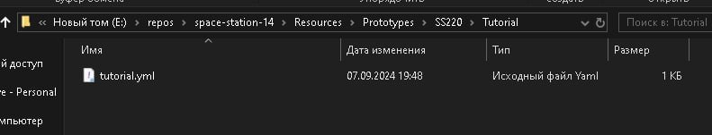
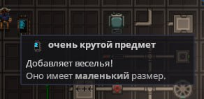
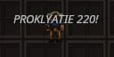

# Создание простейшей системы с компонентом

!!! note ""
	***Данная страница сделана как закрепление теории на практике. Для полного понимая происходящего рекомендуется ознакомиться с страницами выше.***

Для применения всего изученного мы выполним тестовое задание, которое я любил выдавать начинающим разработчикам на SS220: **создадим предмет, который при использовании в руке выводит всем окружающим надпись в игровом мире.**

## Создание прототипа

Для начала, нам необходимо создать прототип нашего предмета, иначе нам не с чем будет работать. Как говорилось в [статье про прототипы](prototypes.md), прототип - это "шаблон" объекта для его создания в игровом мире. Создадим файл прототипа по пути `Resources\Prototypes\SS220\Tutorial`:
<figure markdown>
  
  <figcaption>Созданный прототип лежит тут</figcaption>
</figure>
Теперь создадим сам прототип. Нам нужен простой предмет, так что спрайт мы позаимствуем у настройщика доступов. В итоге получим:
```yaml
- type: entity
  parent: BaseItem
  id: ItemFun
  name: very cool item
  description: Adds fun!
  components:
  - type: Sprite
    sprite: Objects/Tools/access_configurator.rsi
    state: icon
  - type: Item
    size: Small
```
Как можно заметить, мы наследуемся от `BaseItem`. Это абстрактный прототип, от которого наследуется большинство используемых предметов, наш не станет исключением.

Также заметим, что мы написали название и описание предмета на английском языке, однако, для использования в игре предмет должен быть на русском. Исправим эту ситуацию, создав файл [локализации](localisation.md) по пути `Resources\Locale\ru-RU\ss220\tutorial`:
```
ent-ItemFun = очень крутой предмет
  .desc = Добавляет веселья!
```
Взглянем на наш предмет в игре:
<figure markdown>
  
</figure>
Мы можем взять его в руку, но при его использовании ничего происходить не будет. Теперь, нам нужно создать [систему с компонентом](ecs.md).

## Создание компонента

Для работы нашей системы необходим компонент. Но вопрос: куда его поместить? Если вспомнить про [организацию кода между клиентом и сервером](basic-networking.md), то существует три пространства имён: `Content.Client`, `Content.Server` и `Content.Shared`.  
Наша механика не требует создания интерфейса или какой-то графической части (хотя вывод текста и показывается на клиенте, но API этой системы находится в `Content.Shared`), так что в `Content.Client` мы компонент с системой не расположим.  
Теперь выбор состоит между `Shared` и `Server`. Наш компонент можно расположить и на сервере, но это может создать проблемы с доступом к компоненту, если он нам понадобится на клиенте. Поэтому хорошей практикой является располагать компоненты в `Content.Shared`.
Создадим файл `SendWorldMessageComponent.cs` по пути `Content.Shared\SS220\Tutorial`.
```csharp
namespace Content.Shared.SS220.Tutorial;

[RegisterComponent]
public sealed partial class SendWorldMessageComponent : Component
{
    // Пока пусто...
}

```
В принципе, для работы компонента нам более и не надо. Главное - **наследование от `Component` и атрибут `[RegisterComponent]`**. Теперь к данному классу можно отсылаться в любом месте, как на клиенте, так и на сервере.

## Создание системы

Про расположение системы можно мыслить похожим образом: наша система точно не будет располагаться на клиенте, однако про `Shared` или `Server` уже можно подумать. На данный момент главное различие - наличие [предугадывания](basic-networking.md#prediction). Наша механика достаточно простейшая, поэтому обработки с сервера будет вполне достаточно, а какая-то вероятная задержка не сильно повлияет на функциональность.  
Так что создадим файл `SendWorldMessageSystem.cs` по пути `Content.Server\SS220\Tutorial`:
```csharp
namespace Content.Server.SS220.Tutorial;

public sealed class SendWorldMessageSystem : EntitySystem
{

}
```
Мы создали систему, но она довольно пуста...

### Подписка на событие и его обработка
Вспомним, что мы должны выводить текст в игровой мир **при использовании в руке**. Соответственно, нам нужно подписаться на [событие](ecs.md#_3) `UseInHandEvent`. Подписки на события производятся в методе `Initialize()`:
```csharp
public override void Initialize()
{
    base.Initialize();

    SubscribeLocalEvent<SendWorldMessageComponent, UseInHandEvent>(OnUseInHand);
}
```
Мы подписались на событие (ивент) через наш компонент. Значит, при вызове события на энтити с этим компонентом будет вызвам метод `OnUseInHand()`. Он является **обработчиком**. Рассмотрим его:
```csharp
private void OnUseInHand(Entity<SendWorldMessageComponent> entity, ref UseInHandEvent args)
{

}
```
В аргументы передаётся вся информация в данном контексте - от энтити с компонентом до самого ивента. Теперь нам нужно добавить саму логику вывода надписи в мир.

### Добавление зависимости
Нужные нам методы вывода текста в мир находятся в системе `SharedPopupSystem`. Для обращения к другой системе нам необходимо добавить **зависимость**. Напишем её выше метода `Initialize()`:
```csharp
[Dependency] private SharedPopupSystem _popup = default!;
```
Таким образом мы добавили зависимость к нашей системе.

Вернёмся к обработчику ивента, там мы можем просто обратиться к добавленной зависимости, а частности нас интересует метод `PopupEntity()`:
```csharp
private void OnUseInHand(Entity<SendWorldMessageComponent> entity, ref UseInHandEvent args)
{
    _popup.PopupEntity("Hello world!", entity.Owner);
}

```
Пока захардкодим выводимую строчку и проверим результат работы.  
Теперь вся система будет вяглядеть так:
```csharp
using Content.Shared.Interaction.Events;
using Content.Shared.Popups;
using Content.Shared.SS220.Tutorial;

namespace Content.Server.SS220.Tutorial;

public sealed class SendWorldMessageSystem : EntitySystem
{
    [Dependency] private SharedPopupSystem _popup = default!;

    public override void Initialize()
    {
        base.Initialize();

        SubscribeLocalEvent<SendWorldMessageComponent, UseInHandEvent>(OnUseInHand);
    }

    private void OnUseInHand(Entity<SendWorldMessageComponent> entity, ref UseInHandEvent args)
    {
        _popup.PopupEntity("Hello world!", entity.Owner);
    }
}
```

## Добавление созданного компонента и проверка работы

Вернёмся к прототипу и добавим созданный нами компонент в него:
```yaml
- type: entity
  parent: BaseItem
  id: ItemFun
  name: very cool item
  description: Adds fun!
  components:
  - type: Sprite
    sprite: Objects/Tools/access_configurator.rsi
    state: icon
  - type: Item
    size: Small
  - type: SendWorldMessage
```
Заметим, что название компонента пишется без постфикса `Component`, так как при чтении прототипов движок не учитывает его.  
Запустим сборку и проверим работоспособность нашей системы:
<figure markdown>
  
  <figcaption>Привет, Мир!</figcaption>
</figure>

## Модификация системы и компонента

Немного усложним задачу: сделаем так, чтобы в мир выводился текст, **который заранее будет указан в прототипе**.

Начнём с того, что нам нужно добавить место, где будет храниться этот текст. Как мы може вспомнить, компоненты предназначены для того, чтобы **хранить данные**, необходимые для работы системы. Соответственно, для этого нужно создать поле в классе прототипа.

Вернёмся к компоненту и добавим поле `Message`:
```csharp
namespace Content.Shared.SS220.Tutorial;

[RegisterComponent]
public sealed partial class SendWorldMessageComponent : Component
{
    [DataField]
    public string Message = "Hello, World!";
}
```
Для того, чтобы поле можно было изменять в прототипе, необходимо добавить атрибут `[DataField]`, что мы и сделали. Также, мы присвоили полю стандартное значение, которое будет выводится, если в прототипе не было указано никакого текста.

Вернёмся к обработчику события в системе и задействуем созданное поле:
```csharp
private void OnUseInHand(Entity<SendWorldMessageComponent> entity, ref UseInHandEvent args)
{
    _popup.PopupEntity(entity.Comp.Message, entity.Owner);
}
```
Простым обращением к компоненту через передаваемое в аргументах энтити мы получили наше поле и передали его в аргументы метода `PopupEntity()`.  
Таким образом, мы избавились от хардкода и расширили функционал нашей системы.

Напоследок, вернёмся к прототипу и добавим какой-нибудь другой текст:
```yaml
- type: entity
  parent: BaseItem
  id: ItemFun
  name: very cool item
  description: Adds fun!
  components:
  - type: Sprite
    sprite: Objects/Tools/access_configurator.rsi
    state: icon
  - type: Item
    size: Small
  - type: SendWorldMessage
    message: PROKLYATIE 220!
```
Обратим внимание на то, что по умолчанию поля, помеченные как `DataField`, читаются с прототипов также, как и название самого поля, но всегда начинаются с нижнего регистра.

Взглянем на результат в игре:
<figure markdown>
  
  <figcaption>Уэээээээээ</figcaption>
</figure>

## Итоги

Мы закрепили на практике то, что написано в статьях, созданных для обучения основам разработки SS14.

Для новоиспечённого разработчика может встать вопрос: "что делать дальше?".  
Отвечаем:

- Дополнительно изучите [официальную документацию от Space Wizards](https://docs.spacestation14.com/). Там может быть достаточно нового, а также могут присутствовать моменты, которыми пренебрегли при создании этих статей;
- Практикуйтесь! Придумайте несложную (главное для начала - несложную!) и воплотите её в жизнь!

А если у вас вдруг остались вопросы, то будем рады на них ответить на Discord-сервере разработки SS220 - [Map&Code](https://discord.gg/D9qwBBy8yx)!

Также, в команду разработки SS220 вёдется постоянный набор, так что если вы заинтересованы - [приглашаем вас в команду](https://docs.google.com/forms/d/e/1FAIpQLSe24eYhsZUjA_EEJHBvAYZa1MseFf3C13YFlY5_OiZk5CMlaQ/viewform)!