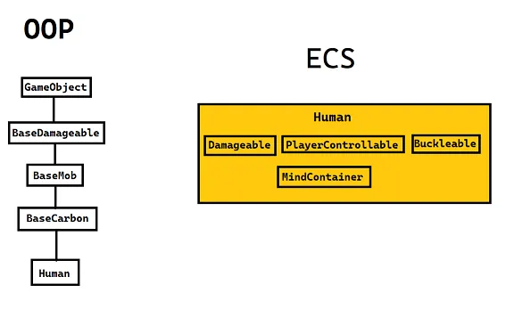

# ECS

**ECS (Entity Component System)** - это паттерн разработки (преимущественно использующийся в геймдеве), основанный на представлении мира как набора объектов, состоящих из компонентов и систем, работающих с этими компонентами.

## Сущность ECS
<figure markdown>
  
  <figcaption>Сравнение структуры объекта, созданного в парадигмах ООП и паттерне ECS</figcaption>
</figure>

Объяснить сущность паттерна ECS можно простым примером выше.

При создании необходимого для станции объекта (как, например, человека) мы, используя здравый смысл и логику, выстраиваем крупную цепочку наследования, так как такие атрибуты сущностей как возможность получать урон, возможность быть мобом и т. д. должны быть заложены в какой-нибудь абстрактный класс/интерфейс для общего использования, так как человек это не единственная сущность с такими свойствами/атрибутами.

А что, если мы захотим сделать общий класс под способность оседлать/садиться на различные объекты? В эту цепочку наследований нам придётся вставить дополнительнон звено. Это самый простой пример, а у человека может быть очень много различных свойств. Я думаю, понятно, к чему всё это в конечном итоге прийдёт.

Для таких ситуаций и в целом для упрощения разработки крупных проектов был составлен паттерн ECS. Давайте рассмотрим пример реализации сущности (или же объекта) человека при помощи него.

Мы имеем объект с ID Human, которое имеет на себе "теги", которые обозначают какое-то свойство/атрибут: то, что объекту можно наносить урон, то, что он является управляемым игроком и т. д. Этот список можно пополнять столько, сколько нам необходимо свойств на нашем объекте, мы как бы "вешаем ярлыки" на шаблон, придавая ему различные свойства.

Эти самые теги (или "ярлыки") называют **компонентами (component)**, а объекты, на который они добавляются, называют **энтити (entity)**.

Таким образом, создав, например, компонент `PlayerControllable`, мы можем добавить его на любое энтити, которое должно уметь управляться игроком. Соответственно, мы избавились от множественных наследований одного класса от другого.

Можно поспорить, сказав, что такое длинное наследование может быть необходимо только для многофункциональных и интерактивных объектов, по типу какой-нибудь играбельной куклы. Однако подумайте о таком случае: вам нужно создать аппарат, который может получать электричество, быть приемником сигнала, быть создателем сигнала, быть разрушаемым, иметь возможность улучшаться, иметь отличный функционал в емагнутом состоянии и вообще иметь собственный уникальный функционал. Таких объектов должно быть не меньше десятка, и все они должны выполнять некоторый уникальный функционал, который может быть унаследован далее. Удачи.

## Связь Компонент-Система

Естественно, компонент сам по себе не будет давать энтити его функционала. **Всю логику, которая должна стоять за компонентом, реализует система. Компонент в себе несёт только информацию, например, различные значения, необходимые для работы системы.**

### Компонент
Рассмотрим теоретический (потому что настоящий компонент имеет более сложную логику и несёт немного другую информацию) компонент `DamagableComponent`:
```csharp
[RegisterComponent]
public sealed partial class DamagableComponent : Component
{    
    [DataField]
    public float Health = 100f;
}
```
Так выглядит структура простейшего компонента с одним полем. Компонент объявляется как класс, наследующийся от класса `Component` и имеющий атрибут `[RegisterComponent]`, необходимый для регистрации компонента движком.

При помощи атрибута `[DataField]` мы помечаем в компоненте поля, которые могут быть изменены в прототипе объекта (о которых позже) и которые несут какую-то информацию о функционирующей части объекта, в данном случае - количество здоровья.

Стоит заметить, что в самом компоненте нету никакой логики, которая могла бы обрабатывать получение урона энтити.

### Система
Рассмотрим систему `DamagableSystem`:
```csharp
public sealed class DamagableSystem : EntitySystem
{
	// Подключение зависимости. Местная форма Dependecy injection.
    [Dependency] protected readonly SharedPopupSystem _popup = default!;

    public override void Initialize()
    {
    	// ТАКОГО ИВЕНТА КАК EntityHitEvent НЕ СУЩЕСТВУЕТ! ДАННЫЙ ИВЕНТ ВЗЯТ В КАЧЕСТВЕ ПРИМЕРА!
        SubscribeLocalEvent<DamagableComponent, EntityHitEvent>(OnHit);
    }
    
    private void OnHit(Entity<DamagableComponent> entity, ref EntityHitEvent args)
    {
    	// В EntityHitEvent присутствует поле Damage, отвечающее за урон. Передаём его в метод нанесения урона.
    	Damage(entity, args.Damage);
    }
     
    public void Damage(Entity<DamagableComponent?> entity, float damage)
    {
    	// Метод Resolve() позволяет произвести проверку данного энтити и компонента:
    	// является ли entity null, существует ли данный компонент на данном энтити, а если он равен null,
    	// то попытается достать его. В случае, когда результат неудовлетворителен - возвращает false.
        if (!Resolve(entity, ref entity.Comp))
            return;
		
		// Обращение к компоненту в переданном энтити - entity.Comp, если нам нужно просто само EntityUid, то - entity.Owner.
       	entity.Comp.Health -= damage;
       	
       	// Если наше здоровье меньше или равно нулю,
       	// то используя подключенную зависимость проецируем сообщение
       	// и поднимаем ивент, сигнализирующий нашу смерть.
       	if (entity.Comp.Health <= 0f)
       	{
       		_popup.PopupEntity("You're dead!", entity.Owner);
       		
       		// EntityDeadEvent ТОЖЕ НЕ СУЩЕСТВУЕТ! ОН ТОЖЕ ВЗЯТЬ В КАЧЕСТВЕ ПРИМЕРА!
        	RaiseLocalEvent(entity, new EntityDeadEvent());
        }
    }
}
```
Как можно увидеть, вся логика находится в этой системе. Любая система должна наследоваться от `EntitySytem`. Начать стоит с того, что реакция системы на какое-либо событие происходит через *обработку ивентов* (тавтология!), с которыми вы можете познакомиться из курса C#. В данном случае, мы обрабатываем некоторый ивент `EntityHitEvent`, который поднимается (триггерится) при ударе чем-либо энтити.

### Ивенты, обработка ивентов
Рассмотрим эту строчку повнимательнее:
```csharp
SubscribeLocalEvent<DamagableComponent, EntityHitEvent>(OnHit);
```
Здесь мы совершаем подписку на ивент `EntityHitEvent` через наш компонент. Эту строчку можно трактовать так: ***когда на энтити с компонентом `DamagableComponent` поднимается (триггерится) ивент `EntityHitEvent`, то мы реагируем на это (обрабатываем) в методе `OnHit()`.***

Сам метод `OnHit()`, соответственно, должен принимать строгий набор аргументов:
```csharp
private void OnHit(Entity<DamagableComponent> entity, ref EntityHitEvent args)
{
	// В EntityHitEvent присутствует поле Damage, отвечающее за урон. Передаём его в метод нанесения урона.
	Damage(entity, args.Damage);
}
```
В данном случае мы просто передаём в последующий метод `Damage()` энтити, которое получило урон и значение урона из самого обрабатываемого ивента. 

Также существуют и другие виды ивентов, такие как broadcast-ивенты, которые не требуют направленного энтити и компонента для обработки, а просто поднимаются могут быть обработаны:
```csharp
SubscribeLocalEvent<BroadcastEvent>(OnBroadcast);
```
Еще, есть и networked-ивенты, но о них и о сетевом состоянии компонентов и энтити будет [позже]().

### Способы обращения к компонентам на энтити и их проверка
Продолжим с методом `Damage()`, нас привлекает эта строчка:
```csharp
if (!Resolve(entity, ref entity.Comp))
	return;
```
Метод `Resolve()` позволяет проверить передаваемое энтити, компонент, и наличие этого компонента на этом энтити. В случае, когда одно из условий не выполняется, метод возвращает `false`. Это позволяет нам убедиться в уместности выполняемых далее операций и предотвращения ошибок.

Это один из способов доставать и/или проверять компонент на энтити. Для таких целей есть вспомогательные методы:

- `HasComp<TComp>()` проверяет наличие компонента на энтити, в случае успешного выполнения возвращает `true`;
- `TryComp<TComp>(out ...)` позволяет получать компонент с энтити, если он есть, в случае успешного выполенения возвращает `true`; 
- `EnsureComp<>()` позволяет убедиться, что компонент есть на данном энтити, т. е. если на энтити есть компонент, то возвращает его, если нет - то сначала добавляет, а потом уже возвращает этот компонент;
- `RemComp<>()` позволяет удалить компонент с данного энтити.

### IoC или Dependency injection
Изучая метод `Damage()` далее, можно заметить использования экземпляра системы `SharedPopupSystem` - `_popup`. В данном случае эта система выступает в роли **зависимости**.
```csharp
[Dependency] protected readonly SharedPopupSystem _popup = default!;
```
Это в Robust Toolbox называется **IoC (Inversion of Control)**, и подключение зависимостей выглядит очень просто, как можно увидеть примером выше.

Любая система может выступить в роли подобной зависимости. Это может быть необходимо, когда в подключаемой зависимости есть нужные публичные методы. IoC является одним из главных способов общения между системами.

### Создание и поднятие ивентов
В проверке на количество здоровья у энтити можно заметить такую строчку:
```csharp
RaiseLocalEvent(entity, new EntityDeadEvent())
```
Поднятие направленного на энтити ивента выглядит именно таким образом. Нам нужно просто передать само энтити и экземпляр класса ивента.

Сам класс ивента можно объявить в любом доступным для системы месте, обычно, это делают в отдельном файле или в файле с классом компонента.
```csharp
public sealed class EntityDeadEvent : EntityEventArgs
{
}
```
Так объявляется ивент, в котором не передаётся никакой информации. Все ивенты должны наследоваться от `EntityEventArgs` или другого наследника этого класса (как, например, `CancellableEntityEventArgs`). Он является чисто информативным: сигнализируя то, что энтити, на которое направлен этот ивент, мертво. И в точно такой же манере, как и ивент в примере выше, на него можно будет подписаться и обработать.

Если нам нужно передать какую-то информацию в ивенте, то это можно сделать так:
```csharp
public sealed class EntityHitEvent : EntityEventArgs
{
    public float Damage { get; }
    
    public EntityHitEvent(float damage)
    {
        Damage = damage;
    }
}
```
Информация будет передаваться как поля, к которым можно будет обращаться. Главное - объявить конструктор класса, в котором полям будет присваиваться значения.