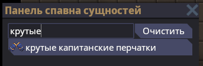

# Прототипы
!!! note ""
	*Эта страница является переделкой гайда на прототипы, написанного Surani, с дискорд сервера Map&Code.*
Для работы над любой игрой нам в конечном итоге придётся создавать какие-либо "шаблоны" объектов, чтобы помещать их в игровой мир.	
В игровом движке Unity это могут быть префабы. Подобным аналогом такого "шаблона" в движке Robust Toolbox являются **прототипы**.	
С помощью них в игре создаются почти все объекты: от игроков и инструментов до декалей, антагов и игровых режимов. Вне зависимости от отдела разработки необходимо знать что такое прототипы и как и их делать.

## Структура прототипа

Все прототипы пишутся на языке сериализации YAML. Для удобной работы с прототипами существует [специальный плагин для VSCode](https://marketplace.visualstudio.com/items?itemName=slava0135.robust-yaml).

Рассмотрим прототип перчаток капитана:
```yaml
- type: entity
  parent: ClothingHandsBase
  id: ClothingHandsGlovesCaptain
  name: captain gloves
  description: Regal blue gloves, with a nice gold trim. Swanky.
  components:
  - type: Sprite
    sprite: Clothing/Hands/Gloves/captain.rsi
  - type: Clothing
    sprite: Clothing/Hands/Gloves/captain.rsi
  - type: GloveHeatResistance
    heatResistance: 1400
  - type: Insulated
  - type: Fiber
    fiberMaterial: fibers-durathread
    fiberColor: fibers-regal-blue
  - type: FingerprintMask
```
Тело прототипа состоит из:

- типа объекта прототипа (в данном случае - энтити): `- type: entity`;
- родителя (если есть, не обязательно): `parent: ClothingHandsBase`;
- ID прототипа (обязан быть уникальным): `id: ClothingHandsGlovesCaptain`;

Данные параметры присуствуют в прототипах любого вида: то будь энтити или мидраунд ивент.	
Однако сейчас мы рассмотрим прототип энтити, как самый используемый и практически нужный. Далее в прототипе энтити идут:

- имя энтити, оно уже будет видно в игре и является [локализуемым](localisation.md): `name: captain gloves`;
- описание энтити, также видно в игре и может (и должно!) локализоваться: `description: Regal blue gloves, with a nice gold trim. Swanky.`;
- [компоненты](ecs.md#ecs_1): `components:`.

Именно компоненты придают какие-либо свойства энтити. У каждого комопнента, добавляемого в прототип, могут быть свои поля (переменные). Например:
```yaml
- type: Sprite
  sprite: Clothing/Hands/Gloves/captain.rsi
```
Здесь указан тип компонента - в данном случае `SpriteComponent` (при регистрации компонента движок вырезает постфикс `Component` из названия для использования в прототипах).	
В качестве поля (переменной) здесь заполняется `sprite`, который, логично, указывает на спрайт (точнее на путь до спрайта), который должен отрисовываться.	
Также мы можем взглянуть на компонент `GloveHeatResistance`:
```yaml
- type: GloveHeatResistance
  heatResistance: 1400
```
Как можно понять из названия, данный компонент даёт возможность перчатке сопротивляться температурам, а в поле `heatResistance` указано значения этого сопротивления.

## Наследование прототипов

Может показаться, что в этом прототипе достаточно мало данных и заполненных полей для предемета одежды. Однако, можно было заметить, что данный прототип наследуется от `ClothingHandsBase`. Взглянем на него:
```yaml
- type: entity
  abstract: true
  parent: Clothing
  id: ClothingHandsBase
  components:
  - type: Sprite
    state: icon
  - type: Clothing
    slots: [gloves]
  - type: Food
    requiresSpecialDigestion: true
  - type: Item
    size: Small
    storedRotation: -90
  - type: SolutionContainerManager
    solutions:
      food:
        maxVol: 10
        reagents:
        - ReagentId: Fiber
          Quantity: 10
  - type: Tag
    tags:
    - ClothMade
    - WhitelistChameleon
```
Этот прототипом является **базовым** для всех прототипов перчаток. Здесь собраны все необходимые компоненты для того, чтоб перчатки были перчатками, например: компонент предмета (`Item`), компонент одежды, в котором указан слот для экипировки (`Clothing`), компонент тегов, в котором указаны важные для перчаток теги (`Tag`). Таким образом, создавая новые перчатки мы просто наследуемся от `ClothingHandsBase` и освобождаемся от надобности постоянно переписывать все базовые компоненты и их значения.	
Конечно, и этот прототип наследуется от другого - `Clothing`, но таким образом мы можем дойти и до `BaseItem`, что даст основную идею о структуре прототипов в SS14.

Также, если мы вернёмся к перчаткам капитана, то мы можем заметить, что, например, компонент `Clothing` в нём не содержит поля `slots`. Я думаю логично, что при наследовании одного протипа от другого все поля наследуемого прототипа переносятся наследник. Поэтому, если нам нужно изменить какое-то поле в наследуемом компоненте, то мы просто пишем тот же компонент, однако с нужными изменёнными полями (как это в капитанских перчатках сделано с спрайтом одежды).

## Создание прототипа

Попробуем создать модифицированную версию капитанских перчаток.	
Все прототипы должны лежать в папке `Resources/Prototypes`. Где-то там мы и создадим новый прототип.
!!! warning ""
	При создании чего-то или модификации чего-либо следуйте гайдлайнам поекта, на котором вы будете публиковать свои изменения. [Особенно, если это касается SS220.](ss220-guidelines.md)
Для простоты создадим наш прототип в папке `Resources/Prototypes/Entities/Clothing/Hands`. Так как пишется прототип на языке YAML, то файл должен иметь расширение `.yml`. Назовём файл `new_amazing_gloves.yml`.

Напишем прототип энтити, который наследуется от капитанских перчаток:
```yaml
- type: entity
  parent: ClothingHandsGlovesCaptain
  id: ClothingHandsGlovesCaptainNew
  name: крутые капитанские перчатки
  description: Перчатки, от которых отрывает голову.
```
Дадим прототипу id `ClothingHandsGlovesCaptainNew`, который при первом взгляде даст понять, что это за прототип.	
Также, дадим перчаткам какое-нибудь отличное от обычных название и описание.

Теперь, например, изменим цвет ткани и сопротивление температурам нашим новым перчаткам:
```yaml
components:
- type: GloveHeatResistance
  heatResistance: 1800 #increased resistance
- type: Fiber
  fiberColor: fibers-regal-black #changed color to black
```
Теперь наши перчатки стали ещё круче! Взглянем на итог:
```yaml
- type: entity
  parent: ClothingHandsGlovesCaptain
  id: ClothingHandsGlovesCaptainNew
  name: крутые капитанские перчатки
  description: Перчатки, от которых отрывает голову.
  components:
  - type: GloveHeatResistance
    heatResistance: 1800 #increased resistance
  - type: Fiber
    fiberColor: fibers-regal-black #changed color to black
```
Теперь, если мы [запустим локальный сервер и зайдём на него](../localhost.md), то в меню создания предметов мы сможем лицезреть наши новые перчатки:
<figure markdown>
  
  <figcaption>А вот и новые перчатки</figcaption>
</figure>
Таким образом, мы создали простой прототип на основе другого.	
Если вы захотите создать прототип энтити с нуля, то сначала определитесь для чего он вам нужен. Если это какой-то предмет, то сначала попробуйте найти базовый прототип для этого рода предметов, и если таковой есть, то наследуйтесь от него и делайте прототип.

Говоря про прототипы НЕ энтити, то каждый из них делается по разному. Для ознакомления рекомендуется смотреть на аналоги уже созданных прототипов (например, прототипы целей). Но зная, какую общую структуру имеют прототипы, будет намного проще.