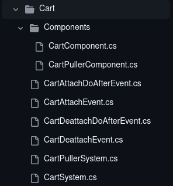

# Наставления по работе с репозиторием SS220

При работе с репозиторием SS220 необходимо следовать некоторым наставлениям, если вы хотите, чтобы ваш pull request был замёрджен.

## Изменения в коде

При создании новых классов в любом из пространств имён (`Content.Client`, `Content.Shared`, `Content.Server`), они должны находится в папках **SS220**.  
Например: `Content.Server/SS220`.

Далее, под соответствующую механику должна быть создана своя папка.  
Например: `Content.Server/SS220/TTS`.

Также, желательно разделять UI, компоненты и системы. К примеру:
<figure markdown>
  
</figure>

При создании любого файла стоит добавить копирайт-дисклеймер в шапку файла:  
`© SS220, An EULA/CLA with a hosting restriction, full text: https://raw.githubusercontent.com/SerbiaStrong-220/space-station-14/master/CLA.txt`.  
Например:
```csharp
// © SS220, An EULA/CLA with a hosting restriction, full text: https://raw.githubusercontent.com/SerbiaStrong-220/space-station-14/master/CLA.txt

using System;

class Program
{
    static void Main(string[] args)
    {
        Console.WriteLine("Hello SS220");
    }
}
```

При изменениях в файлах **ВНЕ** папок SS220 **нужно** добавлять **пометки**.  
При изменениях в одну строку можно делать так:
```csharp
NewMethod(); //SS220-new-feature
```
При изменениях в более, чем одну строку, рекомендуется делать так:
```csharp
//SS220-new-feature begin
if (number > 2)
	NewMethod();
//SS220-new-feature end
```

## Изменения в прототипах

При создании **новых** прототипов их необходимо помещать в соответствующую папку в папке SS220. Даже если очень кажется, что этот прототип нужно оставить и в папке вне 220 (к примеру, дополнение к чему-то ванильному).  
Например: `Resources/Prototypes/SS220/Entities/Clothing/Head`

Также, желательно добавлять в шапке `.yml` файлов копирайт-дисклеймер (`© SS220, An EULA/CLA with a hosting restriction, full text: https://raw.githubusercontent.com/SerbiaStrong-220/space-station-14/master/CLA.txt`), к примеру:
```yaml
# © SS220, An EULA/CLA with a hosting restriction, full text: https://raw.githubusercontent.com/SerbiaStrong-220/space-station-14/master/CLA.txt

- type: entity
  parent: BaseItem
  id: ItemFun
  name: very cool item
  description: Adds fun!
  components:
  - type: Sprite
    sprite: Objects/Tools/access_configurator.rsi
    state: icon
  - type: Item
    size: Small
  - type: SendWorldMessage
    message: PROKLYATIE 220!
```

При изменениях **ВНЕ** папок SS220 **нужно** добавлять **пометки**.  
При изменениях в одну строку можно делать так:
```yaml
- type: SomeNewThing #SS220-new-feature
```
При изменениях в несколько строк стоит делать так:
```yaml
#SS220-new-feature begin
- type: SomeNewThing
  number: 220
  string: curse
#SS220-new-feature end
```

## Изменения в спрайтах

**Новые** спрайты нужно помещать в соответствующую папку под папкой SS220.  
Например: `Resources/Textures/SS220/Clothing/Head/Hats`.

При создании спрайтов необходимо должным образом указать лицензию и копирайт в `meta.json`. В случае, если спрайт был **полностью** создан нами, то:
```json
"license": "EULA/CLA with a hosting restriction, full text: https://raw.githubusercontent.com/SerbiaStrong-220/space-station-14/master/CLA.txt",
"copyright": "Made by {никнейм} (Discord/GitHub) for SS220",
```
Где заместо `{никнейм}` нужно указать никнейм создателя, а в `(Discord/GitHub)` выбрать одно из них, в зависимости откуда никнейм (т. е. если вставляется юзернейм из Discord - то нужно выбрать Discord).

Если новый добавляемый спрайт был взять откуда-то, то ***необходимо*** указать оригинальную лицензию взятого спрайта, а если он был зареспрайчен, то нужно указать, что респрайт выполнен для SS220 и в конце копирайта указать никнейм респрайтера.  
К примеру:
```json
"license": "CC-BY-SA-3.0",
"copyright": "Taken from tgstation at commit https://github.com/tgstation/tgstation/commit/4f6190e2895e09116663ef282d3ce1d8b35c032e, resprite by muriexlol, resprited for SS220 by NightmareStalker (GitHub)",
```

Если респрайтится какой-то уже существующий в игре спрайт, то **допускается** замена спрайтов напрямую в исходной папке. Однако всё равно ***обязательно*** нужно указать новую лицензию и копирайт, а если была зареспрайчена только часть, то необходимо указать эту часть в копирайте и перечислить лицензию/копирайт через запятую.  
К примеру:
```json
"license": "CC-BY-SA-3.0",
"copyright": "Sprited by MEGAROBUSTER, closed state resprited for SS220 by curse220 (Discord)",
```

## Изменения в локализации

При добавлении новых строк в локализации их необходимо добавлять в соответствующую папку под папкой SS220.  
К примеру: `Resources/Locale/ru-RU/ss220/clothing/Head`

При изменении строк **ВНЕ** папок SS220 **нужно** добавлять **пометки**.  
Из-за специфики чтения файлов локализации даже при изменении в одну строку стоит делать следующим образом:
```
#SS220-new-translation begin
ent-NewObject = новый перевод объекта
#SS220-new-translation end
```
Соответствующим образом делается перевод для изменений в несколько строк:
```
#SS220-new-translation begin
ent-NewObject = новый перевод объекта
	.desc = Совсем новый!
new-feature-translation-key = Новый перевод!
#SS220-new-translation end
```