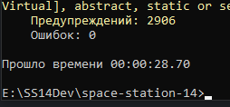

# Сборка и запуск локального сервера

<small>
У официальных разработчиков так же есть [**англоязычный гайд по сборке проекта**](https://docs.spacestation14.io/en/getting-started/dev-setup).
</small>

---

## Подготовка
**Для сборки потребуется скачать и установить:**

* Git - [https://git-scm.com](https://git-scm.com)
* Python 3.7 или новее - [https://www.python.org](https://www.python.org) - качать именно с оф. сайта а не с Windows Store иначе могут возникнуть проблемы со скриптом
* .NET 7 SDK x64 - [https://dotnet.microsoft.com/en-us/download](https://dotnet.microsoft.com/en-us/download)

## Клонирование кода
После установки всего вышеперечисленного теперь нужно скачать код проекта через Git.

1. Для этого сначала нужно получить ссылку на репозиторий, оканчивающуюся на `.git`. Для этого нужно зайти на страницу репозитория на GitHub и нажать справа сверху на кнопку "Code". Скопируйте ссылку из выпавшего окна (вам нужна ссылка по HTTPS).  
**Для билда SS220 вы можете просто скопировать вот эту ссылку:** `https://github.com/SerbiaStrong-220/space-station-14.git`
2. После этого вам нужно открыть командную строку вашей системы (в Windows 10 - Win+R и введите cmd) и перейти в папку, куда вы будете клонировать.  
В cmd и PowerShell (Windows) для этого используется команда cd, например `cd C:\Users\VasyaPupkin\Desktop`.
Вы можете копировать путь прямо из проводника.  
Если папка находится на диске, отличном от C то сначала переключитесь на этот диск введя `<буква диска>:` Например `E:`  
  
Учитывайте то, что в процессе клонирования Git сам создаст подпапку для кода проекта.  
Убедитесь что у вас достаточно места! Билд после сборки может весить больше 4ГБ.  
4. Теперь введите git clone <ссылка из шага 1>. Для билда SS220 команда будет выглядеть так:  
`git clone https://github.com/SerbiaStrong-220/space-station-14.git`
5. Дождитесь конца клонирования. Проверьте результат, по указанному вами пути будет подпапка "space-station-14" с кодом проекта.

## Сборка
1. Откройте командную строку и перейдите через cd в папку проекта (space-station-14). Введите `py -3 .\RUN_THIS.py`. Дождитесь окончания.
2. Введите `dotnet build -c Release`. Дождитесь окончания. В консоли жёлтым цветом может показаться очень много предупреждений, игнорируйте их. Ошибки будут показаны красным цветом. После окончания сборки у вас должно быть 0 ошибкок как на скриншоте:  
  

Теперь у вас есть **релизная сборка**. Она отличается от дебаг-сборки тем, что имеет автосохранение карт во время маппинга и реже крашится (дебаг-сборку крашат ассерты, специально добавленные оффами). Так же релиз-сборка не имеет искуственной задержки (высокого пинга). Именно её рекомендуется использовать для маппинга.

Если вам вдруг потребуется **дебаг-сборка**, то введите просто `dotnet build` (без `-c Release`). Её для маппинга использовать не рекомендуется, но рекомендуется использовать для тестирования добавляемого контента.

## Запуск
Сервер запускается с помощью **runserver.bat** в папке билда, а клиент с помощью **runclient.bat**  
Сервер можно настраивать в файле конфигурации `server_config.toml` в папке `bin\Content.Server`, однако для маппинга или тестирования это не требуется.

## Обновление
Расписано для тех, кто не использует Git для коммита своих обновлений в основной репозиторий или делает это через других людей.

1. Сохраните нужные вам файлы (вашу карту и прототип) в отдельной папке. Все лишние файлы в папке игры будут удалены, как и изменения в существующих файлах. Исключением будет конфигурация сервера и файлы в data.  
Выключите сервер и клиент.
2. Откройте консоль и сделайте cd в главную папку билда. Введите `git clean -fd`
Это удалит все лишние файлы (файлы которые не существовали изначально или которых нет в .gitignore).
3. Введите `git reset --hard` Это откатит изменения в тех файлах, которые не были удалены в предыдущем шаге
4. Это было сделано чтобы не было конфликтов с загружаемым обновлением. Теперь введите `git pull`
5. Если обновление загрузилось успешно, переходите к сборке (`dotnet build` или `dotnet build --configuration Release`)