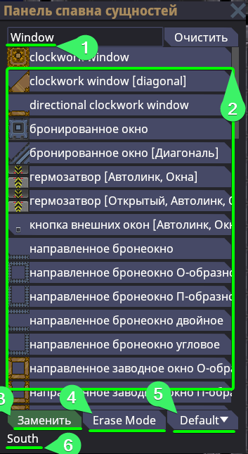
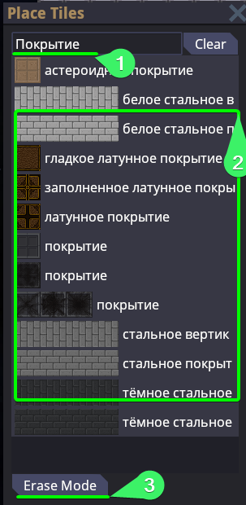
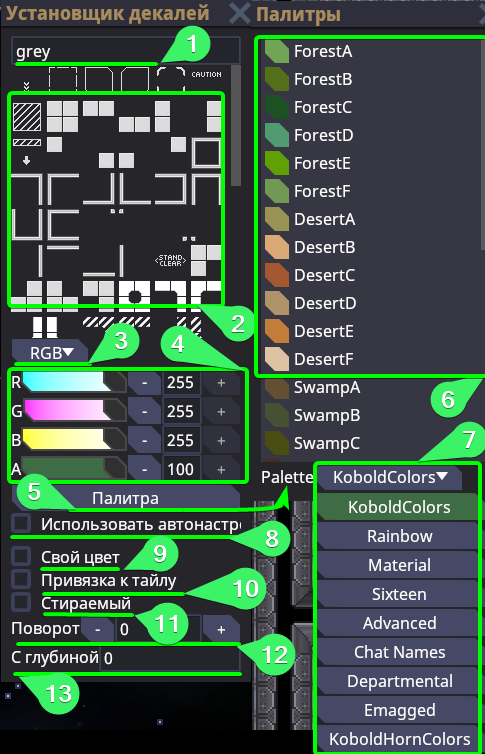
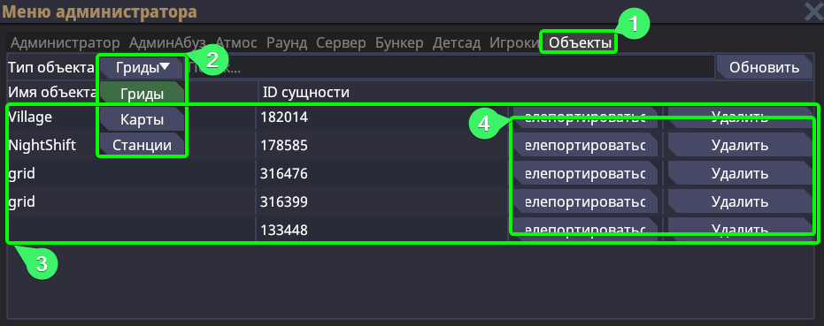
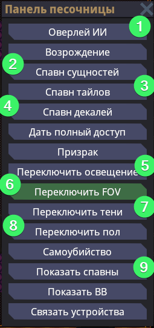

# Управление и термины

## Терминология

Предполагается, что вы так или иначе уже сталкивались с базовыми терминами профессионального языка мапперов. Но даже на тот случай, когда для вас слова "Тайл" "Декаль" "Мапа" и т.д. - чужды, вы можете сориентироваться по этой таблице.

| Термин                                     | Определение                                                                                                                                                                                                                                                                                                                                                                                                                                                                                                                                                                                                                                                                          |
| ------------------------------------------ | ------------------------------------------------------------------------------------------------------------------------------------------------------------------------------------------------------------------------------------------------------------------------------------------------------------------------------------------------------------------------------------------------------------------------------------------------------------------------------------------------------------------------------------------------------------------------------------------------------------------------------------------------------------------------------------ |
| Маппинг                                    | Занятия построения пространства, включающее в себя множество элементов. Маппинг может самым разным, кто-то маппит огромные 3D пространства (больше Level-Design), кто-то маппит как мы 2D пространство песочницы, кто-то работает профессионально и маппит спутниковые и маршрутные карты на реальной мировой карте.                                                                                                                                                                                                                                                                                                                                                                 |
| Маппер                                     | Соответственно человек, что занимается маппингом                                                                                                                                                                                                                                                                                                                                                                                                                                                                                                                                                                                                                                     |
| Мапа (Map)                                 | Она же Карта. Это полотно (космос), на котором располагаются гриды*. Полотно также принято называть "Сектором". Гриды могут располагаться на разных картах, а каждая карта имеет свой ID слота карты (MapID). Он не сохраняется за конкретной картой, а используется в игровой сессии для определения, за каким порядковым числом закреплено определённое полотно. Айди слота текущий карты можно узнать: через F3, через F7 и при помощи `lsmap`                                                                                                                                                                                                                                    |
| Ентити (Entity)                            | Они же сущности или объекты. Зачастую это всё то, что помимо существования физически имеет и функциональность. Энтити может быть довольно много вещей, так как сущность понятие обширное. Если вы видите где-то упоминание Ентити, ЕнтитиID - то имеется в виду сам объект.                                                                                                                                                                                                                                                                                                                                                                                                          |
| Грид (Grid)                                | Это единая сетка размещённых объектов. То есть совокупность соединённых тайлов друг с другом - создают грид, сетку этих тайлов в одной системе. Эта сетка заставляет тайлы двигаться вместе, а соответственно и все объекты на этой сетке. То есть, гридом является например шаттл. Станция, между прочим - то же является гридом, но очень большим.   Для одной системы должен соответствовать в идеале один грид. Гриды - ресурсоёмкий объект, а потому нежелательно их плодить в большом множестве. Существует два типа сохраненённых карт, как грид (то есть без полотна) и как карта. Необязательно иметь несколько гридов, чтобы сохранить грид как карту.               |
| Тайл (Tile)                                | Это покрытие, любой его вид. Он используется для построения гридов и последующего размещения на нём объектов.  Чтобы тайлы создали правильный грид, необходимо помнить, что тайлы нужно соединять последовательно. Сперва ставите первый тайл, а от него строите последующие тайлы. Нельзя без первого тайла сразу строить при множество тайлов при помощи Shift + ЛКМ или Ctrl + ЛКМ. Это приведёт к созданию большого числа гридов.                                                                                                                                                                                                                                          |
| Декаль (Decal)                             | Декоративный объект, размещаемый на тайле, чтобы подчеркнуть его текстурность, выделить как-либо определённое покрытие под определённый объект или создать дополнительное повествование пространства путём добавления декалей пыли, мусоры, ожогов и так далее.                                                                                                                                                                                                                                                                                                                                                                                                                      |
| Юмл (.yml)                                 | Расширение файла карты или грида, он же "точка юмээл/ямл/юмл". Также в пространстве разработки, `.yml` - принято называть файлами прототипов. Не будет ошибкой сказать, что карта или грид - это очень большие прототипы. Все свои работы вы обязательно сохраняете в расширении `.yml`                                                                                                                                                                                                                                                                                                                                                                                              |
| Инициализация, инит, замороженность (init) | Карта может находиться в двух состояниях - инициализирована/инитнута/заморожена и не инициализирована/не ининтнута/ не заморожена. При инициализации карты происходят необратимые события, в указанные объекты спавнеров определяется рандомно какой объект будет заспавнен, контейнеры что предполагают в себе наполняемость после инициализации - наполняются и так далее. Мы никогда и ни в коем случае не сохраняем инициализированные карты и не используем их.   Если во время маппинга вы сохранили карту будучи инициализированной или маппили уже на инитнутой карте, а потом хотите, чтобы эту работу ввели в игру - забудьте, вы можете распрощаться с этой картой. |

## Управление и команды

Первоначально, и естественно, это освоиться с управлением. Я ожидаю, что вы открыли эту статью уже после того как установили локальный сервер или зашли на специализированный под маппинг сервер и получили необходимые права.

В первую очередь, чтобы получить доступ ко всем заветным действиям мапперов - необходимо зайти в игру как администратор через присоединение как наблюдатель, или будучи в игре персонажем, написать: `aghost`

Собственно, представляю таблицу ниже с пояснениями о том, что и за что отвечает:

### Команды

| Команда                                                                                    | Пояснение к команде                                                                                                                                                                                                                                                                                                                                                                                                                                                                                                                                                          |
| ------------------------------------------------------------------------------------------ | ---------------------------------------------------------------------------------------------------------------------------------------------------------------------------------------------------------------------------------------------------------------------------------------------------------------------------------------------------------------------------------------------------------------------------------------------------------------------------------------------------------------------------------------------------------------------------- |
| `aghost`                                                                                   | Режим админ-наблюдателя, в нём же происходит взаимодействия с игровой песочницей и весь маппинг. Его мы прописываем в первую очередь и **обязательно на инициализированной** карте.                                                                                                                                                                                                                                                                                                                                                                                          |
| `mapping` <`id слота карты`>                                                               | создаёт пустую **замороженную** карту с заданным айди. Принудительно включает одиночный режим редактора карт, но это может быть отключено на онлайн-серверах. // *UPD: Так как на момент 09.01 - редактор карт сырой - не рекомендуется к использованию*  **Пример:** *mapping 1*                                                                                                                                                                                                                                                                                   |
| `scene` <`GameplayState`/`MappingState`>                                                   | Включает или выключает режим редактора карт. Соответственно `GameplayState` - включает обычный режим. `MappingState` - включает режим редактора карт.  **Пример:** *scene MappingState*                                                                                                                                                                                                                                                                                                                                                                             |
| `lsmap`                                                                                    | Выводит списком все занятые слоты карт по порядку. Пример подобной строки: `50: Map Entity, init: true, paused false,  grids: 414123`, где: **ID слота карты**: 50 **Название карты**: Map Entity **Инициализирована ли карта**: true **ID гридов на карте**: 414123                                                                                                                                                                                                                                                                                             |
| `loadmap` <`id слота карты`> <`путь до карты`>                                             | Загружает уже существующую карту в **замороженном состоянии**. В качестве ID слота карты - указывается пустой, ещё не занятый другой картой слот. Путь до карты берётся из корневой директории сервера `Resources/Maps` и `bin/Content.Server/data`.  **Пример:** *loadmap 500 /Maps/SS220/frankenstein.yml*                                                                                                                                                                                                                                                        |
| `tp` <`координата X`> <`координата Y`> <`id слота карты`>                                  | Перемещает вас на нужное полотно (карту) по заданным координатам и ID слота карты.  **Пример:** *tp 0 0 500*                                                                                                                                                                                                                                                                                                                                                                                                                                                        |
| `savemap` <`id слота карты`> <`путь для сохраняемой карты`>                                | Сохраняет карту по id слоту по нужному вам пути. **Примечание:** все карты сохраняются в директорию `bin/Content.Server/data`, а не в `Resources/Maps`. Переносить из data в Maps их нужно вручную.  **Пример:** *savemap 500 /MyCoolFirstMaps/MyFirstMap.yml*                                                                                                                                                                                                                                                                                                      |
| `loadgrid` <`id слота карты`> <`путь до нужного грида` > <`координата X`> <`координата Y`> | Загружает на **уже существующую** карту по id слота карты дополнительно грид, с указанного пути и предварительно заданными координатами появления.  **Пример:** *loadgrid 500 /Maps/SS220/Shuttles/cargo_shuttle.yml* 250 -250                                                                                                                                                                                                                                                                                                                                      |
| `pos`                                                                                      | Возвращает значение EntID грида на котором вы находитесь, а также значение координаты X и Y. Если вы находитесь не на гриде - вернёт EntID самой карты.                                                                                                                                                                                                                                                                                                                                                                                                                      |
| `griddrag`                                                                                 | Позволяет вам **зажатием** левой кнопки мыши - перетягивать грид из стороны в сторону. Очень полезно, в случае когда один грид наложился на другой или когда надо примерить подходит ли стыковку к шаттлу.                                                                                                                                                                                                                                                                                                                                                                   |
| `savegrid` <`id грида`> <`путь по которому надо сохранить`>                                | Сохраняет грид по id грида (можно узнать через F3/F7/`lsmap`) по указанному вами пути. Чаще всего используется для сохранения шаттлов, так как их требуется сохранять как отдельные гриды, а не карты. **Примечание:** все гриды сохраняются в директорию `bin/Content.Server/data`, а не в `Resources/Maps`. Переносить из data в Maps их нужно вручную.   **Пример:** *savegrid 414123 /MyCoolFirstMaps/MyFirstShuttle.yml*                                                                                                                                       |
| `mapinit` <`id слота карты`>                                                               | **Размараживает** (**инициализирует**) карту по заданному вами ID.  **Пример:** *mapinit 500*                                                                                                                                                                                                                                                                                                                                                                                                                                                                       |
| `forcemap` <`ID карты`>                                                                    | Используется обычно перед началом раунда для того, чтобы принудительно указать, на какой карте должен начаться раунд.   Уточнение: в Tools версии билда вы предпочительно не будете грузиться в лобби и появляться сразу же на Dev станции. Нежелательно использовать `forcemap` в Tools версии - так как полноценно нужного результата вы не добьётесь. Вместо этого используйте `forcemap` только на Release версии билда, чтобы вместе с картой загружались все необходимые родительские и дочерние прототипы гридов.  **Пример:** *forcemap Frankenstein* |
| `fixgridatmos` <`ID грида`>                                                                | Перезаполняет тайлы карты атмосом, который задан по умолчанию для тайлов, или который выставлен принудительно специальными атмос-фиксерами. Для удобства, при написании `fixgridatmos` выбрать грид на котором вы находитесь на текущий момент, можно быстро через `TAB`.  **Пример**: *fixgridatmos 414123*                                                                                                                                                                                                                                                        |
| `colornetwork` <`uID одной из труб`> `Pipe` <`HEX значение цвета`>                         | Перекрашивает полностью систему труб в нужный вам цвет. Система (участок, который будет перекрашен) определяется по одной из труб и её uID (можно увидеть в VV или нажав правой кнопкой мыше по трубе). В конце команды указывается hex-код значения цвета, который вам необходим.  **Пример:** *colornetwork 153743 Pipe `#0f0f0f`*                                                                                                                                                                                                                                |
| `tilewalls`                                                                                | Заменяет тайлы плиток на тайлы покрытия под всеми стенами станции. Не заменяет под окнами. Может заменить тайл решётки на тайл покрытия под диагональными стенами. Используйте с уверенностью в своих действиях.                                                                                                                                                                                                                                                                                                                                                             |
| `variantize` <`ID грида`>                                                                  | Для тайлов, у которых имеется несколько вариаций спрайта - позволяет рандомизировать их вариацию на определённом гриде.  **Пример:** *variantize 433425*                                                                                                                                                                                                                                                                                                                                                                                                            |
| `toggledecals`                                                                             | Переключает отображение декалей. Полезно для просмотра в особо загруженных местах декалями на предмет ошибок маппинга тайлов.                                                                                                                                                                                                                                                                                                                                                                                                                                                |
| `toggleautosave` <`ID слота карты`>                                                        | Переключает режим автосохранения карты для определённого слота карты. Автосохранения по стандарту располагаются в `bin/Content.Server/data/Autosaves`  **Пример:** *toggleautosave 50*                                                                                                                                                                                                                                                                                                                                                                              |
| `nodevis`                                                                                  | Переключает отображение сетки нод. Позволяет в своеобразном формате просмотреть стеку проложенных проводов и труб по их визуализации гриф.                                                                                                                                                                                                                                                                                                                                                                                                                                   |
| `nodevisfilter` <`ID группы`>                                                              | Отключает отображение конкретной сетки граф по указанной ID группе графы. Узнать ID группу наведясь на один из элементов сетки графа - значение `groud id`.                                                                                                                                                                                                                                                                                                                                                                                                                  |

Команды желательно запомнить наизусть, особенно те, что будут использоваться чаще всего, как загрузка и сохранение карт. Но вы всегда можете заглянуть сюда, чтобы освежить память, потому команды выведены в первую очередь. А вот во вторую очередь пробежимся по управлению.

В чём существенные отличия команд: `savemap` и `savegrid`. Вернёмся к понятиям карты и грида. Карта - это полотно, которое может содержать как один грид, так и несколько гридов, так и вовсе не содержать гридов. А грид, это сетка объектов, на которой располагаются объекты. Чаще всего мы маппим на гридах, но никто не запрещает нам маппить прямо на полотне, например оставить где-то в космосе пасхалку.

Сохраняя при помощи `savemap` мы записываем в `.yml` файл данные о полотне. То что на нём замапленно, как конкретно на полотне расположены гриды, какие данные самого полотна изменены, используется ли на нём пользовательский паралакс и так далее.

Сохраняя при помощи `savegrid` мы записываем в `.yml` файл только данные о конкретном гриде. В таком файле у нас не будет никаких данных о полотне, а будет лишь один единственный грид, без привязки к родителю (полотну).

Отдельно сохранённые гриды нужны для загрузки на уже существующие карты шаттлов, как пример. Либо для некоторых технически сложных объектов в исполнении кода, которые требуют сохранения гридом, так как загружаются на станции при помощи специального параметра `loadgrid` у объекта. Например так загружаются шаттл СБ, сразу пристыкованный и шаттлы ЦК. 
### Клавиши

| Клавиша                                            | Назначение                                                                                                                                                                                                                                                                                                              |
| -------------------------------------------------- | ----------------------------------------------------------------------------------------------------------------------------------------------------------------------------------------------------------------------------------------------------------------------------------------------------------------------- |
| Ё / ~                                              | Открыть консоль разработчика                                                                                                                                                                                                                                                                                            |
| F5                                                 | Открывает панель спавна сущностей (ентити или объектов). Основной инструмент для маппинга                                                                                                                                                                                                                               |
| F6                                                 | Открывает панель спавна тайлов.                                                                                                                                                                                                                                                                                         |
| F7                                                 | Открывает общую административную панель, в ней можно найти полезные для себя инструменты и кнопки.                                                                                                                                                                                                                      |
| F8                                                 | Открывает панель спавна декалей.                                                                                                                                                                                                                                                                                        |
| B                                                  | Открывает меню песочницы, содержит множество полезных переключателей, освещения, FOV, пола и т.д.                                                                                                                                                                                                                       |
| P                                                  | Копирует объект, на который вы навелись мышкой (не копирует его уникальные свойства, только по прототипу объекта). Рекомендуется к переназначению в настройках на наиболее удобную кнопку для быстрого использования, так как в маппинге копировать придётся часто.                                                     |
| Нужно задать вручную. Настройка "Изучить сущность" | Изучить сущность - это открыть VV интерфейс объекта. Если вы ещё мало знаете о том как работать с VV и компонентами, то пока просто назначьте на наиболее удобную вам клавишу, так как в будущем, вам придётся очень часто открывать это меню, а делаю это по бинду, а не через ПКМ - вы сэкономите себе много времени. |

### Хоткеи
Что же касается о хоткеях во время самого процесса маппинга:

| Клавиша / Комбинация | Пояснение                                                                                                                                                                                                                                                                                                                                     |
| -------------------- | --------------------------------------------------------------------------------------------------------------------------------------------------------------------------------------------------------------------------------------------------------------------------------------------------------------------------------------------- |
| ЛКМ                  | Размещает выбранный вами объект, будь то сущность из F5, тайл из F6 или декаль из F8                                                                                                                                                                                                                                                          |
| ПКМ                  | Отменяет размещение при использовании в F5 и F6 и **удаляет** декаль при использовании в F8                                                                                                                                                                                                                                                   |
| Ctrl + ЛКМ           | Размещение в сетку. Позволяет множество объектов сразу по сетке. *Учитывайте, что использование с тайлами не рекомендуется на момент 09.01.* При использовании с тайлами важно начинать тянуть тайлы от уже существующего и **ни в коем случае не от космоса**, иначе вы создадите множество лишних гридов. Не работает с декалями.           |
| Shift + ЛКМ          | Размещение в линию. Позволяет множество объектов разместить по лини. *Учитывайте, что использование с тайлами не рекомендуется на момент 09.01.* При использовании с тайлами важно начинать тянуть тайлы от уже существующего и **ни в коем случае не от космоса**, иначе вы создадите множество лишних гридов. Не работает с декалями.       |
| СКМ                  | Изменяет угол объекта. Если объект можно вращать, то на эту кнопку вы как раз и будете его вращать. Работает до размещения в момент проекции, а не после. Не работает с декалями. Не работает с тайлами.                                                                                                                                      |
| Ctrl + СКМ           | Отзеркаливает объект, если у него есть соответствующая форма. Наиболее примененимо к газовым фильтрам, смесителям или утилизационным фильтрам, у которых могут быть их зеркальные версии, что замаппить можно, конкретно отразив объект. Работает до размещения в момент проекции, а не после. Не работает с декалями. Не работает с тайлами. |

### F5 - Меню управления
В рамках управления, стоит отдельно пройтись по каждому интерфейсу и меню маппинга, которые чаще всего открываются для размещения объектов. Начнём по порядку:
#### Панель спавна сущностей
  

Само меню из себя представляет список из объектов, которые можно разместить, а также несколько кнопок, которые переключают режимы размещения.

1. В первую очередь, это окно поиска предметов. Если вы знаете как называется прототип или объект (ищет по обоим), то вы можете указать сюда нужный вам запрос и найти соответствующий объект.
2. Сам список объектов, достаточно нажать на один из, чтобы начать его размещать.
3. Режим "Замены" объектами. В основном размещает объекты на карте, но некоторые стены например в этом режиме могут быть заменяемые, например массово заменять обычные стены на укреплённые. Размещать объекты можно и без этого режима, но он включён по умолчанию.
4. Режим удаления, переключая на него, вы соответственно начинаете удалять нужные вам объекты при помощи ЛКМ.
5. Режим размещения объекта. Есть множество режимов, все они соответствуют их названию и могут быть полезны, когда объекты не закрепляется за тайлом по стандарту и его нужно закрепить. Например для некоторых стульев будет полезным SnapToGrid, а для некоторых кнопок AlignWall.
6. Направление света, которое на текущий момент выбрано у размещаемого объекта. Иногда может быть полезным, когда по объекту не видно в какую именно сторону он смотрит, а расположить нужно в конкретную.
#### F6 - Панель размещения тайлов

В меню размещения тайлов гораздо меньше кнопок, которые можно было бы описать, но всё же:

1. Окно поиска нужных тайлов. Наиболее частыми тайлами для поиска обычно являются: Покрытие (ставится под стены и окна) и Космос (для удаления тайлов)
2. Список тайлов. При нажатии на один из - выбираете как тайл для размещения.
3. Функция удаления тайлов, тоже самое, что и установка тайла Космоса.

#### F8 - Панель размещения декалей

Может показаться довольно затруднительным по началу меню декалей, но постараемся максимально подробно разобрать каждую кнопку в этом меню.

1. Привычное нам окно поиска. Декали тяжелее всего искать, но можете подбирать логические слова, чтобы найти нужное: flowers, sand, dust, wood, gray и так далее.
2. Соответственно само меню выбора декали. Декаль ставится свободно меж тайлами по нажатию ЛКМ. Стирается по нажатию ПКМ. Стереть конкретно одну декаль нельзя, поэтому при работе на одном тайле комплексно с несколькими декалями - старайтесь быть аккуратны.
3. Выбор цветовой модели. Есть RGB и HSV, их различия отражаются в ползунках, которые настраивают конкретный цвет. Использовать RGB рекомендуется в тех случаях, когда вы уже имеете предварительно заданный шаблон RGB. HSV же рекомендуется использовать, когда вы определяете цвет самостоятельно, так как цветовая модель более интуитивно понятная.
4. Сами ползунки и настройки цвета. При цветовой модели RGB - R (red) отвечает за красный, G (green) за зелёный и B (blue) за синий. A (alpha) - маска альфа-прозрачности. То есть этот ползунок отвечает за прозрачность декали. Если используется цветовая модель HSV, то H (hue) это тон - им мы задаём нужный цвет, S (saturation) это насыщенность, то есть насколько заданный тон будет блеклым, и V (value) это яркость. То есть сколько белого в заданном тоне. Чтобы освоиться с палитрой, проще всего потратить немного времени, чтобы поиграться с ней.
5. Помимо того, что можно выбрать цвет вручную - вы можете воспользоваться уже заготовленными палитрами. Нажав на "Палитра" у вас откроется дополнительное окно с цветами из палитры.
6. Соответственно здесь вы выбираете нужный вам цвет, можете ориентироваться на название и сам цвет.
7. А здесь уже можете сменить палитру. Зачастую подходящие палитры. это Departmental для классических станция как Frankenstein и Advanced для более продвинутого использования декалей, от этой палитры зачастую настраиваются цвета далее.
8. "Использовать автонастройку" автоматически включит нужные параметры или цвет, которые установлены декале по дефолту - использовать нерекомендуется.
9. "Свой цвет" - эта настройка определяет, будет ли применяться на декаль цвет, о котором говорилось в пунктах 3-6, если она отключена, будет использоваться стандартный ванильный цвет декали, если включена - то на декаль будет наложен цвет, который вы установили.
10. "Привязка к тайлу" - эта настройка определяет, будет ли декаль установлена ровно по центру тайла. Рекомендуется использовать, так как многие декали рассчитаны, что их устанавливают не вручную на край тайл, а ставят в центр, а потому они могут иметь сразу несколько направленностей.
11. "Стираемый" - настройка определяет, можно ли игровым путём стереть декаль с тайла. Эта настройка необходима для тех декалей, что теоретически может убрать уборщик при помощи космического очистителя, специального предмета в игре.
12. Настройка поворота. Думаю тут всё просто и понятно. Шаг добавления по 90 градусов.
13. Настройка слоя или же Глубина. Определяет слой декале. Например на одном пространстве у вас может быть несколько декалей. С помощью глубины вы можете под уже существующую декаль подложить ещё одну. Например сначала вы установили декаль пыли с глубиной 0. А после решили установить туда дополнительно декаль окантовки, тогда вам надо будет установить глубину "-1". **Примечание:** при попытке вписать сначала "-", у вас могут возникнуть трудности, поэтому сначала впишите число, например "1", а после добавьте перед ним знак минуса, чтобы получилось "-1".

#### F7 - Меню администратора
Конкретно в этом меню нас интересует лишь вкладка "Объекты" в самом конце списка сверху.

Разберём более подробно, что мы на ней можем делать и наблюдать:

1. Кнопка самой вкладки, если ещё не нашли и не перешли в меню
2. Переключение типов объектов. Во вкладке объекты, как и в `lsmap` можно просмотреть список станций, карт или гридов. Эта кнопка как раз переключает сам тип объекта. После переключения обязательно нажмите кнопку "Обновить".
3. Это список всех объектов. Список не обновляется динамически, а потому после каждого действия с объектом необходимо нажимать кнопку "Обновить"
4. Это действия с объектами из списка. Соответственно "телепортироваться" позволяет вам переместиться к объекту, а "Удалить" - очевидно что. После удаления необходимо обязательно нажать на кнопку "Обновить", чтобы информация была актуальной.
#### B - Меню песочницы

Это всё переключатели и кнопки, что могут быть полезны. Проговорим не про все, а про те, что действительно могут использоваться в маппинге.

1. Оверлей ИИ - переключает режим отображения ока ИИ. Очень полезный инструмент, когда вы занимаетесь расстановкой камер и голопадов, и вам надо проверить, везде ли ИИ достаёт своим взором или не достаёт ли она до определённого участка, как и задумано.
2. Спавн сущностей, это аналог F5, вы можете открывать это окно как вам удобнее.
3. Аналогично Спавн тайлов аналог F6
4. И спавн декалей аналог F8
5. Переключение освещение - очень полезный инструмент для маппинга. Так как мы не маппим в первую очередь электроосвещение, то работаем сначала в этом режиме.
6. Переключение FOV'а позволяет посмотреть на пространство так, как на него бы посмотрел игрок. Обязательно отключите освещение (пункт 5), чтобы увидеть взглядом игрока, а не призрака.
7. Переключение теней, редкоиспользуемая функция, но может быть полезна для оценки качества освещения комнаты.
8. Очень полезная функция переключения пола, показывает как проложены трубы и провода под полом. Чрезвычайно важна в маппинге инфраструктур. Рекомендуется совмещать с `nodevis` в моментах самопроверок.
9. Переключение спавнов - также очень важная функция, что влияет на отображение объектов спавнеров на карте. Предпочтительно всегда держать включённой и выключать, только когда мешает маппить что-то точечное.