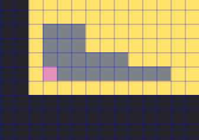
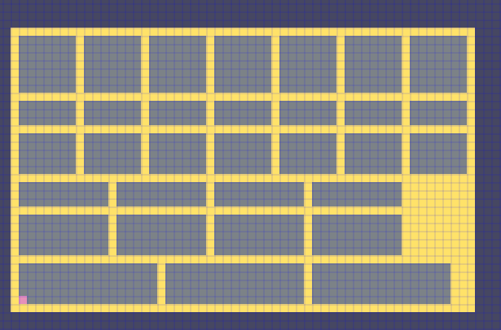
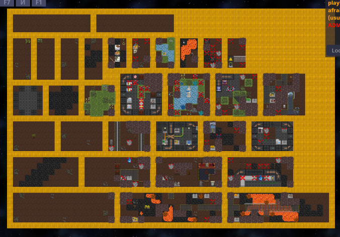
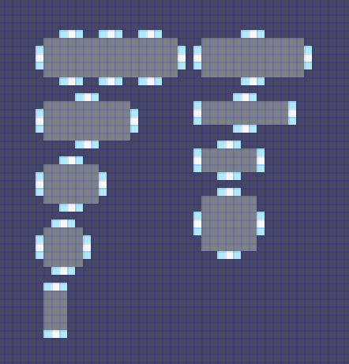
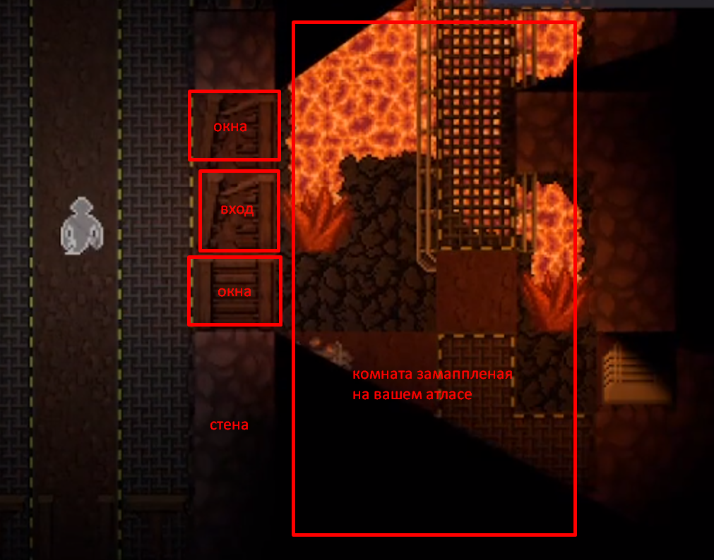

# Как создать свой процедурный данж

> С соглашения eshhhed - публикую его статью (гайд).

# Введение

У вас есть возможность создавать собственные шаблоны для процедруных данжей, которые будут генерироваться на планете. Тема интересная, и тут я объясню как с этим работать.

Создание ПРа с новым теймплейтом данжа концептуально разделено на 2 части:
## 1 - Настройка прототипа данжа.
Тут процедурки и индексация комнат на маппинг-атласе. Тут так же входят параметры генераций коридоров, стен, рандомных окон наружу, дверных проемов и всего остального, чего нет на атласе.
## 2 - Маппинг данжен-атласа. 
Тут чисто работа для мапперов, включающая в себя только маппинг внутреннего содержимого комнат.

О первой части тут статья не будет расписана, пока что. Только о второй.

# Правила создания маппинг атласа

Создаем новую пустую карту, и в 0 координатах мира располагаем следующую схему, где розовый пиксель является координатами `0*0`



Весь маппинг идет в плюсовые координаты, то есть вверх и направо.
Атлас представляет из себя набор из комнат, в любом порядке и форме расположенный на одном гриде. Для удобства ориентации, оффы используют ярко желтую плитку для разграничения комнат, и группируют комнаты определенных размеров рядом.



Пример шахты:



Необходимо чтобы на атласе было минимум один (а лучше больше) комнат каждой из следующих форм:

```
# 17x5
# 11x5
# 7x5
# 5x5
# 3x5

# 13x3
# 11x3
# 7x3
# 7x7
```
Важно понимать: Комнаты НЕ ВКЛЮЧАЮТ в себя стены. Стены, окна и шлюзы вокруг вашей комнаты будут генерироваться процедурно. Это влечет за собой несколько правил касательно содержимого ваших комнат

1) Не маппить внешние стены комнат, если это не сделано специально (на моем примере можно видеть аварийные капсулы со стенами. В итоге, эти комнаты закопаны за обычным слоем земляных стен)
2) Если вы хотите чтобы в вашем данже было электричество, вы сами проводите НВ кабеля в рамках комнат, и делаете комнаты в которых есть источник питания, подстанции, смесы, и НВ провод, выходящий во все стороны. НВ провода автоматически соединят все ваши комнаты по данжу, соединив все ЛКП в единую НВ сеть, в том числе и источник питания
3) Не мапить много повергейм лута. Не маппить мобов. Ценные предметы генерируются и раскидываются по данжу процедурно, так что маппим только интерьеры и какие-то тематические вещи, которые можно и на станции встретить.
4) С каждой стороны вашей комнаты должен подразумеваться вход. Вход представляет из себя 3 тайла: 1 тайл шлюза, и 2 тайла окон по бокам.
   ```
   Здесь пока не понятно точно, но генератор кажется ищет точки входа из свободных краев в комнате. Но НЕЛЬЗЯ делать одну сторону плотно застроенной, вход все равно может оказаться там, и будет вести тогда игроков в стену
	```



Тип входов, стен, окон возле стен и всего остального - настраивается в прототипе, и там я буду играться уже сам.

Пример того что я сделал с шахтой:

Смотреть примеры конкретных замаппленных атласов можно по `Maps/Dungeon/Experimental` или `Maps/Dungeon/LavaBrig`
Сохранять атлас нужно как шаттл, то есть через `savegrid`