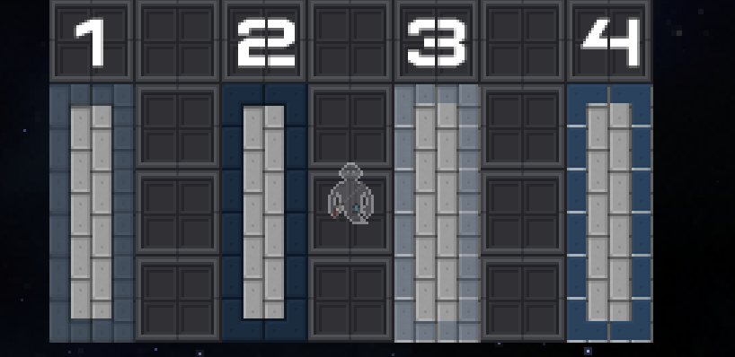
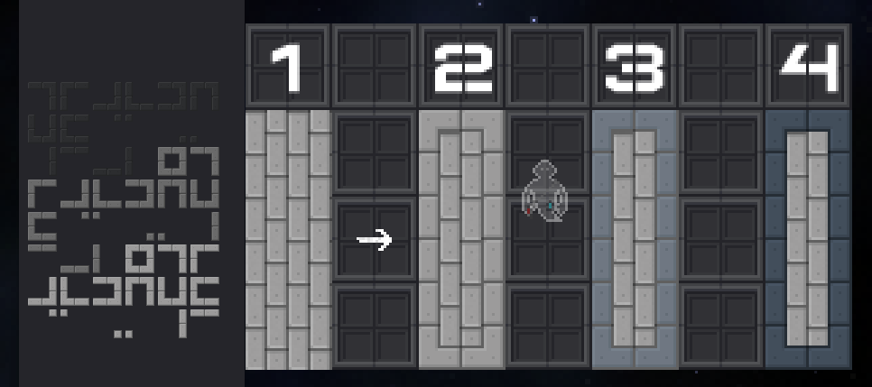
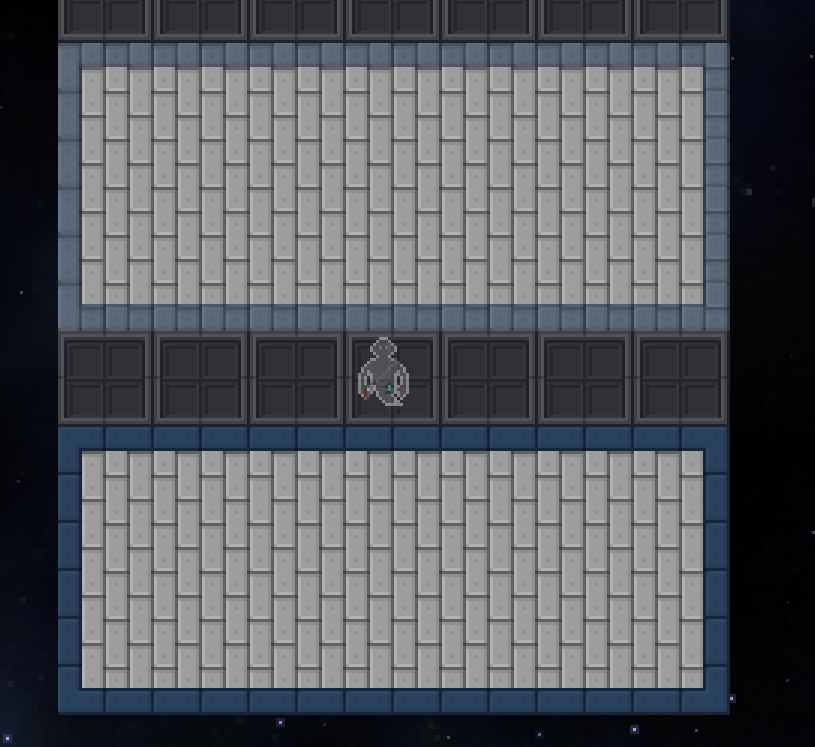
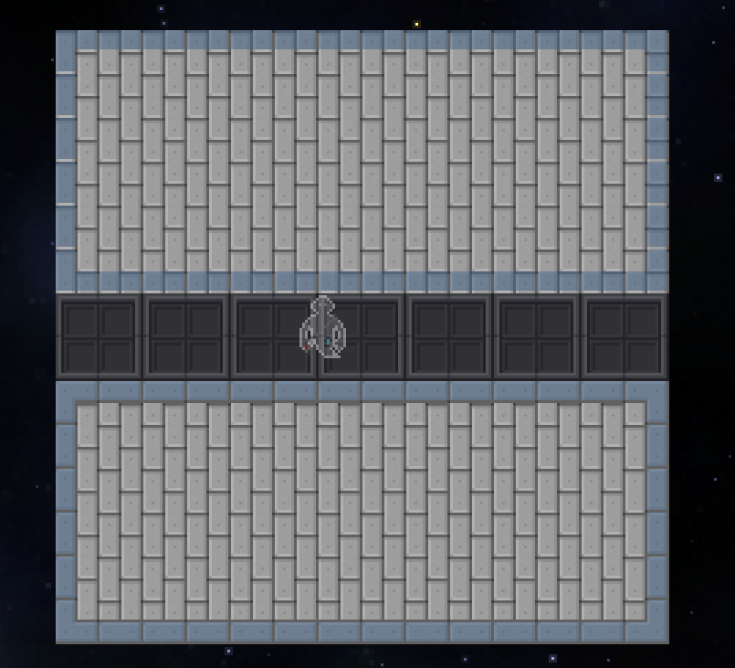

# Как научиться красиво декалить?

Итак, вы захотели украсить свой прекрасный пол декалями! Но вот незадача, скорее всего произойдет один из четырех нижних вариантов:

1. Вы поставите нужную вам прозрачность (70%), но на выбранной плитке это будет смотреться плохо из-за кривого наложения.
2. Тогда вы решите повысить плотность до максимума (100%) из-за чего теперь декаль становится слишком перенасыщенной, тоже плохо.
3. Вы попробуйте взять другую декаль и сделать её еще прозрачнее (40%), но к вашей плитке она тоже не подходит.
4. Повторяем трюк с повышением плотности (100%) и снова получаем перенасыщенную декаль, пусть и смотрится она лучше чем предыдущие варианты.

Что же делать? Выход есть! 

Прежде чем укладывать цветную декаль, поставьте поверх вашей плитки (в моем случае кирпичной) НЕПРОЗРАЧНУЮ ДЕКАЛЬ ПЛИТКИ (они на скриншоте):

1. Плитка без этих декалей.
2. Плитка с этими декалями.
3. Как мы видим, поверх этих плиток идеально ложится полупрозрачный (40%) нам вариант.
4. Точно также как и в предыдущем пункте, более яркая декаль (70%) хорошо смотрится, при этом не будучи перенасыщенной.

Пример с прозрачностью 100%.

Сначала мы ставим например 58, видим что стоит некрасиво и повышаем до 100%.
Как итог, плитка конечно стоит как влитая, но перенасыщенная.

А вот НАГЛЯДНО, как меняется внешний вид, если перед покраской добавить простые плиточные декали и уже поверх них ставить нужную декаль с нужной прозрачностью.

> Автор методики и руководства: Vnoeg