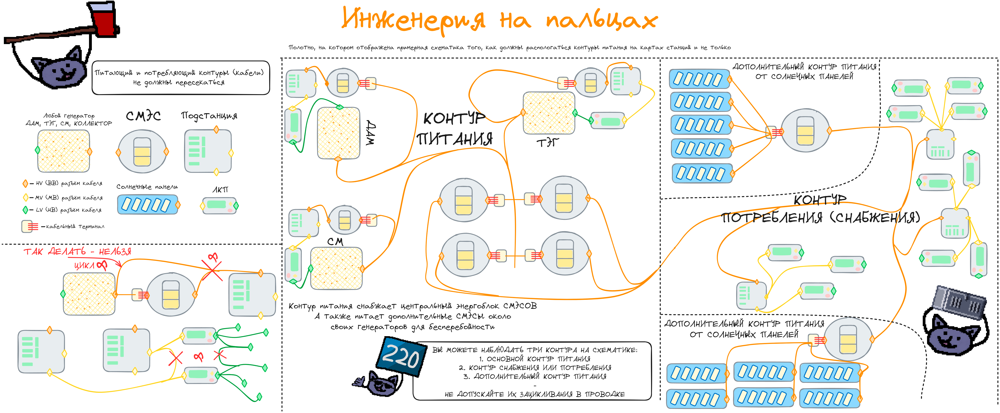

# Как прокладывать электропитание

Чтобы разобраться в электропитании космической станции - не нужно иметь несколько высших степеней магистратуры. Всё довольно базово, а в формулы и расчёты мы не углубляемся. Так что с тем, как заставить станцию светиться - разберётся даже школьник.

## Основы

Начнём с базы:
Есть **источники питания** - это различного рода двигатели, генераторы, большие конструкции, космические явления и так далее. Они питают аккумулятивные приборы.

Аккумулятивность отражается больше всего в **СМЭСах** - устройствах, что сохраняет в себе большое количество заряда и снабжают станцию. Саму аккумулятивность имеет каждое устройство на станции, что относится к энергетики, то есть: СМЭСы, Подстанции, ЛКП. Однако СМЭСы предназначены именно как объект энергохранилища.

**Подстанции** же в этой цепочки нужны лишь для перемены тока и дополнительного энергохранилища между СМЭСом и ЛКП.

А вот **ЛКП** представляет собой источник питания приборов в округе посредство проводки к ним низковольтных проводов.

**Провода** бывают разного вольтажа: ВВ - **Высокий Вольтаж**, СВ - **Средний Вольтаж**, НВ - **Низкий Вольтаж**. Они соответственно отличаются цветом и видом, ВВ - оранжевые, СВ - жёлтые и НВ - зелёные.

### Принципы прокладывания

Давайте в первую очередь сгребём все возможные источники питания, кроме пары исключений (пакманы) под одно условное - **Двигатель**, как мы это сделали во втором абзаце. Двигатель, это и ДАМ, и СМ, и Тесла, и Сингулярность, и РИТЕГ, и ТЕГ, и Генератор - любой.

В большинстве случаев двигатель поглощает что-либо, а взамен отдаёт электроэнергию. Вывод электроэнергии происходит либо с условного главного элемента двигателя, либо с "сборщиков", либо с самого устройства, например:

- Сборщиками бы являлись: коллекторы радиации, катушка теслы
- Главными элементами: центральная часть ТЕГа, Контроллер ДАМа
- Сами устройства: РИТЕГ, Генератор, разные виды ПАКМАНов, солнечные панели

Соответственно, под эти объекты нужно помещать провод, чтобы провести от двигателя электропитание до СМЭСа и запустить аккумулятивные свойства последнего. Располагать нужно ВВ (оранжевый) провод практически всегда, если не указано обратное (смотрим описание ПАКМАНов). 

Помимо этого, недостаточно просто провести *оранжевую змейку* от двигателя до СМЭСа.
Чтобы СМЭС начал питаться, нам требуется **Кабельный терминал**. Выглядит он как маленький порт, что имеет ряд красных проводов, направленных в одну из сторон.

Кабельный терминал мы размещаем **красными проводами к СМЭСу**. Под кабельный терминал прокладываем ВВ провод от двигателя. Таким образом мы подключаем питание к СМЭСам. 

Уже от самих СМЭСов мы протягиваем питание до Подстанций, устройств, что разделяют нашу станцию на логические сектора/отделы, и также являются некой буферной зоной для электропитания. Ведём питание мы также при помощи ВВ провода, он должен начинаться под СМЭСом и заканчиваться под Подстанцией.

По такому же принципу проводится СВ (жёлтый) провод от Подстанций до ЛКП.
НВ (зелёный) провод подводить под абсолютно каждый прибор и шлюз - не нужно. Он запитывает все устройства вокруг себя в радиусе 3 блоков. Его начало вы должны расположить под ЛКП, а продолжение раскидать удобным образом по комнате или другому пространству. 

Воспользуйтесь следующим изображением, чтобы рассмотреть на интуитивно понятном примере то, как работает схема электропроводки станции. Сохраните себе как шпаргалку.

*Откройте изображение при помощи ПКМ - Открыть в новой вкладке, чтобы просмотреть более детально.*

### Деление на сектора

Собственно, как и в реальной жизни, весь дом не работает лишь от одного щитка в парадной. Как вы можете знать, в многоквартирных домах **на каждом этаже** имеются щитки, а также предохранителе в самом доме. *(Честно, пример плохой и не приводите его реальным электрикам или инженерам, используйте только для личного понимания или представьте что-то другое, более близкое вам. За подобную аналогию душнилы загрызут)*

Собственно также и на станции, для каждого отдела идёт своя подстанция, для каждой комнаты, своё ЛКП. Но начнём по порядку.

---
Двигатели. Тут всё просто, их количество соразмерно карте. Если карта большая, то и множество двигателей - лишь плюс. Если нет, то не стоит "*впихивать невпихаемое*".

---
СМЭСы. В основном располагаются в специальной комнате в инженерном отделе. Там их, как я называю, центральный энггергоблок, то есть основной массив СМЭСов, что питает всю станцию. Однако. СМЭСы могут также располагаться около двигателей, для обеспечения собственного бесперебойного питания двигателя. Здесь под двигателями подразумеваются: солнечные панели (1 на массив), СМ, ТЕГ, Тесла/Синга. Другим зачастую оно не требуется. Некоторым особо крупным отделам можно выделить собственный СМЭС, но это делается в крайне редких случаях. Лучше обратиться к куратору или ведущему мапперу перед тем как размещать подобное.

---
Подстанции. Подстанций размещается гораздо больше. В практике большинства карт, на каждый отдел есть по минимум одной подстанции, и редко больше. Подстанции размещаются в технических тоннелях, смежных к отделу в специальных инженерных коморках. Подстанции также могут не быть привязаны к отделу. Так например, они могут размещаться в хранилище боеголовки, около генератора гравитации или станционного якоря (питающие только их ЛКП).

---
ЛКП. Здесь всё просто. Идеально, когда вы не тыкаете на каждом повороте ЛКП в коридоре, но и не привязывается всю станцию к одному ЛКП. Размещая ЛКП для коридоров, акцентируйте внимание на их плотность и массовость. Если стандартных размеров отдел можно обойти вокруг, то обычно для такого пространства хватает двух ЛКП.

Если же отойти от темы коридоров, то в помещениях ЛКП ставится практически везде. Очень часто используется методика, при которой ЛКП ставится по одной на каждое помещение, за исключением малых пространств или смежных комнат. Например малая кладовка, которая не имеет большого пространства внутри, не требует ЛКП и может быть запитана ЛКП с коридора этого отдела. По аналогии можно запитывать смежные кабинет и каюту главы под одно ЛКП. Учитывайте - ЛКП, это предмет, который может и будет использоваться антагонистом. От того, где вы его поставите - зависит свободность прогулки антагониста по отделу, так как он может его разобрать или переключить.

ЛКП не рекомендуется ставить на соседней от шлюза стене или впритык к другому лкп, даже если они направлены в разных помещения, но размещаются на одной стене. Первое может образовать круги из проводов, а также выглядит неэстетично в планировке. Второе может зациклить разные контуры НВ, из-за чего могут возникнуть конфликты и сбои двух контуров.
ЛКП не рекомендуется загорождать. Помним, что это один из самых наиболее используемых настенных предметов, а потому вероятнее всего ваш красивый стеклянный стол под ЛКП, очень забавно разобьёт технический ассистент своим лицом и скрутит инженер.

### Двигатели и их схематики

Рассмотрим сложные двигатели и то, как маппить их схематики. Здесь будем учитывать, что я привожу идеальный вид схематики двигателя, в котором **присутствует все элементы** для работы двигателя.

Вам же, как мапперу, предстоит разбирать спроектированную схематику по частям, заменяя или пряча что-либо, что бы у игрока был вызов дособрать преподготовленную конструкцию двигателя и запустить последнюю. 

---
!!! quote

    Дальнейшая часть раздела - всё ещё в разработке. Однажды тут появится актуальная информация.
---

#### ДАМ

#### Клетка Сингулярности

#### Клетка Теслы

#### СМ

#### ТЕГ

#### Солнечные Панели

---
Чтож. Основам мы обучились. А теперь о полезном.

## Что такое оверчардж, как его настроить?

