# С чего начать. Основы.

## Что такое маппинг? 

!!! quote "[Wiki](https://ru.wikipedia.org/wiki/%D0%94%D0%B8%D0%B7%D0%B0%D0%B9%D0%BD_%D1%83%D1%80%D0%BE%D0%B2%D0%BD%D0%B5%D0%B9)"

    Дизайн уровней (англ. level design, environment design) или маппинг (англ. game mapping) — дисциплина в разработке компьютерных игр, которая включает в себя создание уровней для игр — локации, миссии, задания и прочее окружение. Обычно это делается с помощью редактора уровней, предназначенного для создания уровней в играх.

Простыми словами, **маппинг, это процесс создания игрового пространства**. Далее маппинг будет обсуждаться только предметно по игре Space Station 14 (далее SS14). Однако основные базовые навыки могут применяться ко всем подобным играм и ко всему процессу дизайна уровней в целом.

Любительский маппинг начинается, когда вы приступаете к созданию чего-то простого. Постройка шаттла, перестройка любимого отдела, создание первых комнат, уровней. 

Профессиональный уровень же следствует о приобретении комплексных навыков создания уровней. 

* Умение зонировать уровни согласно игровому процессу и его **функциональности**;
* Аналитика игровой ситуации, в которой используется игровой уровень, **логичное** наполнение;
* Планировка уровня, архитектурный, ландшафтный дизайны, **красота** и **баланс**;
* Умение **наполнять** пространство объектами интереса для создания неоднообразности уровня;
* Работа со сложными техническими **инфраструктурами** маппинга;
* И конечно же важное умение **планировать** процессы работы.

### Функциональность

Каждое помещение уровня должно быть функциональным. Это касается, как объектов внутри, так и самого предназначения уровня. Если речь о комнатах отделов, то она не обойдётся без функционального объекта отдела, но не должна тянуть на себя одеяло других отделов. Уровню всегда необходима цель. Иногда цель может быть конкретной, в других случаях общей, например когда разделяются отделы на комнаты по процессам работы в отделе, или когда шаттл разбивается на отсеки.

- #### Примеры нефункциональных комнат:
  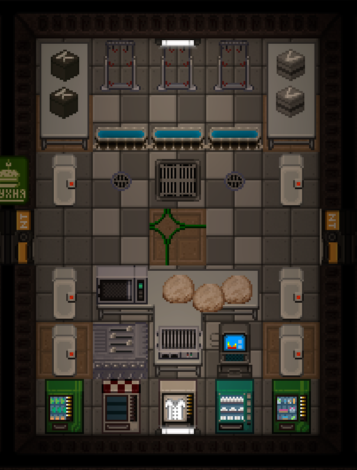
- #### Примеры функциональных комнат:
   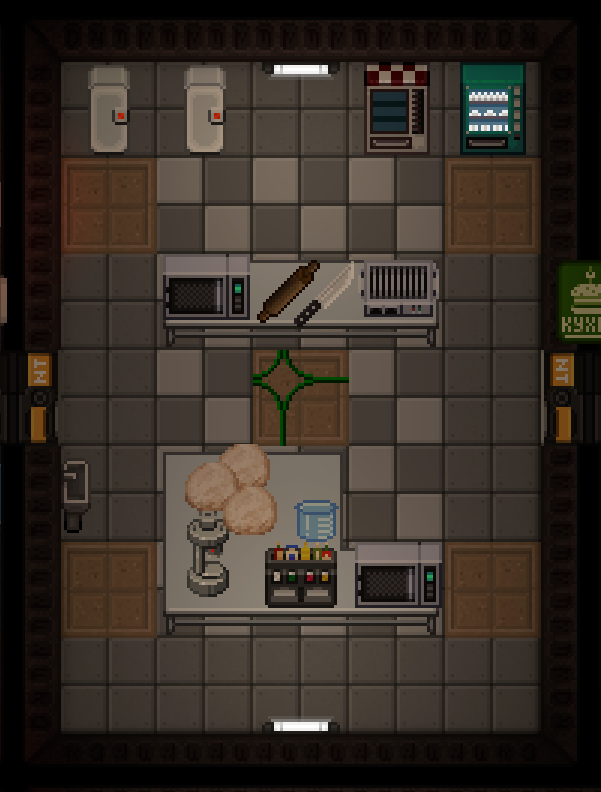

### Логичность

Расстановка объектов каждого помещения вашего уровня должна соответствовать базовой логике. Самое часто нарушение этого критерия - расстановка предметов в сложнодосягаемых местах и лампы в лампах.

Самый простой способ избежать таких ошибок - представлять, как бы выглядело это помещение в реальной жизни.

- #### Примеры нарушения логики:
  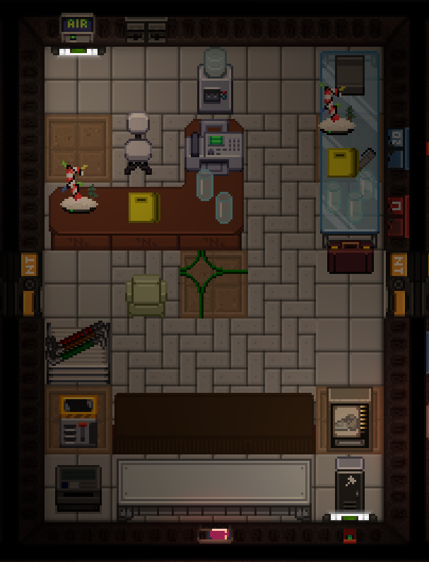
  
- #### Примеры сохранения логики:
  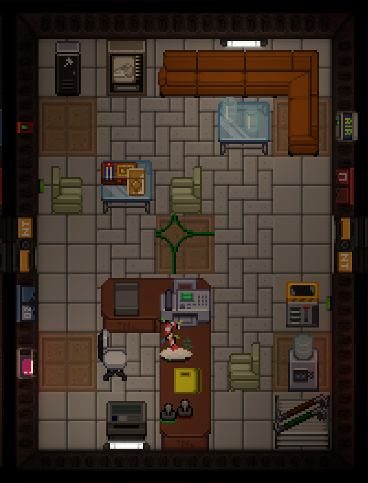
  

### Красота

Умение делать грид красивым – это удачное использование декалей, декоративных объектов (растения, плакаты и т.д.) и разнообразия пола.

Важно использовать эти инструменты в нужной мере - в малых помещениях стоит использовать их в меньшей мере, но также важно не перебарщивать с этими инструментами. Я рекомендую, чтобы в одном помещении было не более 3-х основных цветов (цветов декалей и пола).

Правильное использование декалей - это довольно сложная для понимания начинающими вещь, которая познаётся только с опытом. Чтобы научиться качественно использовать декали, я советую потренироваться над заполнением пустых прямых коридоров, используя только декали и разнообразный пол.

Самый простой способ сделать помещение красивее – использование декалей, окрашенных в цвета отделов.

- #### Примеры плохого дизайна:
  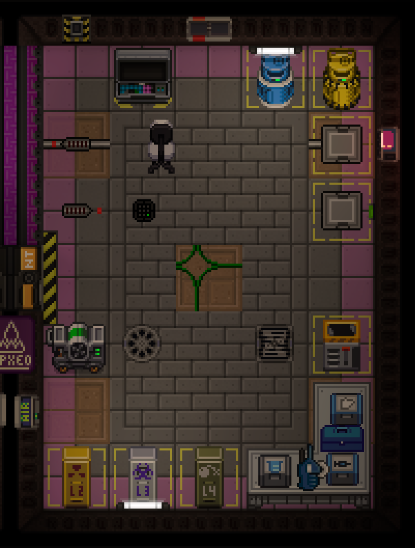
- #### Примеры хорошего дизайна:
  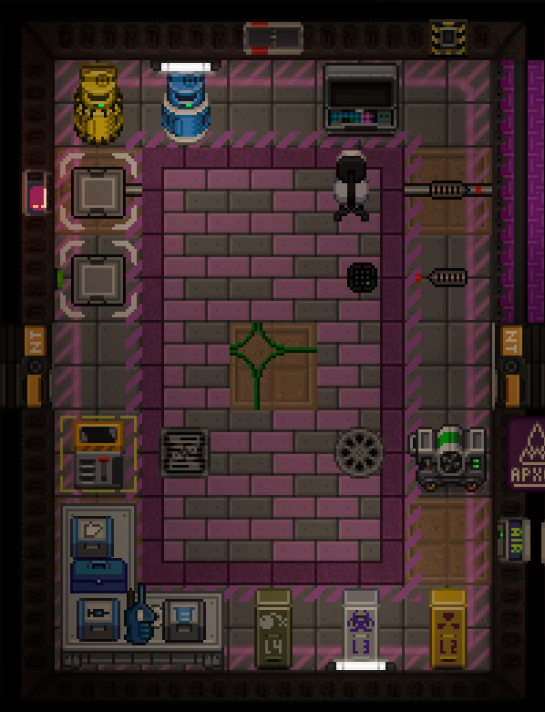

### Баланс

Важно не баловать игроков оверлутом - во всём должен быть баланс. Данный критерий редко относится к маппингу для ивентов, так как ивентёры в большинстве своем тоже мало понимают в балансе, но забывать про него всё равно не стоит. А вот при маппинге станций данный критерий очень важен.

Лутом является любой предмет, выходящий за рамки стандартного наполнения какого-либо помещения - одежда, инструменты, материалы, платы, даже мыло и красивые одеяла. И разный лут, в зависимости от его важности и редкости, должен приобретаться игроками с разной сложностью. 

Обычные инструменты могут находиться в техах на каждом шагу, а мультитул или конфигуратор должны располагаться только в труднодоступных помещениях. В одном помещении должно находиться не более 2-3х полезных предметов. Одна секретка с ящиком припасов синдиката – плохо, много секреток синдиката в разных частях станции с небольшим количеством лута – хорошо.

- #### Примеры нарушения баланса:
  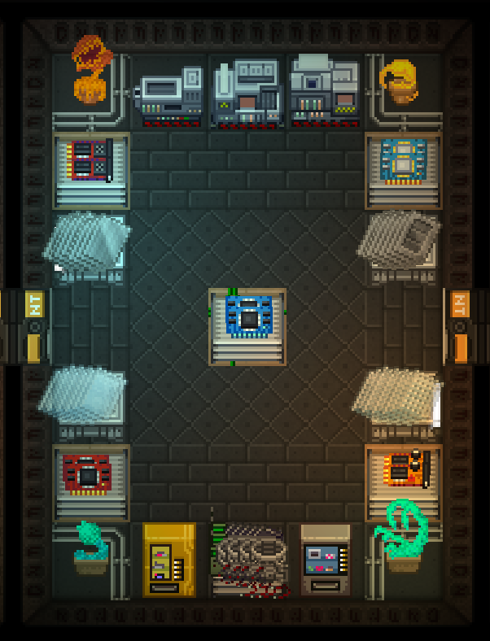
- #### Примеры соблюдения баланса:
  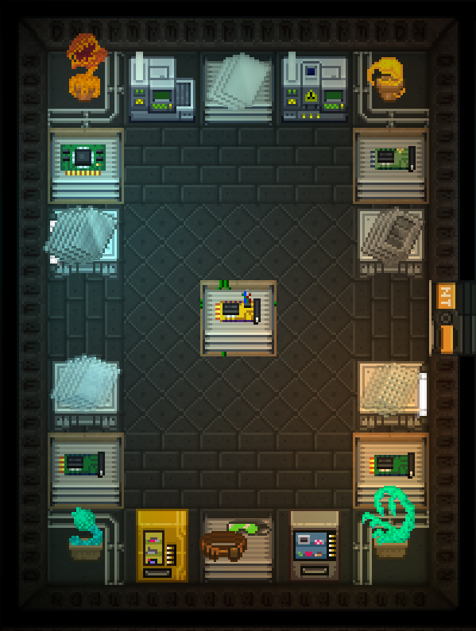
  

### Наполненность

Избегайте пустых помещений. Всё пространство комнат должно использоваться эффективно в зависимости от их функционала. Например, лобби медбея должно быть просторным помещением, где пациенты ожидают врачей, но столовая не должна иметь больших пустот.

Не нужно ставить все объекты вдоль стен, важно не забывать должным образом использовать центр помещения.

- #### Примеры плохого наполнения:
  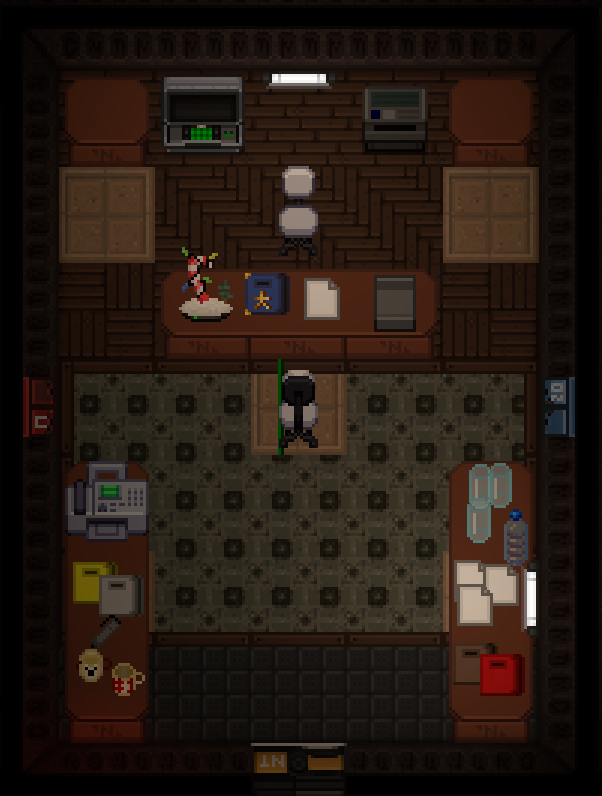
- #### Примеры хорошего наполнения:
  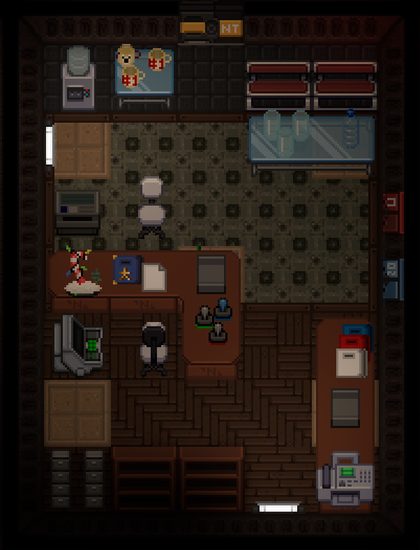

### Инфраструктура

Маппинг инфраструктуры - очень важная и неотъемлемая часть карт. Больше всего работы приходится на станционную инфраструктуру, так как в неё входят:

- Проводка всей энергетики, создание двух основных контуров (контур питания и контур снабжения)
- Размещение всех атмосферных труб по станции с соблюдением чистоты проводки
- Размещение всех атмосферных девайсов по станции (вентиляции, скруберы, сенсоры, воздушные сигнализации, пожарные шлюзы, пожарные кнопки и т.д.)
- Размещение всех утилизационных труб, блоков и качественное соединение их в систему мусоропровода
- При возможности - размещение почтовой сети при помощи утилизационных труб
- Расстановка всех камер по станции, переименование их по соответствующим логике названиям комнаты в которой они размещены
- Размещение всех видов варпов (навигационные маяки, специальные варпы Ниндзи для целей)
- Наполнение станции необходимым аварийным оборудованием, а также аварийных ламп
- Размещение всех навигационных знаков на стенах для логически верной навигации по станции
- Размещение всех необходимых спавнеров (фауна, должности, мыши)
- Размещение и переименовка всех факсов на станции

Зачастую, это очень кропотливая и изматывающая работа. По статистике, вы можете потратить на маппинг всех объектов, их украшение, декоративные особенности и сторителлинг столько же времени, сколько в следующем потратите на маппинг всей инфраструктуры.
### Планирование

Планирование - залог успешной и продуктивной работы над картой в дальнейшем. Стоит начать с концепции. Станции/другие объекты не рождаются как звёзды, у них есть история. Осознайте то, что вы строите сами. Дайте фантазии крылья и пусть она опишет вам идею, которую вы хотели бы уместить в ту постройку, что вы хотите замаппить. Именно идея позволит вам в дальнейшем совладать с тем, что вы собираетесь делать.

Может быть вы строите станцию, что ранее была заброшенным военным ангаром, где половина отделов выглядят как шаттлы, а от того на ней часто будут проскакивать элементы старых бортовых устройств и стены шаттла, а коридоры напоминать то ангарные помещения, то узкие технические перемычки. Или может ваша будущая постройка, это самый белый и самый чистый в мире аванпост, в котором содержится самое большое в космической системе хранилище органов, от чего каждая перемычка предназначена системой очистки (визуально, не обязательно добавлять исключительный функционал под карту) и даёт понимание, что грязи тут не место.

Как только у вас рождается в голове идея - конечно же запишите её и попробуйте набросать первый эскиз. Самые начальные эскизы могут быть очень простыми, 6 кругов в пэинте, пару линий, что отображают коридоры. Просто закрепите свою эскизную визуализацию так, как вы способны. Когда вы будете рассказывать другим о вашей идее, никто не сможет влезть в вашу голову и прочитать ваши мысли. Но с описанием и хотя бы самым нелепым эскизом - у вас есть шанс, что вас поймут.

В идеале, после набросков эскиза, подготовленной идеи и выставленным планом на работу. Приступить к чертежу проекта. Поверьте, подробный пиксельный чертёж поможет вам в будущем не удариться в гигантизм и реализовать строго по задумке. Отклонятся от чертежа или нет - будет уже на вашей совести во время маппинга. Главное, что он у вас есть и вы понимаете итоговый вариант.

Конечно тут не упоминаются тонкости организации работы для командных проектов, но сейчас вам знать об этом совсем не обязательно, ведь тогда бы вам пришлось понимать, как надо заводить задачи в гитхаб, как собирать команду мапперов на командный проект, по какому принципу назначается куратор карты и как вообще контролировать рабочий процесс. Не думаю, что вам это нужно, а потому по мере роста, вы и сами со временем поймёте, как работает эта система.

А вот то, что ещё не практикуется, но в будущем должно начать - открытые и внутренние дизайн документы карт. Это специальный документ, в котором описаны все используемые ассеты. Например, в коридорах определённой станции может прослеживаться конкретный узор из декалей разных цветов. Внутренние дизайн-документы должны стать опорой для командной и одиночной работы, чтобы не забывать о том, какого цвета и какие декали использовались в определённом месте. Публичные дизайн-документы нужны уже после релиза карт, так сказать для потомков. Именно по ним будущему последователю мапперу будет проще всего взяться за поддержку карты, так как ему не придётся гадать, что тут воротил маппер, когда строил свою станцию. Также в дизайн-документах могут отражаться уникальных особенности проекта, которые обязуют что-то пристраивать каждый раз, когда например ставится шлюз.
## Как начать то?

В первую очередь, вам нужно изучить статью о том, как установить локальный сервер и выдать себе на нём права. Для этого посетите [**данный гайд**](../localhost.md), а уже после возвращайтесь сюда.

Чтобы выдать себе права администратора, запустив ваш игровой сервер (включив server.bat к примеру), в случае если вы подключились с лаунчера, пропишите команду `promotehost` <`ваш ckey`>, после чего вы назначите себя "хостом". 
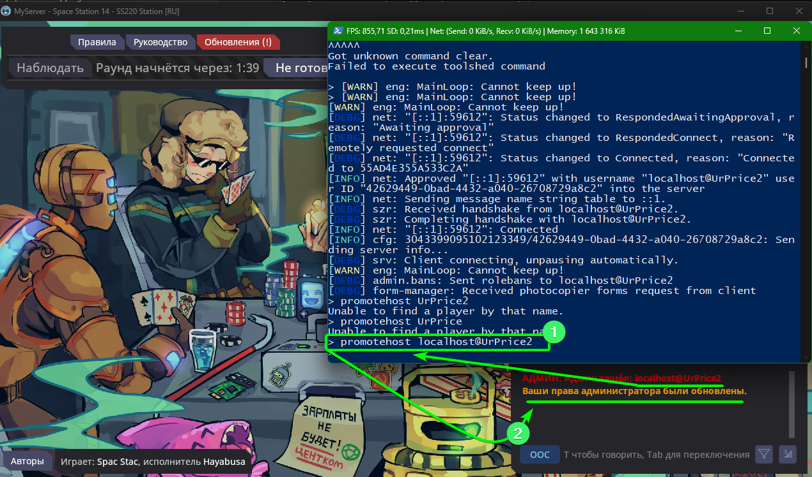

Однако это необазятельно делать, если вы запускаете клиентскую версию игры при помощи `client.bat`. 
**Запускать рекомендуется** именно `server` и `client` `.bat`.

Как только вы появились на сервере, прочитайте конечно же правила (для их пропуска можно использовать команду `fuckrules` в консоль), а после в идеале появитесь в качестве капитана на специальной станции разработки. Вот как это должно выглядеть:

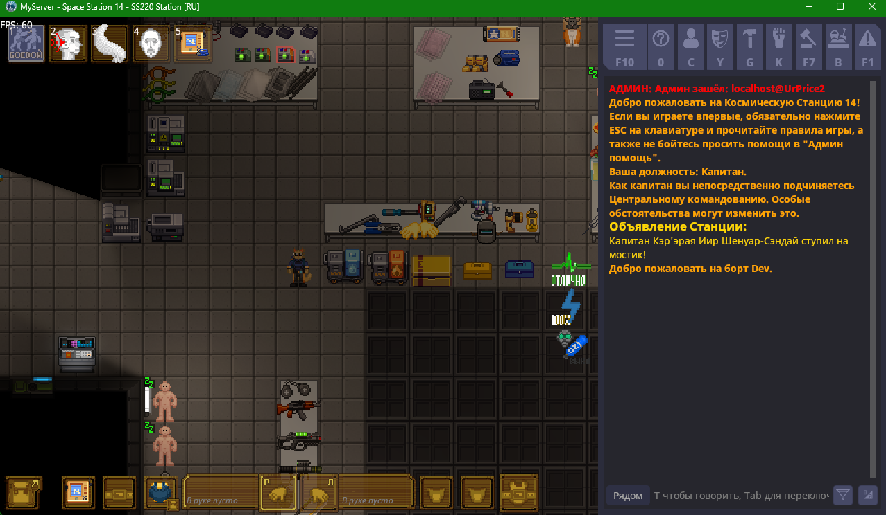

Но что если вы сделали всё как описано, однако вместо того, чтобы появиться на станции разработчиков, вы появляетесь в лобби и у вас идёт отсчёт до начала раунда. Это означает, что сейчас ваш билд (версия сервера) собран на версии Release. Это не есть хорошо, так как в этой версии спавнится очень много гридов, станций и отрабатывается обычный геймсет раунда, что может мешать маппингу. Конечно в вашу замороженную карту не прилетит метеорит, но всё же маппить на таком билде - не рекомендуется.

Для того, чтобы было всё как нужно - закройте/выключите сервер и клиент, и снова запустите консоль в корневой директории игры. Всё что вам необходимо, это пересобрать ваш игровой сервер на нужную версию, а именно **Tools**.

Для этого пропишите команду в консоль `dotnet build --configuration Tools`:
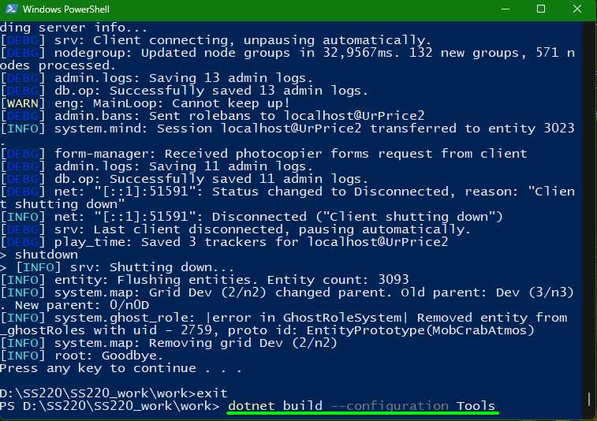

А после дождитесь успешного окончания сборки. По окончанию сборки у вас не должно быть ошибок. Если у вас они возникают - убедитесь, что вы выключили сервер и выключили клиент игры.

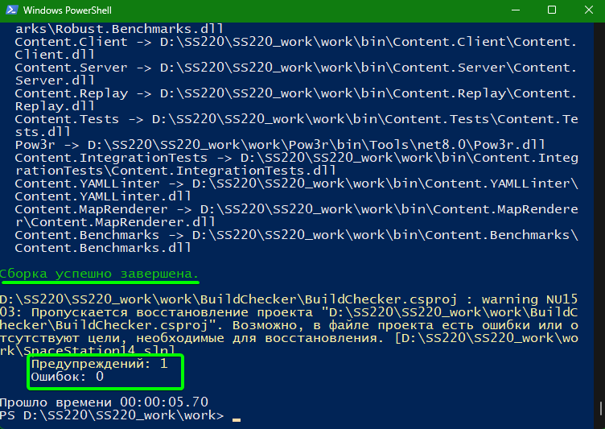

Как только вы преодолели это препятствие - вы большие молодцы. Всё что осталось, также запустить клиент/сервер и появиться на станции разработчиков.

Вот вы зашли на сервер, появились капитаном, убили пару уристов, взорвали топливный бак - всё по канонам. Что дальше? От маппинга вас отделяет лишь команда `aghost` и загрузка нужной вам карты. Весь инструментарий уже в ваших руках, всё что остаётся - это маппить.

Считайте, что вы уже начали, а чтобы освоиться с управлением, терминологией и азами работы с картами - переходите в [следующую статью](../mapping/controls.md).
## Примеры редакторов карт в других играх:

- 
- 
- 
- 
- 
- 
- 
- 

