# Как создать и установить свой параллакс

Нет какого-то единственного способа создания параллаксов, так как сам параллакс представляет из себя наслоенные изображения, что двигаются по разным степеням скорости на фоне карты. Параллаксы могут быть как космическими, так и планетарными. 

<div class="grid cards" markdown>


-  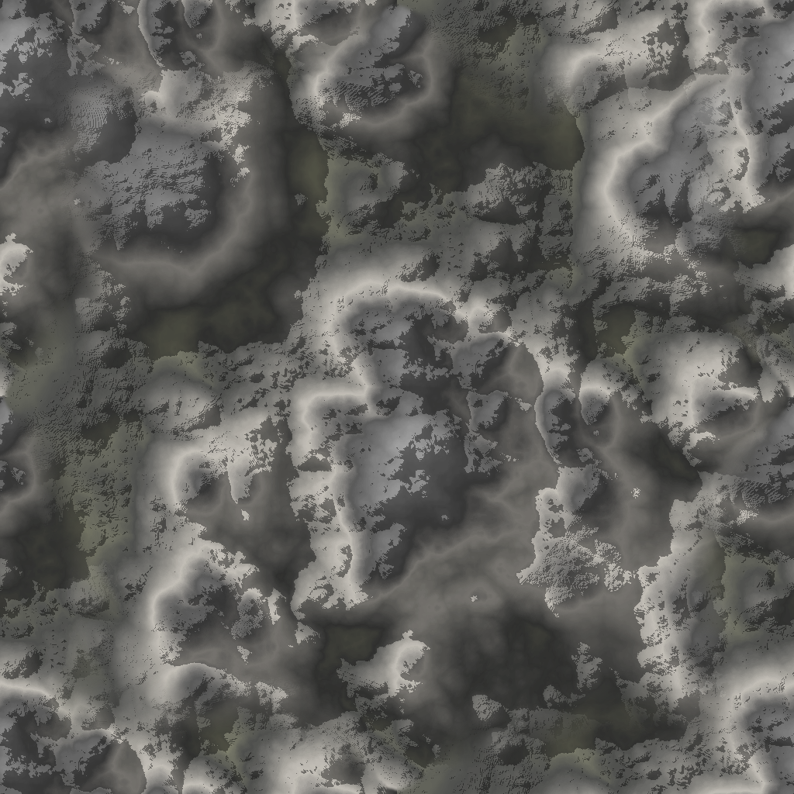
-  
-  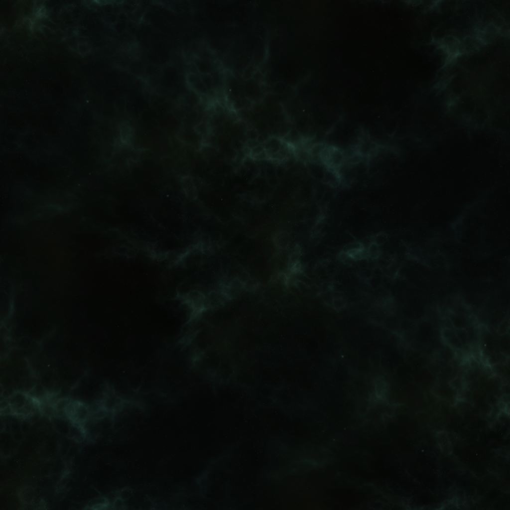
-  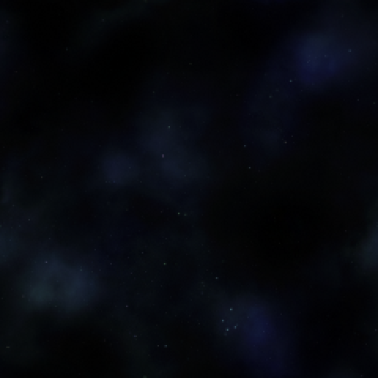

</div>

### Где находятся параллаксы?

Посмотреть список можно по прототипам параллаксов, так как все они имеют свои уникальные идентификаторы.

Ванильные параллаксы расположены по пути: `Resources/Prototypes/Parallaxes`
Наши параллаксы соответственно по пути: `Resources/Prototypes/SS220/Parallaxes`

Также представляю список текущий существующих:

```
## SS220
AstroParallax
AxiomaParallax
DonutsStation
EclipseParallax
NoxParallax

## Vanilla
AspidParallax
TrainStation
OriginStation
KettleStation
FastSpace
CoreStation
BagelStation

Sky
Dirt
Grass
Snow
```

### Как установить параллакс на карту?

Параллакс меняется при помощи изменения VV карты, поэтому изначально рекомендуется изучить [гайд по взаимодействию с VV](../mapping/vv.md). Чтобы открыть VV карты, нужно нажать F7 -> Перейти в последнюю вкладку -> Выбрать тип "Карты" и нажать ПКМ по нужной на карте, после чего "View Variables".

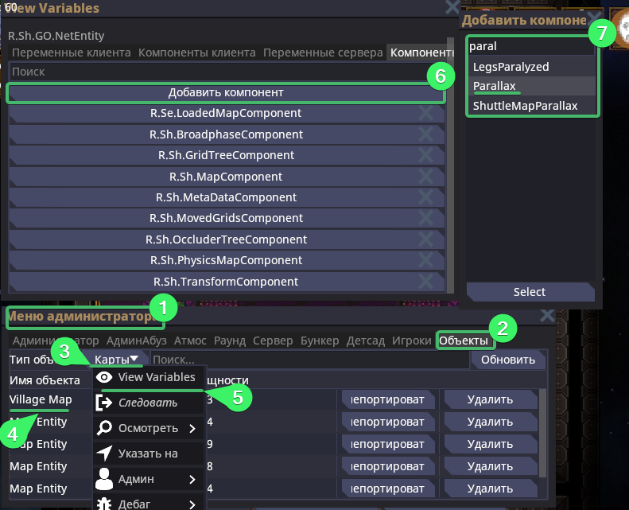

Раскрыв компоненты сервера карты, вы можете не найти компонент параллакса, поэтому его нужно добавить. Нажимаем "Добавить компонент" и ищем  `Parallax`, после чего выбираем его и нажимаем "Select".

Добавив `ParallaxComponent` и раскрыв его, вы увидите два нужных вам флага, в которые и нужно вписать ID нашего параллакса.

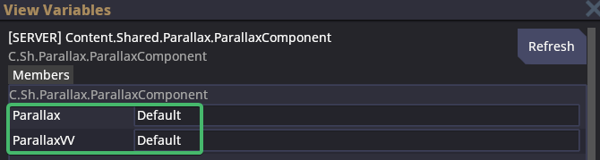

### Как создать свой параллакс?

Я расскажу лишь об одном способе. Для него нам понадобится программа ["Space Background Generator"](https://deep-fold.itch.io/space-background-generator) 

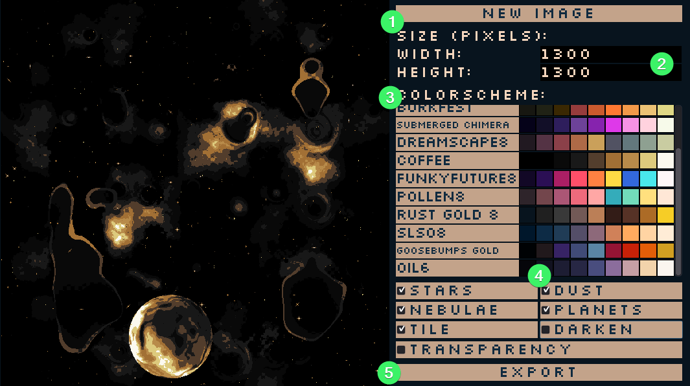

С помощью неё можно сгенерировать уникальный параллакс, настроить свою цветовую схему и экспортировать по слоям.

1. Кнопка "New Image" - регенерирует сам параллакс. Можете тыкать её пока не получится наиболее понравившийся вам результат.
2. Width - Ширина, Height - Высота, а всё вместе разрешение параллакса. Не рекомендуется использовать слишком большие параллаксы. Вероятнее всего оптимальным для вас вариантом получится параллакс 1000х1000.
3. Цветовая палитра. Можно выбрать одну из существующих, а можно полностью перенастроить под себя. Если провести довольно много времени в ней, можно создать уникальный параллакс по цвету. Однако не стоит использовать слишком яркие и акцентные цвета. Если не уверены в себя, лучше посоветуйтесь с остальными.
4. Слои. Сначала определитесь, какие слои вы хотите видеть в конечном итоге. После чего вам предстоит по очереди их переключать и экспортировать. Очень важно экспортировать с включённой настройкой `Transparency` - чтобы параллакс был на прозрачном фоне и не загараживал друг друга.
5. Кнопка экспорта изображения.
   Можете не использовать настройку "Tile" - у нас нет задачи замостить всё нашим изображением. Мы используем его полностью на весь экран.
   При экспорте слоёв, **обязательно** включайте `Transparency`
   Не забудьте экспортировать фон вашего параллакса, отключив абсолютно все слои.

Вот как слои будут выглядеть по отдельности:

<div class="grid cards" markdown>


-  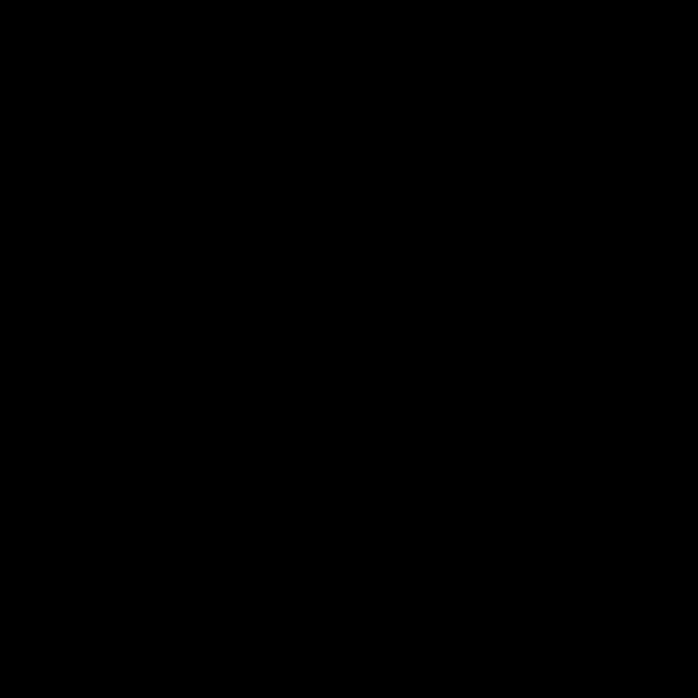
-  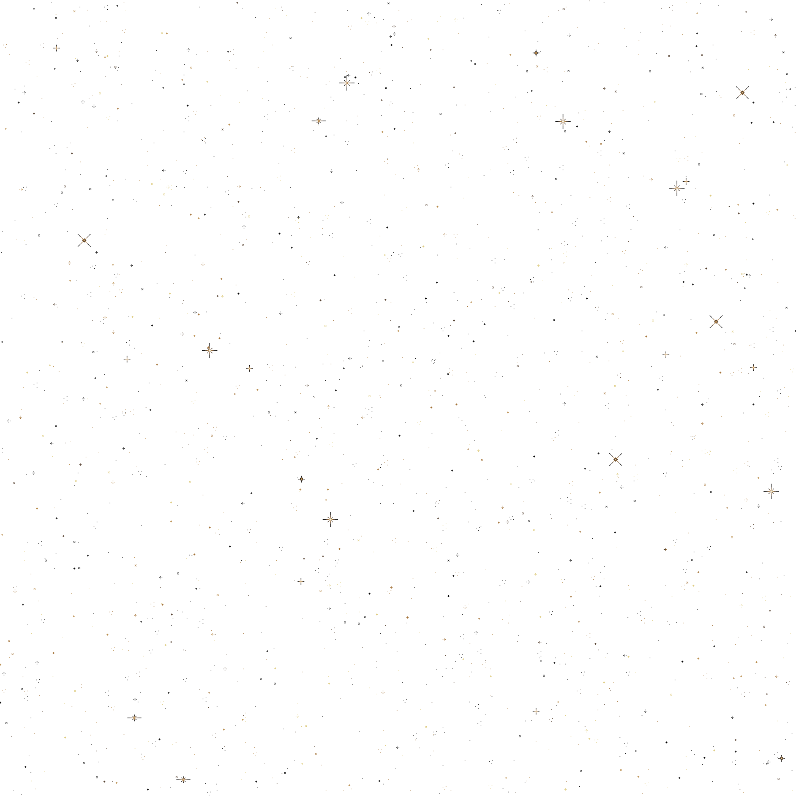
-  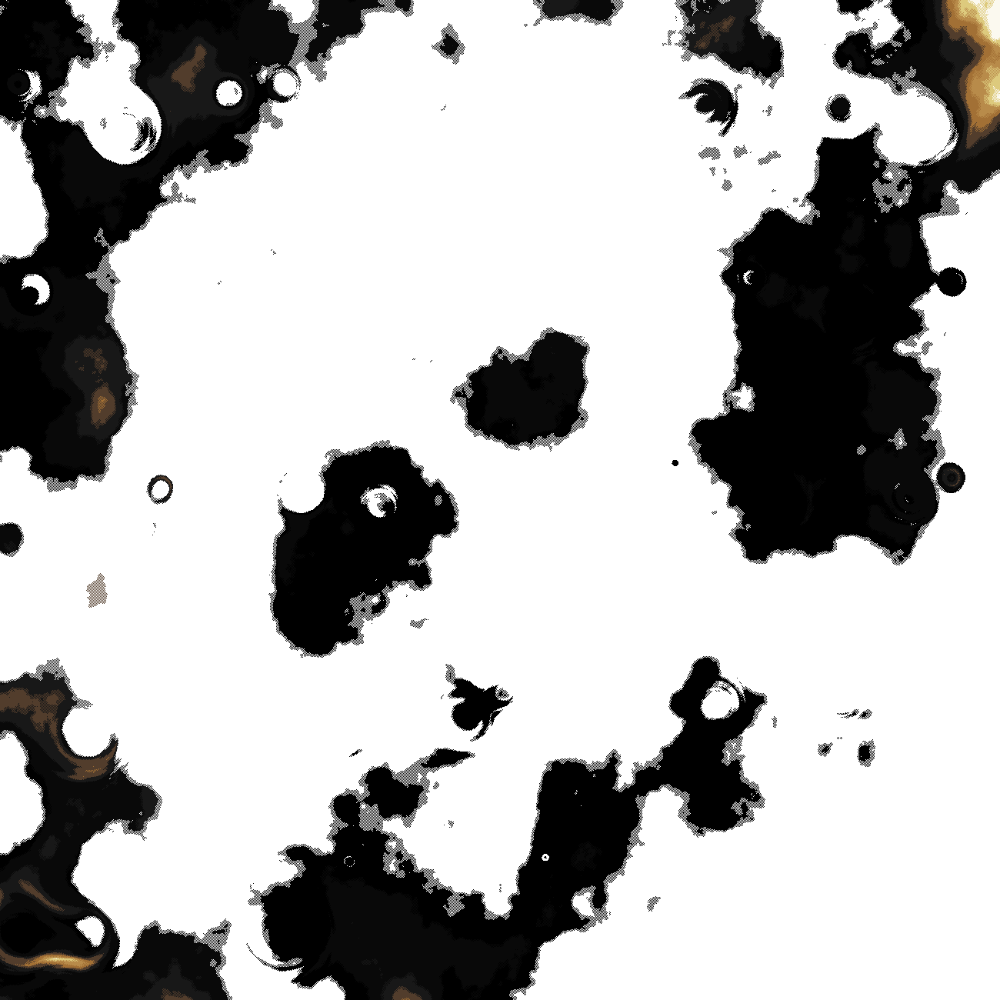
-  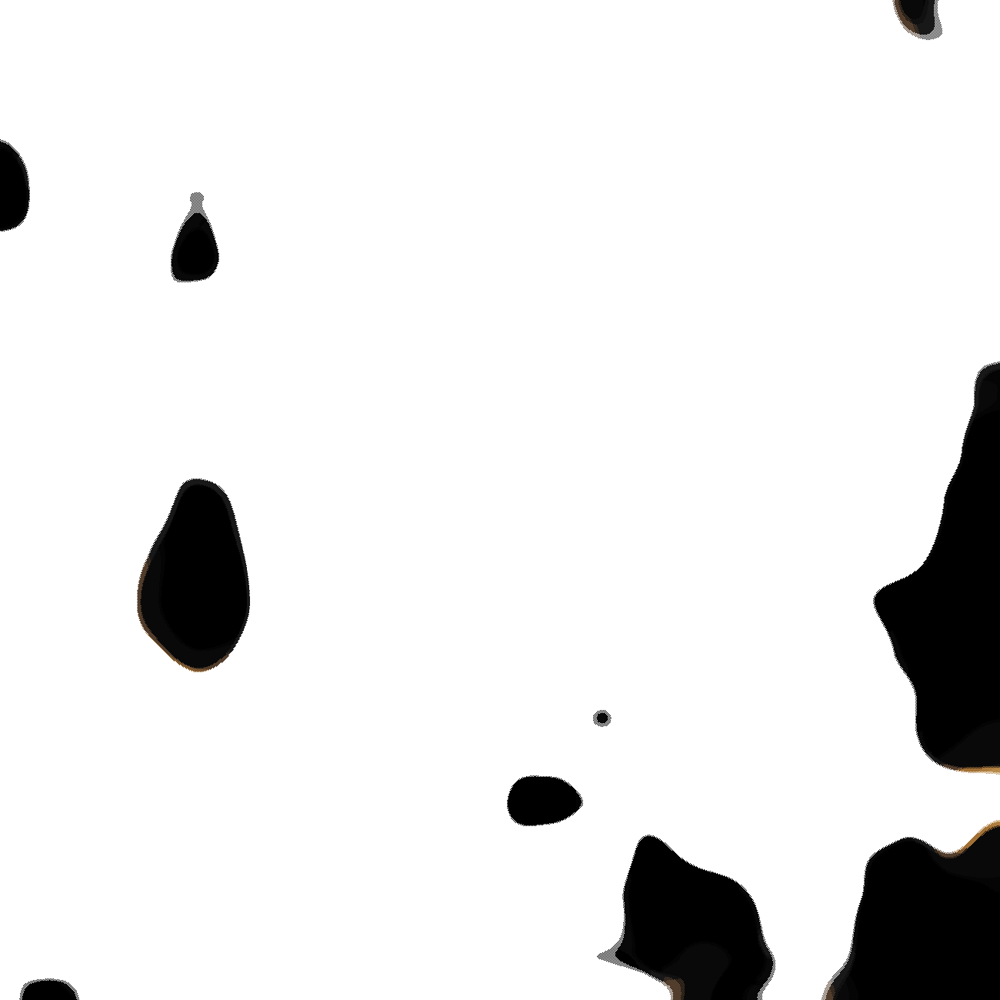
-  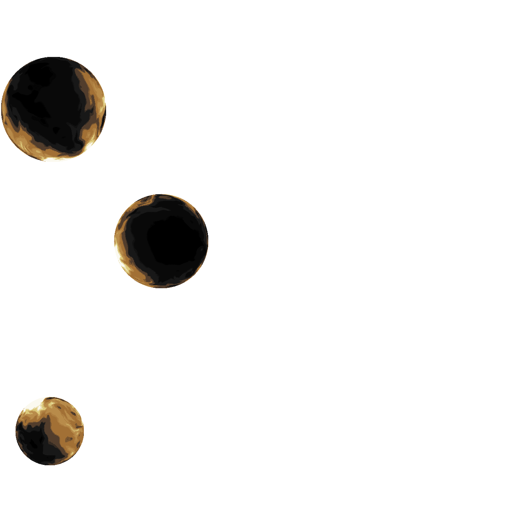

</div>

Сохраняем мы изображения параллаксов в директорию: `Resources/Textures/SS220/Parallaxes`
А наименования их примерно таковы:
```
- EclipseBackground_space.png
- EclipseDust.png
- EclipseNebulae.png
- EclipsePlanets.png
- EclipseStars.png
- EclipseStars_Background.png
```

А в файл `license.txt` дополняются наименования файлов, чтобы было указание о том, что они были сгенерированы при помощи специального сервиса: `generated from https://deep-fold.itch.io/space-background-generator`.

### Как создать прототип параллакса?

Новый файл прототипа вы создаёте в специальной директории `Resources/Prototypes/SS220/Parallaxes`

Разберём на примере прототипа Eclipse:
```
- type: parallax
  id: EclipseParallax
  layers:
    - texture:
        !type:ImageParallaxTextureSource
        path: "/Textures/SS220/Parallaxes/EclipseBackground_space.png"
      slowness: 0.998046875
      scale: "1, 1"
    - texture:
        !type:ImageParallaxTextureSource
        path: "/Textures/SS220/Parallaxes/EclipseStars_Background.png"
      slowness: 0.97
      scale: "1, 1"
    - texture:
        !type:ImageParallaxTextureSource
        path: "/Textures/SS220/Parallaxes/EclipseDust.png"
      slowness: 0.98
      scale: "1, 1"
      scrolling: "-0.02, 0.02"
    - texture:
        !type:ImageParallaxTextureSource
        path: "/Textures/SS220/Parallaxes/EclipseNebulae.png"
      slowness: 0.98
      scale: "1, 1"
      scrolling: "-0.02, 0.02"
    - texture:
        !type:ImageParallaxTextureSource
        path: "/Textures/SS220/Parallaxes/EclipseStars.png"
      slowness: 0.94
      scale: "1, 1"
    - texture:
        !type:ImageParallaxTextureSource
        path: "/Textures/SS220/Parallaxes/EclipsePlanets.png"
      slowness: 0.998046875
      scale: "1, 1"
      tiled: false
  layersLQ:
    - texture:
        !type:GeneratedParallaxTextureSource
        id: ""
        configPath: "/Prototypes/Parallaxes/parallax_config.toml"
        slowness: 0.875
  layersLQUseHQ: false
```

В `id` - вы указываете то, что в будущем будете вписывать в компоненту карты, само название.
Потом вы начинаете разбивать параллакс на слои, отделение слоёв при помощи `- texture`
Параметры `scale`,`scrolling` и `slowness` - можно экспериментировать с ними, а можете оставить как есть, делая по аналогии. 
Не обязательно иметь все слои из набора, вы можете спокойно отказаться от какого-то определённого слоя, или дополнить ещё слоями.

Главное помнить - параллакс, это фоновая картинка, и хорошо - когда она не пуста, но и не забирает на себя всё внимание взгляда. Если вы добились эффекта, в котором хочется просто сесть и понаблюдать за космосом - то с 80% вероятность у вас вышел хороший параллакс.