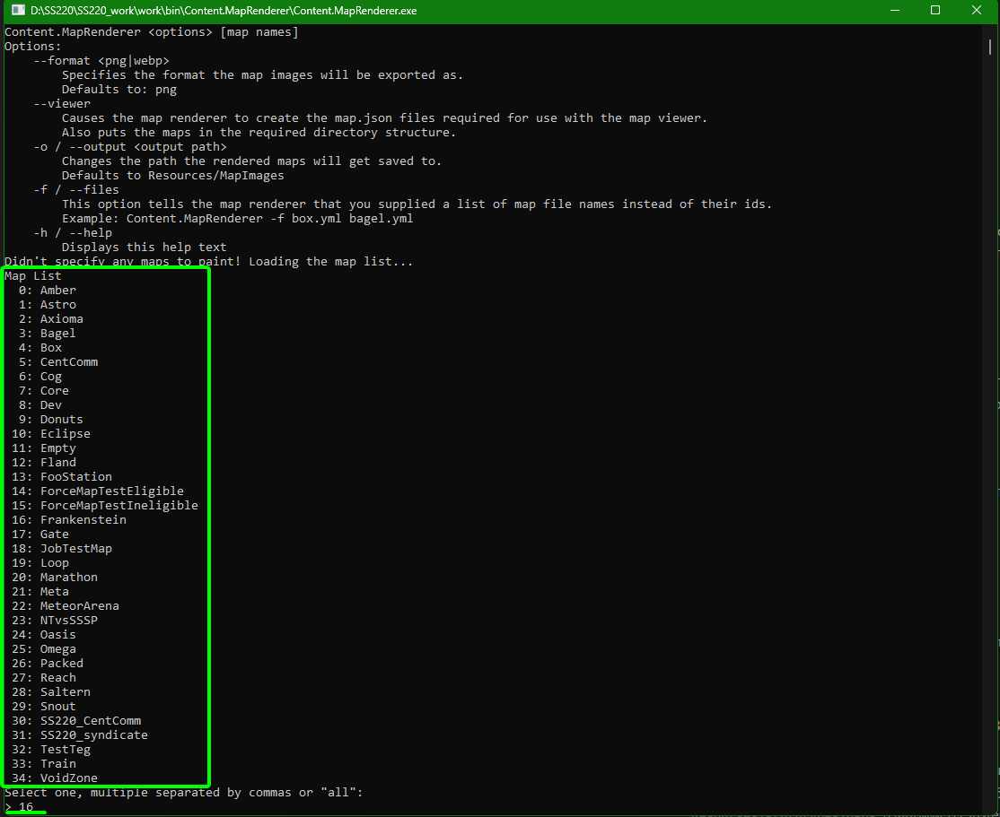
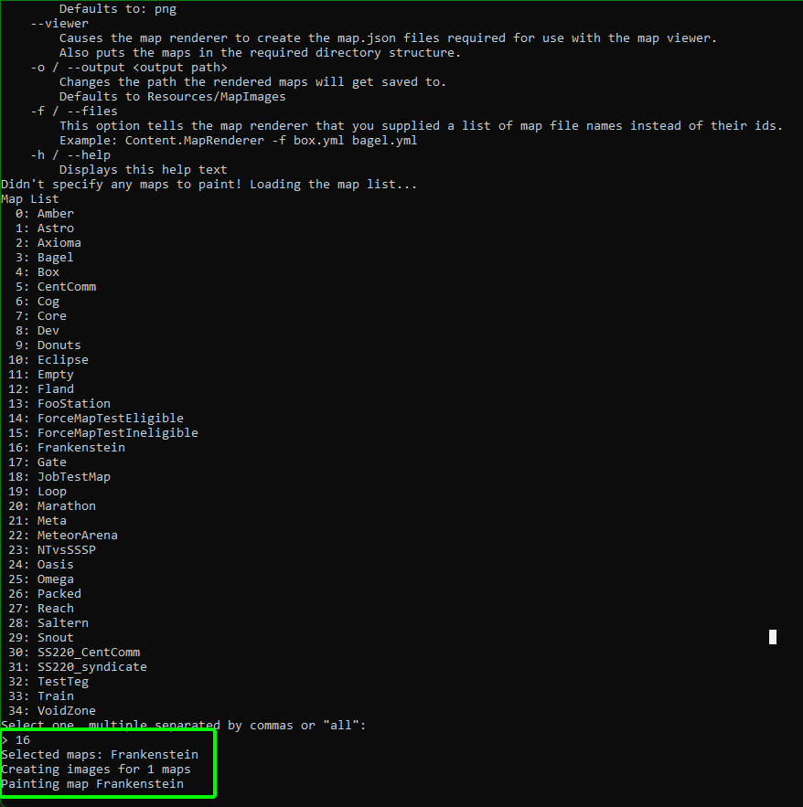
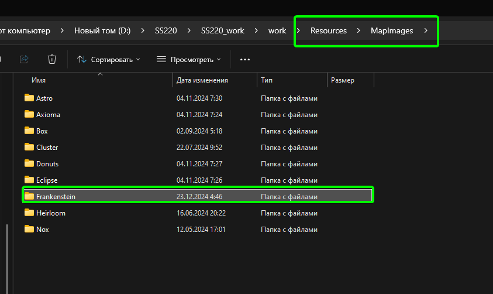
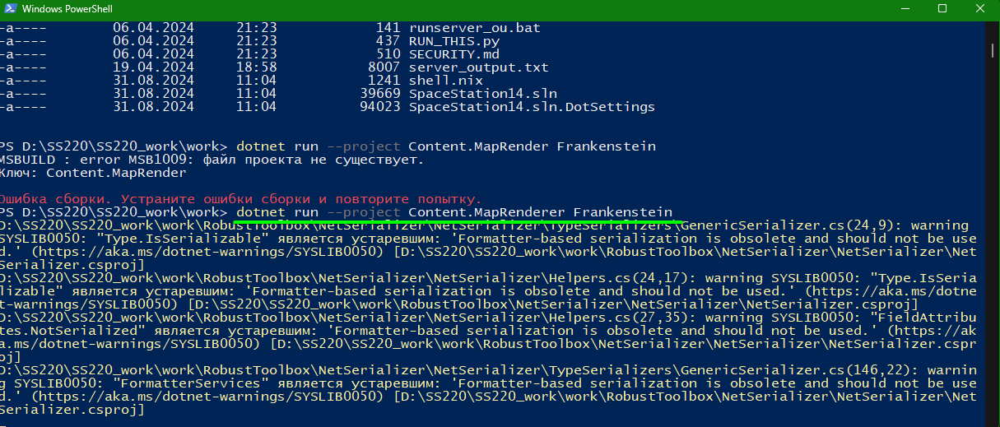
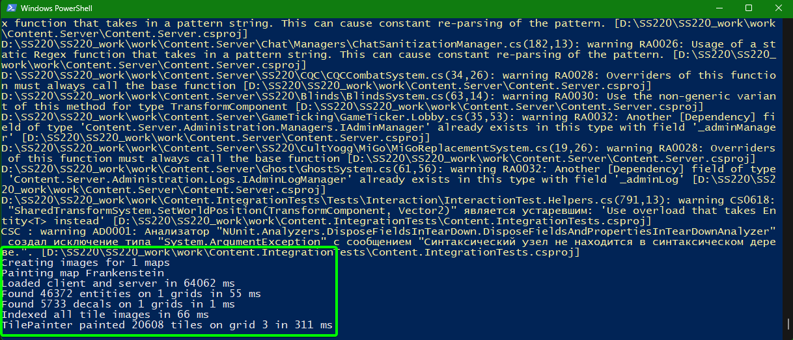
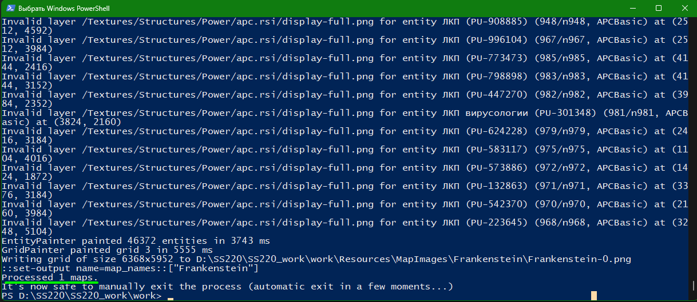
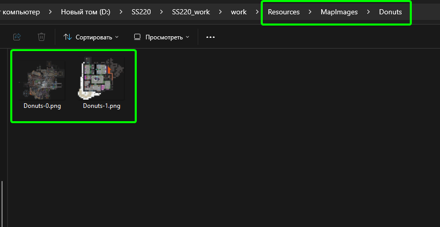

# Как сделать рендер карты

Есть 2 способа рендера карт, которые разнятся в сложности исполнения, но не в результате. Можно применять какой удобно, но рекомендуется прибегать к следующему, если в одном из способов у вас возникла ошибка.

### Рендер при помощи EXE файла

- Запускаем bin -> Content.MapRenderer -> Content.MapRenderer.exe
- Далее ждём пока загрузится список карт (процесс не быстрый) и выбираем нужную из списка (ввод номера карты в консоль).

(Момент выбора карты и список доступных карт)

(Начало отрисовки карты, после её выбора)

В этом способе вы не увидите сообщения о завершении, приложение просто закроется по завершению, поэтому проверять - успешно ли отрисовалось нужно проверяя саму директорию рендеров. Если рендера нет - переходите к следующему способу.
Но для этого способа нужно чтобы существовал прототип карты в `Resourses\Prototypes\Maps`.

Рендеры сохраняются в `Resourses\MapImages`

Поэтому если нужен рендер какого-нибудь небольшого шаттла то лучше воспользоваться 2м способом.

### Рендер при помощи консоли и без прототипа карты
 
- Сохраняем нужный для рендера шаттл/станцию как `Grid` (командой `savegrid`).
- Далее спавним (через команду `mapping` или `loadmap`) любую карту, у которой есть прототип в `Resourses\Prototypes\Maps` (Например Box).
- После этого спавним в любой точке карты свой шаттл/станцию при помощи команды `loadgrid`.
- Далее сохраняем как карту (`savemap`) -> и заменяем файл карты в `Resourses\Maps` на новый отредактированный (естественно с таким же именем и заменой файлов).
- Далее открываем корневую директорию и запускаем в ней командную консоль, как мы это делаем при обновлении локального сервера или сборки билда
- Вписываем в консоль команду `dotnet run --project Content.MapRenderer {your_map_id_here}`, где в фигурных скобках указывается  ID карты из прототипа, находящегося в папке `Resources/Prototypes/Maps/` или`Resources/Prototypes/SS220/Maps/`
- После этого сразу же начнётся рендер карты и остаётся лишь дождаться его окончания. При этом, так как мы сохранили дополнительно грид на чужой карте, мы сгененрируем рендер всей группы гридов на карте

-  
-  
-  
-  

Рендеры сохраняются в `Resourses\MapImages`

> Автор руководства Kirus59