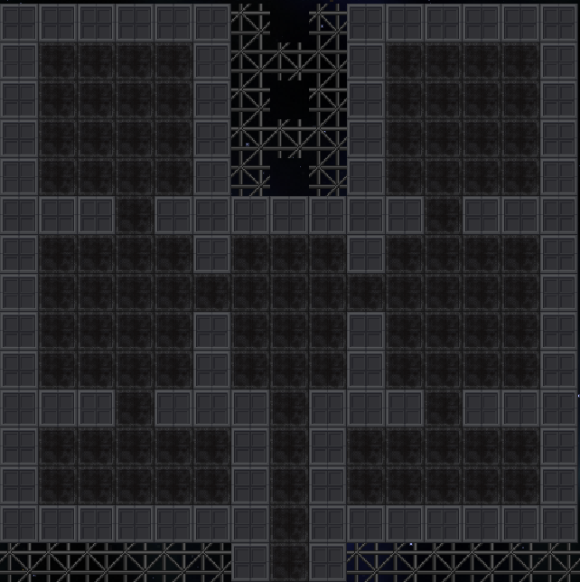
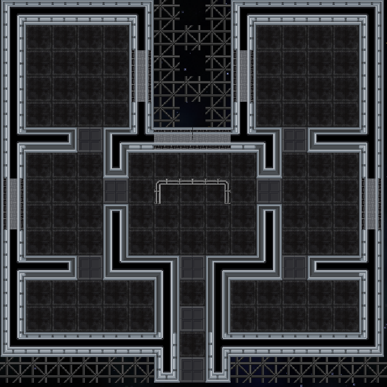
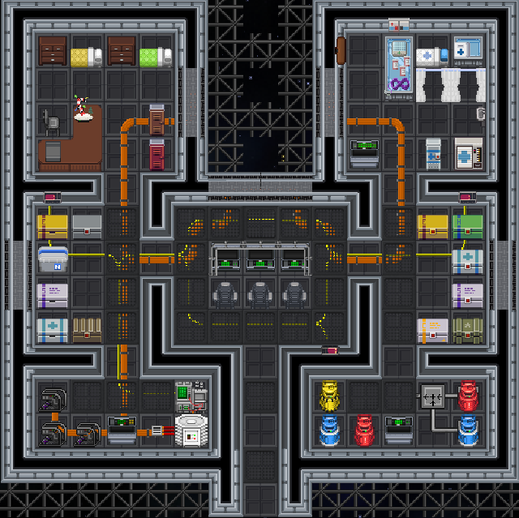
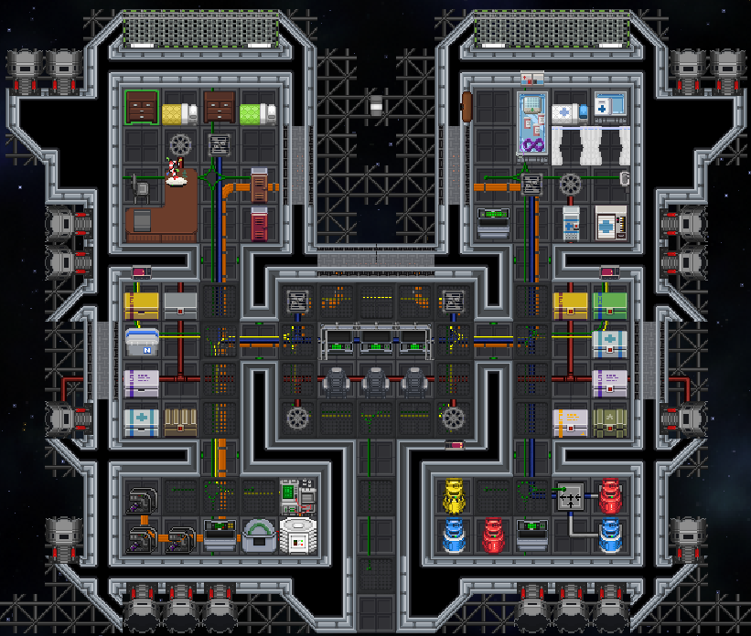
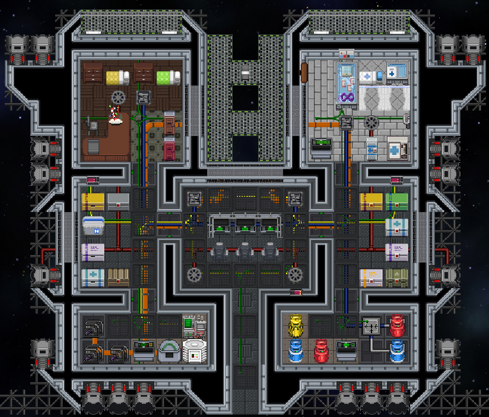
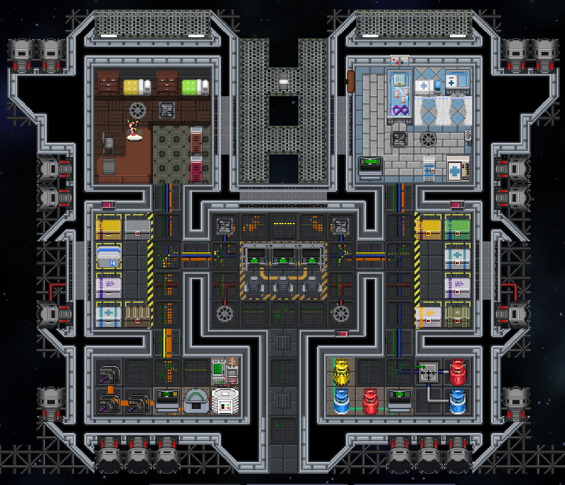
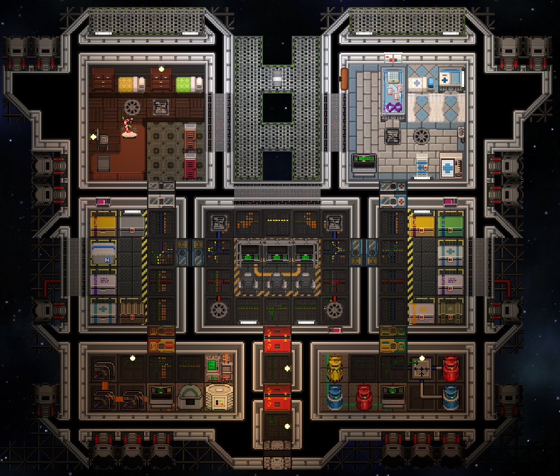

# Первые труды

Давайте попробуем начать. Чтобы освоиться, а также постепенно закреплять материал, который вы изучаете, попробуем совместно создать наш первый шаттл.

Сперва создадим чистое полотно. Сделайте это наиболее удобным для вас способом. Я например пропишу команду `mapping`, а после включу стандартный режим отображения.

После того как мы появились на полотне - в самом центре я поставлю свой первый тайл. От него я начну строить форму шаттла. Предположим, что это гражданский шаттл с различными по надобности комнатами и пилотской рубкой в самом его начале.

Строить свои гриды рекомендую последовательно, шаг за шагом, особенно если вы строите что-то масштабное.

Примерная последовательность создания вашего грида:

1.Разметка формы грида. Создаём первый тайл и от него размечаем покрытием примерную форму шаттла.  
   
   
   Для удобства, одно покрытие у меня отображает будущие стены, а второе, будущие пространства.
   
2.Разметка внутреннего наполнения грида с помощью стен и окон, шлюзы ставить не рекомендуется. Лучше всего при любом маппинге ставить шлюзы в последнюю очередь, после установки под них пожарного шлюза и тайла. Дополнительно я немного переопределил изначальную структуру комнат и определил будущую идею в центре.

3.Занимаемся наполнением комнаты перед тем как начать украшать фоновую часть (тайлы), думаем о наполнении и логике. Сразу укажу, что дополнять можно постепенно и по чуть-чуть. Не обязательно украшать сразу всем. Так как я наметил инженерный блок, я сразу же разбросил основную проводку и наметил ЛКП. Вам же желательно делать это последовательно.

4.Размещаем последнюю проводку, которой не хватало до этого. Дополнительно укладываем трубы, расставляем атмос девайсы и всё соединяем. Так как шаттл у нас получаетсяя довольно квадратным, то придаём внешней оболочке дополнительную форму и расставляем двигатели там, где они должны быть логически. Учитываем, что шаттл у нас должен уметь летать в разные стороны.

5.Наконец наполняем наш шаттл тайлами. 
  

6.Добавляем на шаттл декали . 

7.После того, как убедились, что инфраструктура настроена, тайлы добавлены, декали установлены. Начинаем также добавлять шлюзы и наполнять шаттл освещением.

8.Сохраняем грид.

9.Пробуем загрузить его на другую карту.  

10.Если всё окей, то можно инициализировать карту и проверять наличие косяков (всё ли запитано, все ли кнопки подключены, везде ли хватает света).  

11.Загружаем заново грид и исправляем все косяки (если есть).  

12.Прописываем fixgridatmos (прописывать его нужно именно после повторной загрузки, иначе команда может сработать неправильно).  

13.Сохраняем повторно грид. 

Чтож мои поздравления, вам первый шаттл готов. Всё что останется для этого шаттла из ещё неизученных вами инструментов - это переименовать сам грид, дать шаттлу лорное название. Возможно изменить цвет отображения шаттла на сканере масс, если это требуется.

Далее же я рекомендую изучить статьи из категории полезных и полностью пройтись по категории "Моя первая станция". 