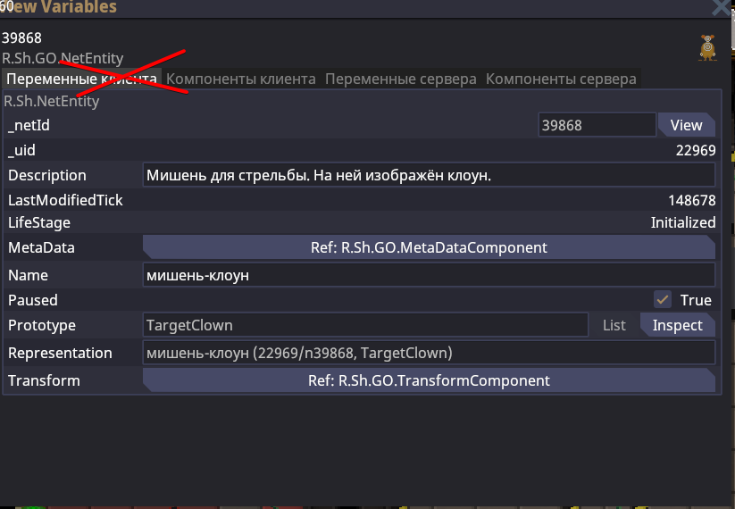
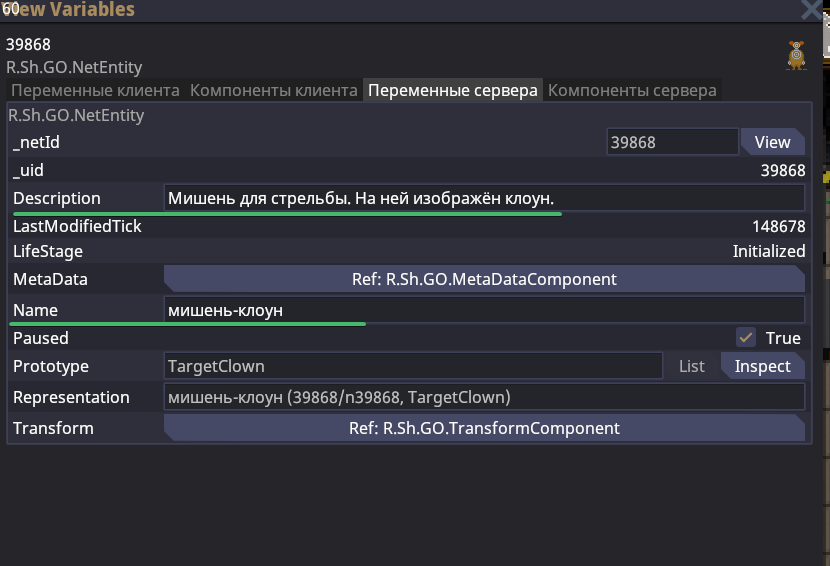
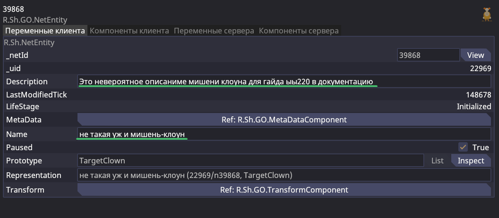
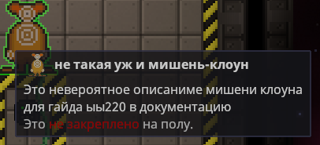
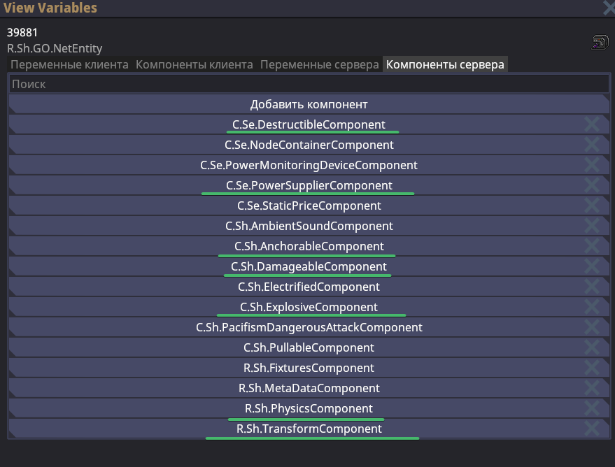
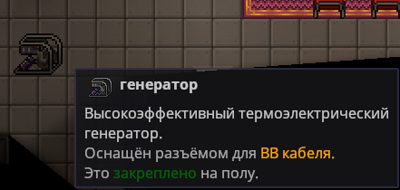
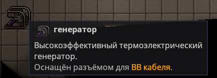

# Как работать с View Variables (VV)

В первую очередь стоить начать вообще с того, что такое View Variables? И что за переменные такие мы можем посмотреть? Открыв это меню впервые, можно столкнуться с отвержением к чему-то сложному, но давайте мы сразу упростим нам задачу вдвое.

Я буду рассматривать на примере объекта мишени клоуна.

Забываем про первые две вкладки. При этом запоминаем навсегда, что мы забываем про них и никогда в них не работаем. Они попросту не для нас.

Что же касается оставшихся двух вкладок.
Давайте всё же начнём с того, что вкладки:
Перменные клиент и Переменные сервера - идентичны за исключением источника.
Также как и Компоненты клиента и Компоненты сервера - тоже идентичны.

## О Переменных

Но Переменные и Компонента клиента - нам не нужны, мы можем их просмотреть, но в VV мы заходим, чтобы изменять объект. Поэтому перейдя на вкладку "Переменные сервера" обращаем внимание на две строки `Description` и `Name`.

Именно при помощи них задаются все те бесчисленные отсылки на наших картах.
**Важно!**
- Имена всегда пишутся с маленькой буквы
- Описания всегда пишутся с заглавной буквой и пунктуацией на конце

Вы можете изменить описания и имя на любое другое, которое вам захочется. Однако, чтобы изменения применились, в поле ввода (в самой строке) нужно нажать `Enter`. Без него - изменения сбросятся.

Например:

И результат:

Даже опечатка перенеслась. Помним, что автокоррекции у нас движком не предусмотрено, учимся на ошибках старших и перепроверяем себя на четыре раза, чтобы не допускать подобных ошибок.

## О Компонентах

Переменные быстро иссякли, поэтому продолжим разговор уже о компонентах. С помощью них, можно действительно сильно модернизировать прототип. На этот раз возьмём маленький генератор электропитания. 

В действительности, открыв "Компоненты Сервера" нужного нам объекта, мы можем столкнуться с очень большим списком различных компонент. В первую очередь вы будете теряться - это нормально. С опытом наиболее часто используемые компоненты запоминаются и в будущем вы будете сразу понимать не только, что можно изменить, но и как работает тот или иной объект на техническом уровне.

Разберём с сущностью двигателя по порядку:
- Destructible - отвечает за разрушаемость объекта
- PowerSupplier - конфигурирует отдачу электроэнергии объектом, сколько он вырабатывает энергии
- Anchorable - настраивает у объекта его возможность быть прикрученным к полу
- Damageable - ответственен за возможность объектом получать урон
- Explosive - даёт понимание, что объект может взорваться и конфигурируется это данной компонентой
- Physics - отвечает за базовую физику объекта, например за его коллизию
- Transform - определяет расположение объекта в мире, смещение по координатам X, Y, поворот объекта

Но что нам это всё даёт? Часто бывает, что в угоду игровых особенностей, мы обязаны расположить какой-то простой генератор электропитания на аванпосте/поде, но при этом такой, чтобы его невозможно было загриферить в угоду игрока, чтобы игрок не использовал самые легкие пути и не нарушал баланс игры. В таком случае я прошу заранее продумать на объектах генераторов система против гриферства.

Вот как она может настраиваться при помощи компонент. Мы можем удалить разрушаемость, поднастроить выдачу электропитания ровно на столько, сколько нам необходимо, например 9кВт, после удалить Anchorable сделав объект неоткручиваемым.

Вот классический вариант:

Мы можем его открутить, своровать.
А вот скорректированный вариант.

В котором возможность открутить генератор от пола - уже отсутствует. Более того, например удалив `Destructible` - мы не допускаем возможности взрыва этого генератора. Либо же можем поступить наоборот, удалить взрывоопасность и сделать генератор уничтожаемым без взрыва. Однако в этом плане я бы предпочёл вовсе не изменять генератор. Достаточно и того - что его нельзя открутить и скоммуниздить.

Это лишь один вариант из сотни, что могут вам предложить компоненты. На просторах наших карт вы можете встретить секретные проходы прямо сквозь стены, потому что на них специально отключена коллизия. Часто на угловых перилах отключается коллизия для удобства взаимодействия игрока с этим объектом. Некоторые уникальные предметы созданы, потому что им предоставлена специальная компонента следов от джетпака и так далее. Конечно, всё это только запоминать и изучать.

### Таблица компонент

| Название компоненты  | Объяснение                                                                                                                                                                                                                                                                                                                                                                                                                                                                                                      |
| -------------------- | --------------------------------------------------------------------------------------------------------------------------------------------------------------------------------------------------------------------------------------------------------------------------------------------------------------------------------------------------------------------------------------------------------------------------------------------------------------------------------------------------------------- |
| ApcPowerReceiver     | Отвечает за требование объектом питания от ЛКП.  Флаги: `NeedPower` - может отключить требование в питании                                                                                                                                                                                                                                                                                                                                                                                                |
| PowerSupplier        | Отвечает за электроснабжение Флаги: `MaxSpply` - максимальное энерговыработка `SupplyRampRate` и `SupplyRampTolerance` - выработка энергии за один тик времени (так как движки в момент начало работы начинают разгоняться, а не сразу отдавать максимальное - то это как раз разгон до максимума)                                                                                                                                                                                                     |
| Destructible         | Отвечает за разрушаемость объекта. Флагов не имеет, чтобы отключить разрушаемость, можно просто удалить компоненту.                                                                                                                                                                                                                                                                                                                                                                                             |
| RCDDeconstructable   | Отвечает за возможность разобрать объект при помощи РСУ Флаги: `Deconstructable` - отключает возможность разобрать объект при помощи РСУ                                                                                                                                                                                                                                                                                                                                                                  |
| Anchorable           | Отвечает за возможность прикрепить объект к полу при помощи гаечного ключа. То есть буквально якорь объекта.  Флаги: `Anchorable/Unanchorable` - можно установить флаг для только закрепления или открепления объекта. None - устанавливает невозможность того и другого `Delay` - задержка для закрепления или открепления объекта `Tool` - инструмент, которым собираемся откреплять. По стандарту гаечный ключ, но например указав "Welding" - мы уже открепляем и закрепляем при помощи сварки. |
| Dabageable           | Отвечает за получение урона. При отсутствии этой компоненты, удары как бы будут проходить мимо объекта. Изменить что-то флагами нельзя.                                                                                                                                                                                                                                                                                                                                                                         |
| Rotatable            | Отвечает за возможность объект поворачивать игроком Флаги: `Increment` - устанавливает порог для поворота. По стандарту это 90 градусов. Можно установить 180 градусов, чтобы только отзеркаливать. Можно установить меньше чем 90 или не кратное - но в этом зачастую мало смысла.                                                                                                                                                                                                                       |
| Physics              | Глобально отвечает за физику объекта. Флагов у компоненты много, но нас интересует лишь один `CanCollide` - при установлении false - сможем ходить сквозь объект, если до этого не могли.                                                                                                                                                                                                                                                                                                                       |
| Transform            | Отвечает за пространственное расположение объекта. Хорошо работает с незакреплёнными объектами. Флаги: `_localPosition` - перемещение по координатам X и Y. Позволяет более точечно поставить координату положения объекта. Мы часто прибегаем к подобному, когда расставляем объекты на столах. `_localRotation` - угол поворота объекта.                                                                                                                                                             |
| Item                 | Даёт объекту тип "Предмета", то есть возможность брать объект в руки и например убирать в рюкзак. Зачастую нужен для удаления, когда необходимо оставить какой-то элемент, как элемент декора.                                                                                                                                                                                                                                                                                                                  |
| PoweredLight         | Отвечает за освещаемость светильником. Флаги: `IgnoreGhostBoo` - не подвержется пугалкам призраков `isBlinking` - заставляет лампочку постоянно моргать `On` - определяет статус, включена или выключена лампочка                                                                                                                                                                                                                                                                                   |
| TimedDespawn         | Отвечает за удаление объекта через N количества времени Флаги: `Lifetime` - количество оставшегося времени. Можно подобным образом сделать бесконечные атмос голопроекторы, как на Axioma.                                                                                                                                                                                                                                                                                                                |
| Airtight             | Отвечает за герметизацию объекта. То есть, будет ли через структуру или объект проходить газ или нет.                                                                                                                                                                                                                                                                                                                                                                                                           |
| AntiRottingContainer | Наделяет объект свойствами контейнера, в котором трупы не будут гнить. Как у мешков для трупов или холодильников.                                                                                                                                                                                                                                                                                                                                                                                               |
| BadDrink, BadFood    | Компоненты плохой еды и питья, которые отравят вас                                                                                                                                                                                                                                                                                                                                                                                                                                                              |
| Insulated            | Компонент, защищающий от поражения током.  Флаги: `Coefficient` - настраиваемая вероятность пропускания током. 0 - значит нулевая возможность, что ударит током.                                                                                                                                                                                                                                                                                                                                          |
| RadiationSource      | Компонента отвечающая за распространение радиацией (излучение). Флаги: `Intensity` - максимально возможная радиация по мере приближения к объекту. `Slope` - шаг на который радиация будет падать или повышаться (количество рад за тайл)                                                                                                                                                                                                                                                              |
| IgnoreFTLMassLimit   | Накидывается на грид и позволяет проигнорировать ограничение в 300ед. массы для шаттлов при совершении БСС прыжка. С этим компонентом можно создавать шаттлы любых размеров и они смогут совершать БСС прыжки.                                                                                                                                                                                                                                                                                                  |

