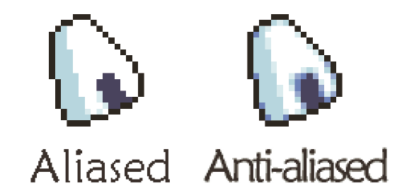
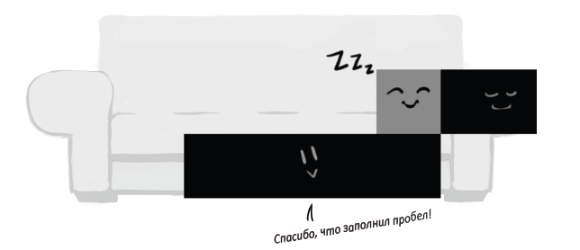
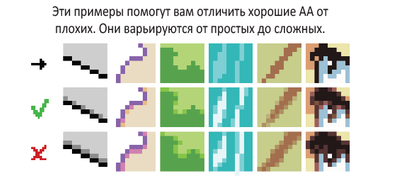
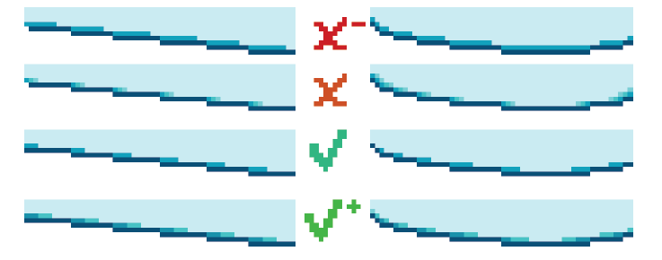
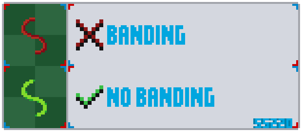
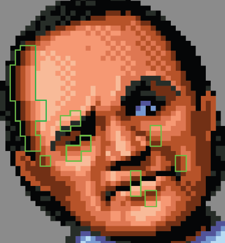
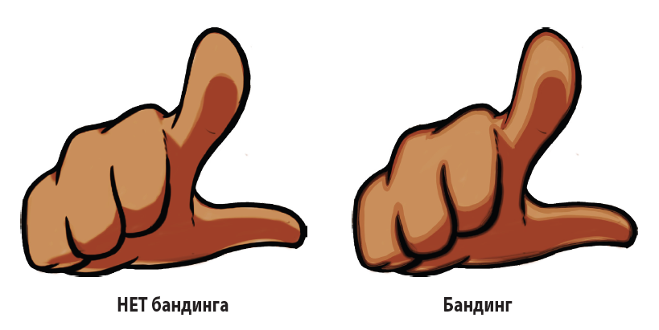
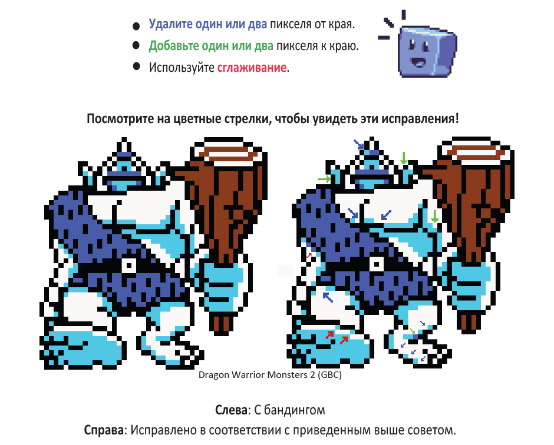

# Глава 2. Сглаживание

**Aliased** (жёсткое, рваное) — это изображение **без сглаживания**. Оно строится строго по пиксельной сетке, с резкими краями и углами.

**Anti-aliasing** (сглаженное) — это **ручное смягчение краёв** с помощью промежуточных оттенков. Он делает изгибы и наклонные линии менее зубчатыми. В пиксель-арте **anti-aliasing применяется аккуратно и точечно**, в зависимости от формы, фона и желаемого визуального эффекта.

*<small>Pixel Logic (Michael Azzi)</small>*
## Как применить?
**Anti-aliasing** — это как мягкие **подушки на жёстком диване**: они не меняют форму полностью, но делают её приятнее. Достаточно добавить пиксели промежуточного цвета в острые уголки или по краю кривых — и форма станет плавнее.

*<small>Pixel Logic (Michael Azzi)</small>*

*<small>Pixel Logic (Michael Azzi)</small>*

*<small>Pixel Logic (Michael Azzi)</small>*

## Бандинг
**Бандинг (banding)** — это повторяющиеся, параллельные линии градиента, где цвета разных оттенков **слишком плотно прилегают** друг к другу и создают ощущение прилипших полос. Это может «размыть» контур или сделать тени слишком механическими.

*<small>Pixel Logic (Michael Azzi)</small>*

**Бандинг в цифровой графике**:

*<small>Pixel Logic (Michael Azzi)</small>*

---
## Почему бандинг считается ошибкой?

- Линии кажутся **толще**, чем нужно.
- **Размывает форму** — теряется чёткость и читаемость.
- Создаёт **пиллоу-шейдинг** — теневые зоны выглядят неестественно и «надутыми»  ([см. Главу 4: Свет и тень](shading.md)).

---
## Как исправить?

*<small>Pixel Logic (Michael Azzi)</small>*

## 🤔 Так ли плох бандинг?

**Бандинг — не всегда ошибка.** Это всего лишь инструмент, такой же, как и сглаживание. При правильном подходе он может стать выразительным элементом и дополнить ваш спрайт. В умелых руках бандинг способен усилить объём, глубину или стилизацию изображения.

Однако **у новичков бандинг чаще возникает случайно**, как побочный эффект неправильного шейдинга или излишне симметричных теней. В таком виде он не усиливает рисунок, а, наоборот, портит форму, делает спрайт неаккуратным и «мыльным».