# Глава 5. Аксонометрия
*<small>Огромная благодарность гайдам Feichtmeir</small>*

**Аксонометрия** (вид) — это метод проекции, при котором трёхмерный объект изображается в двух измерениях без перспективного искажения.

---
## Построение аксонометрического куба
Построим аксонометрический куб под углом 45°. Для начала нарисуем квадрат и повернём на 45°:

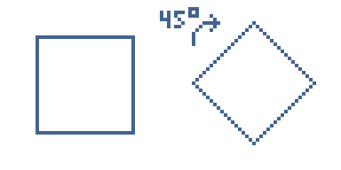

Спроецируем угловые точки и создадим куб, длиной равной длине квадрата:

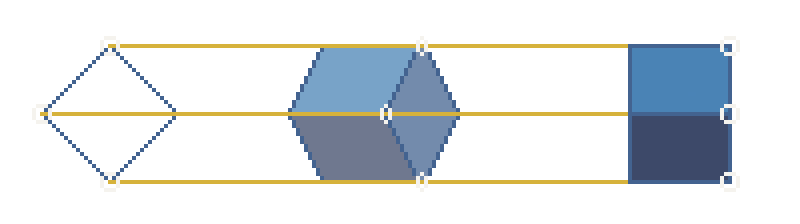

Для построения аксонометрии 3/4 всё гораздо сложнее. Чтобы построить аксонометрию с пропорциями 3:4, потребуется угол, тангенс которого равен 3/4 (≈ 36,87°). Однако точно вычертить этот угол сложно. Однако, высота у кубов разных пропорций остаётся практически одинаковой, так что, если вам нужно определить точную высоту, можете воспользоваться способом сверху.

Высота нам известна, пропорции нам известны. Поменяем пропорции куба под углом 45° (1:1) на 3:4:

```
Высота двух граней в аксонометрическом кубе нашего примера состовляет 34 пикселя.
В пропорции 3:4 сумма частей равна 7. Тогда:
1 часть = 34​/7 ≈ 4,857
Верхняя грань: 3 × 4,857 ≈ 14,571
Нижняя грань: 4 × 4,857 ≈ 19,429
```

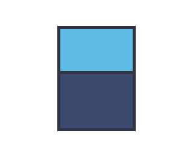

**Это и есть вид / пропорции / проекция / аксонометрия 3/4.**

*<small>
ДИСКЛЕЙМЕР
Неизвестно, откуда пошло, но термин «3/4» в SS14 и других художественных искусствах отличается.
</small>*

---

## Разница аксонометрии и перспективы
Ключевой особенностью аксонометрии является то, что в ней нет перспективных искажений. Рассмотрим на примере: 

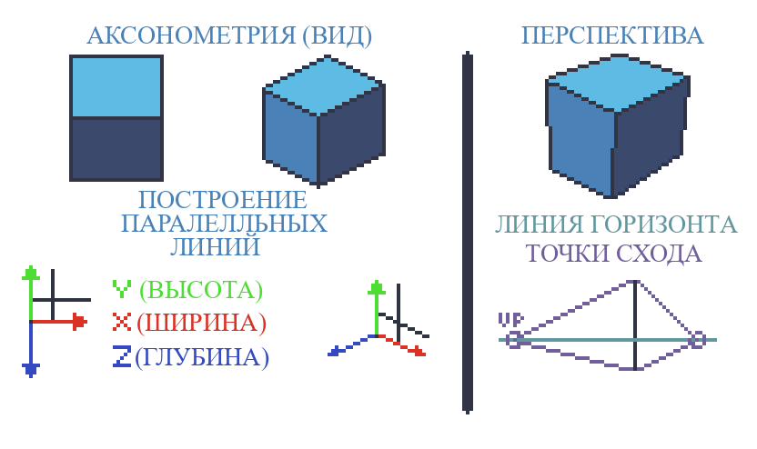
Аксонометрия использует параллельные линий.
Перспектива использует точки схода.

---
## Полноценное 3/4
То, что мы рассматривали выше это лишь проекция и пропорции. Сейчас же нам надо всё, что мы проходили в главах выше (контур, цвет, шейдинг), интегрировать в наш получившийся куб 3/4. Покажу и расскажу наглядно каждый шаг:


|                                                    | Пошаговая визуализация превращения куба 3/4 в финальный объёмный объект                                                                                                                                                                     |
| -------------------------------------------------- | ------------------------------------------------------------------------------------------------------------------------------------------------------------------------------------------------------------------------------------------- |
| 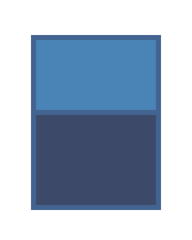 | Аксонометрический куб с пропорциями 3:4. Сделаем из него стальной куб.                                                                                                                                                                      |
| 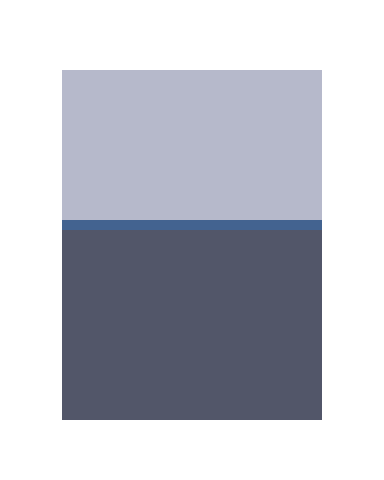      | Источник света у нас находится сверху. Верхнюю грань выделяем оттенком "свет". Нижнюю грань оттенком "полутени". "Стык" двух граней пока не трогаем, он нам понадобится.                                                                    |
| 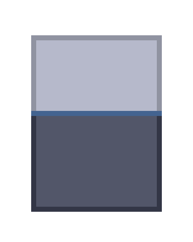      | Добавляем контуры на каждую грань. Для контура берём оттенок ниже.                                                                                                                                                                          |
|       | Как уже можно заметить, видна чёткая разница между верхней гранью и нижней. Однако, не помешает её выделить ещё сильнее. Это "разница", "стык" называется "ребром" или же "углом" 3/4. Для неё обычно используется оттенок "блик".          |
| 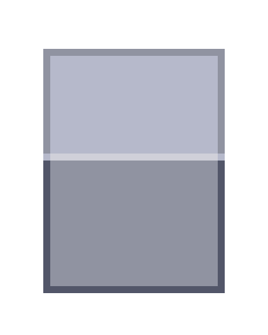      | Для построения аксонометрического куба так же можно использоваться 4 оттенка. Однако, разница между гранями заметно уменьшается. Следите за тем, чтобы грани оставались различимыми — это важно для сохранения объёма и читаемости спрайта. |

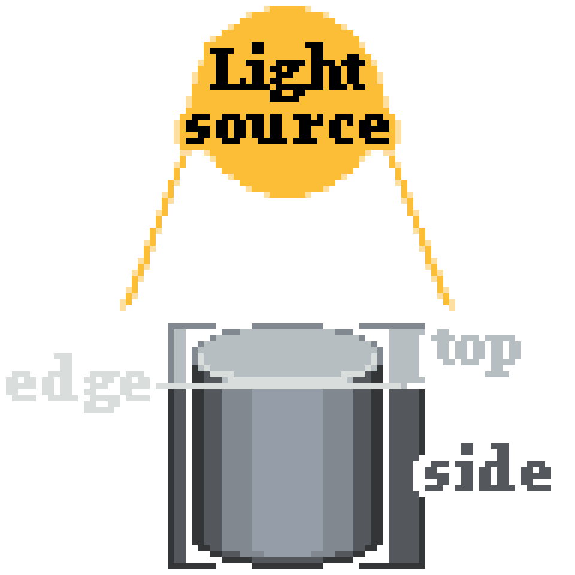
*<small>CrystallEdge</small>*

---
## Обобщение терминов
**Вид** — это общий термин, обозначающий **то, как мы смотрим на объект**. Это может быть фронтальный вид, сбоку, сверху, аксонометрический, перспективный и т.д. Это скорее **ракурс, точка зрения наблюдателя, то, что «видно»**.

**Аксонометрия** — это **метод изображения трёхмерных объектов на плоскости**, котором сохраняются **параллельные линии** (без искажений перспективы). **Конкретный способ изображения вида** на плоскости.

**Проекция** —это **результат применения метода проецирования**. По сути, это изображение объекта на плоскости (экране, листе), с использованием определённых правил (перспективная, ортогональная, аксонометрическая и т.д.). Примеры:

- перспективная проекция (с точками схода),
- ортогональная проекция (прямо, без искажений),
- аксонометрическая проекция (под углом, без перспективы).

Проекция — это **результат метода**, способ переноса 3D-объекта на 2D.

**Пропорции** — это соотношение размеров между сторонами объекта (например, 3:4 — означает, что одна грань в 1.33 раза длиннее другой). В аксонометрии пропорции искажены намеренно, чтобы создать иллюзию глубины.

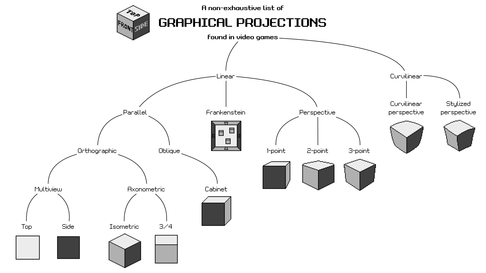

---
## Форма
Каждый объект в пиксель-арте начинается с **формы**. Каким бы сложным ни был предмет, его можно упростить до набора **базовых геометрических примитивов** — шара, цилиндра, пирамиды, но чаще всего может помочь простейший **куб**.

Перед тем как браться за цвет и детали:

1. **Начни с простых фигур** — наметь общий объём.
2. **Собери объект как конструктор** — с помощью копирования, трансформации и выделения.
3. **Проверь читаемость силуэта** — даже без цвета он должен быть узнаваем.
4. И только потом — приступай к шейдингу, цвету и мелочам.

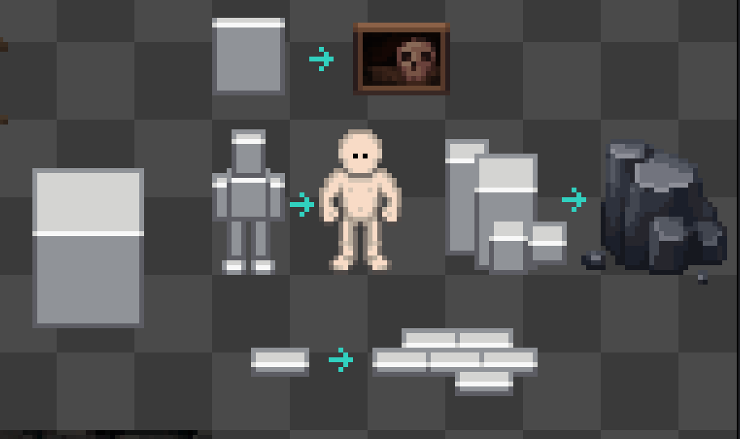

*<small>CrystallEdge</small>*