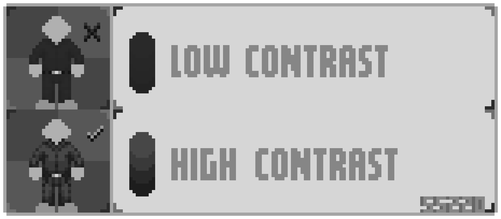
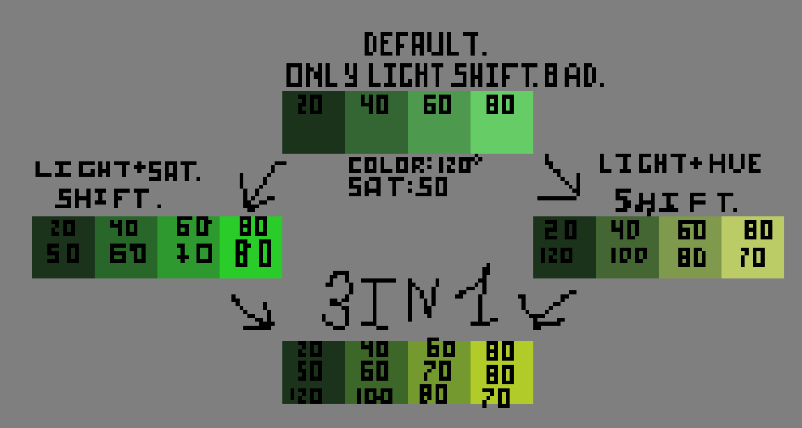
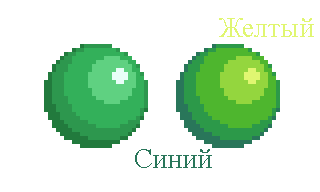

# Глава 3. Цвет

**Цвет** — это результат отражения света от объектов.

---
## Основные принципы работы с цветом

### 1. Ограниченная палитра
Используйте ограниченное количество цветов: 4-5 оттенка для одного основного цвета.

1. **Блик** *(Hightlight / Хайлайт)* — самая светлая точка на объекте, где свет отражается максимально. В основном используется для глянцевых поверхностей.
2. **Свет** (Light / Лайт) — освещённая часть объекта. 
3. **Основной** *(Нейтральный / Базовый / Midtone)* — основной оттенок, от которого образуются другие оттенки. Он находится между освещённой частью и тенью.
4. **Полутень** *(Глубина)*— переходный оттенок от базового к тени. 
5. **Тень** *(Контур)* — самая тёмная часть спрайта, на который не попадает прямой свет.

*P.S. В скобках указаны альтернативные названия, которые так же могут использоваться и использовать некоторые*.

### 2. Контраст
**Контраст** — это **разница между светлыми и тёмными участками изображения**. Он помогает **обозначать форму, глубину и объём** объекта.

Чем выше контраст — тем чётче объект читается на экране. Однако важно соблюдать баланс:  
• **Слишком низкий** контраст делает спрайт «размазанным» и плохо читаемым.  
• **Слишком высокий** может выглядеть **неестественно**, особенно для мягких объектов (например, ткани или кожи).

Если на глаз сложно определить, хороший ли у вас контраст — используйте один из простых приёмов:

1. **Отдалите** спрайт — уменьшите его масштаб. Если детали сливаются, значит, контраст стоит усилить.
2. **Переведите в чёрно-белое** — в оттенках серого контраст виден особенно чётко.

---
## Три основные компоненты цвета

1. **Тон *(Hue)*** - Это то, что мы обычно считаем "цветом". Оттенки обозначаются названиями, такими как красный, зеленый, синий и т. д. Они характеризуются положением цвета в спектре.
2. **Насыщенность *(Saturation)*** - Указывает на чистоту или яркость цвета. Высокая насыщенность означает, что цвет сочный и интенсивный, а низкая насыщенность — более тусклый и серый.
3. **Яркость *(Lightness или Brightness)*** - Это уровень освещенности цвета. Яркие цвета приближаются к белому, тогда как темные — к черному.
### Смещение компонентов цвета
Разберём, что такое **Light Shift**, **Saturation Shift** и **Hue Shift** — три простых, но мощных приёма, которые помогут вам самостоятельно создавать выразительные палитры.

Для начала — наглядный пример. Ниже изображён базовый принцип создания палитры с использованием **всех трёх смещений**, а не только изменения яркости (как делают новички).

На схеме показано:

- **Яркость и насыщенность** возрастают по направлению вверх — ближе к светлым цветам.
- **Смещение тона (Hue Shift)** — уходит в сторону более холодных или тёплых оттенков при осветлении или затемнении.

Хотя в примере используются максимально "дефолтные" значения без изысков, итоговая палитра уже выигрывает в **контрасте**, **глубине** и **живости** по сравнению с линейной заливкой одного цвета.

### Hue Shifting (сдвиг тона)
Чтобы спрайт выглядел живо, используется **сдвиг тона**:

- Светлые участки — смещайте к **жёлто-оранжевому**.
- Тёмные — к **синевато-фиолетовому**.

Пример:
- Базовый зелёный → светлый: жёлтовато-зелёный, тень: синевато-зелёный.

---
### Освещение
Цвет — это не просто "краска", а отражение света. Используйте простую модель:

- **Свет**: яркие, слегка теплые оттенки.
- **Основной цвет**: базовый цвет материала.
-  **Тень**: оттенки тусклее и холоднее, чем основной.

### Цветной контур
Как упоминалось в [Главе 1](lineart.md), контур должен быть **цветным**, а не чёрным.
- Используйте оттенки тени или полутени.

---
## Типичные ошибки
