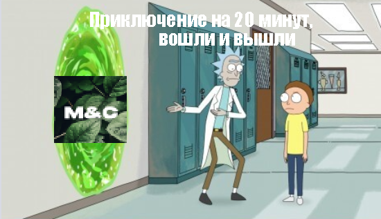
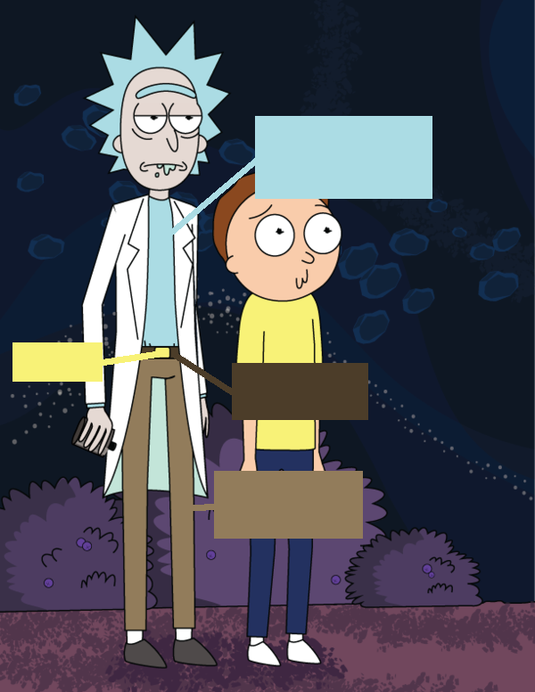
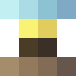
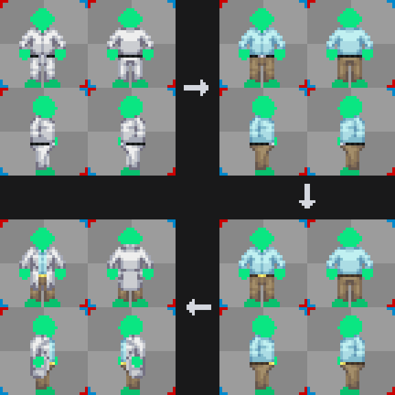
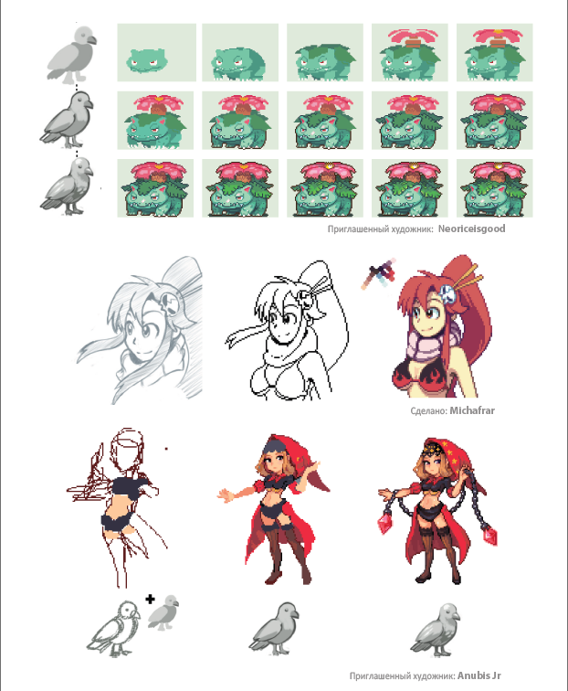
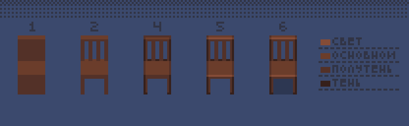

# Твой первый спрайт
В этом разделе мы рассмотрим два подхода к созданию спрайта:

1. **По шаблону** — когда мы используем готовый темплейт и просто заменяем в нём палитру.
2. **С нуля** — создание спрайта с чистого холста, с пошаговым объяснением.

---
## Создание спрайта по шаблону
Как некоторые из вас знают, у SS220 есть обширная коллекция шаблонов (далее — **темплейты**) и палитр. Попробуем сделать одежду Рика из _«Рика и Морти»_ на базе стандартного темплейта.

Разберём одежду Рика (без лабораторного халата) и выделим основные цвета:

1. Светло-голубой — рубашка-поло
2. Ярко-жёлтый — пряжка ремня
3. Тёмно-коричневый — ремень
4. Приглушённый золотисто-коричневый — брюки

Как мы обсуждали в [Главе 4. Свет и тень](shading.md), ткань рассеивает свет, а не отражает его. Поэтому для каждого цвета нам нужно **4 оттенка** в палитре: базовый, тень, полутень и свет.

*<small>Для ремня по 2 оттенка, так как по шаблону понадобиться ровно столько</small>*

### Работа с темплейтом
Теперь применим получившуюся палитру к стандартному темплейту:

1. Загружаем шаблон.
2. Меняем палитру рубашки и брюк: каждый оттенок — на свой аналог в новой палитре.
3. Аналогично заменяем цвета ремня и пряжки.
4. Добавляем лабораторный халат, чтобы завершить образ.

### Результат
Как можно заметить, итоговая палитра выглядит немного **инородно**. Это потому, что базовые цвета, взятые с оригинального арта Рика, слишком **насыщенные и яркие** для нашего стиля и игры.

---
## Создание спрайтов с нуля
Есть множество способов того, как можно создать спрайт:

*<small>Pixel Logic (Michael Azzi)</small>*

---

Давайте нарисуем **простой деревянный стул**. Это хороший пример, чтобы отработать форму, свет и тень. Ниже — пять базовых этапов:
### **Шаг 1: Силуэт и источник света**

Начнем с простой формы — это будет основа стула. Одновременно определим, **откуда падает свет** (в нашем случае — сверху). Это важно для понимания, где будут тени и блики. Не заморачивайся с деталями — просто намечай общую форму.

### **Шаг 2: Строим объём**

Теперь добавляем **дополнительные детали**, чтобы превратить "плашку" в узнаваемую форму стула — ноги, сидушка, спинка. Старайся сохранить правильную перспективу и пропорции.

Думай, как будто ты лепишь стул из блоков. Если сложно, можно наметить всё простыми прямоугольниками.

### **Шаг 3: Добавляем тени и контуры**

На этом этапе показываем **объём через тень**. Затемняем части, на которые не падает свет.

Не делай тени слишком тёмными — используй просто более насыщенный/приглушённый оттенок основного цвета.
### **Шаг 4: Переход между граней**

Добавляем **бликовые части**.
### **Шаг 5: Падающая тень**

Последний штрих — **тень от стула на землю**. Тень должна быть логичной по направлению, соответствуя источнику света. Тень — не просто чёрная клякса. Сделай её прозрачной или более холодной по оттенку.

### Результат
Получившийся стул — **простой и базовый**, без сложной текстуры или декоративных деталей. Он не претендует на идеал, но отлично выполняет свою задачу: передаёт форму, объём и материал.

Важно помнить — это **тренировочный спрайт**, и цель была в том, чтобы освоить этапы: от формы до света и тени. Навыки текстурирования и стилизации приходят позже, с практикой.