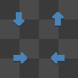
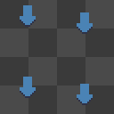
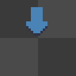

# Глава 0. Введение

## Что такое спрайт?

**Спрайт (Sprite)** — это двумерное изображение, используемое в видеоиграх и других интерактивных приложениях для представления объектов, персонажей, эффектов и фонов.

## Что такое спрайтинг?

**Спрайтинг (Spriting)** — это процесс создания, редактирования и анимации спрайтов.

В Space Station 14 (далее — **SS14**) спрайты хранятся в формате **.rsi**, который представляет собой папку с **PNG-файлами** и **файлом метаданных `meta.json`**.

---

### Какую программу использовать?

Для создания спрайтов чаще всего применяются следующие графические редакторы:

- **Aseprite** — специализирован для **пиксель-арта** и анимации.
- **Photoshop** — хороший растровый редактор, также подходящий для создания пиксельной графики.

---

### Какой размер у спрайтов?

В SS14 большинство спрайтов имеют размер до **32×32 пикселя**. Однако холст может увеличиваться в зависимости от особенностей:

- Если у объекта есть **направления** (вид спереди, сзади, слева, справа) — холст увеличивается до **64×64**.
- Если у спрайта есть **анимация**, добавляются дополнительные кадры — это также увеличивает размер холста.

| Спрайт                                                  | Описание                                                                           |
| ------------------------------------------------------- | ---------------------------------------------------------------------------------- |
|  | Однонаправленный спрайт                                                            |
|  | Спрайт с четырьмя направлениями                                                    |
|     | Анимированный спрайт с одним направлением и четырьмя кадрами                       |
|     | Демонстрация анимации в действии — как выглядит результат при проигрывании кадров. |

---

### Основные инструменты (Aseprite)

- **Карандаш** — рисует пиксели.
- **Пипетка** — копирует цвет с холста.
- **Ластик** — удаляет пиксели.
- **Заливка** — заполняет область одним цветом.