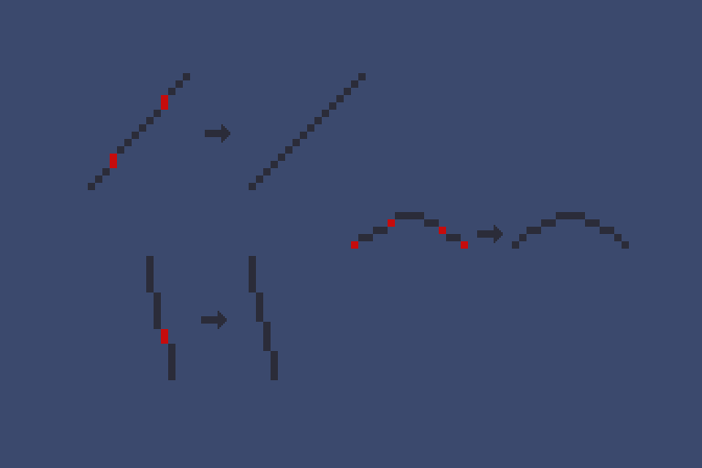
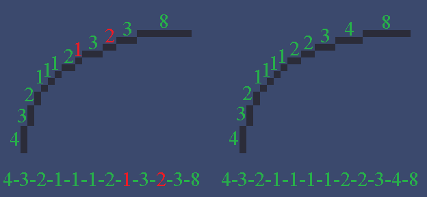
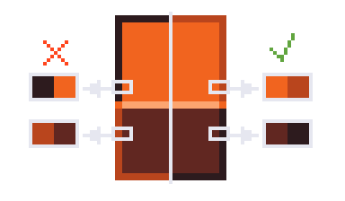

# Глава 1. Линии

Линии (Line Art) — это "скелет" пиксель-арта, основа, задающая форму и очертания объекта.

---
### Основные принципы Line Art

1. **Толщина линий**: сохраняйте одинаковую толщину линий во всем спрайте.
2. **Чёткость и плавность**: старайтесь избегать "лесенки" — резких, прерывистых пиксельных ступенек на диагональных и изогнутых линиях.

---
## Кривые и зазубрины

**Кривые** — это плавные линии, которые могут формировать форму объекта, будь то изгибы тела, складки ткани или органические формы, вроде деревьев. Однако при рисовании кривых в пиксель-арте легко столкнуться с проблемой **зазубрин** — неровных, «рваных» углов, которые делают спрайт неаккуратным и мешают читаемости.

---
## Контур. Основные принципы

### Что такое контур?

**Контур** (обводка, окантовка) — это внешняя линия, отделяющая объект от фона. Он определяет форму, делает спрайт читаемым и стилистически цельным.

### Зачем нужен контур?

- Объект выделяется и становится легко различим.
- Контур задаёт границы для цвета, света и тени.
- Помогает поддерживать единый визуальный стиль.

### Какой контур нужен?

- Контур **обязателен** для всех объектов.
- **Чёрный контур — запрещён**, он делает спрайт плоским и неестественным.
- Вместо этого используйте **цветные контуры** — оттенки, близкие к цвету объекта.

### Цветной контур

Используйте оттенки, гармонирующие с основным цветом объекта. Более подробно о подборе оттенков -  [см. Главу 3: Цвет](color.md).

Избегайте однотонного контура. Смешивайте его с цветом полутени для плавных переходов.

Контур каких-либо вещей требует контраста с **рядомстоящими** пикселями в тёмную сторону. Чересчур тёмный/светлый контур является ошибкой. **Пример:**

*<small>CrystallEdge</small>*