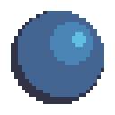
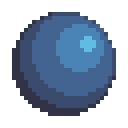
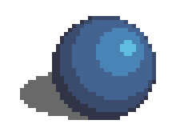
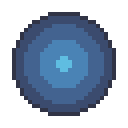
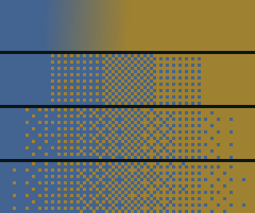
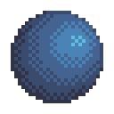

# Глава 4. Свет и тень
Шейдинг - это техника передачи объёма, глубины и освещения в пиксель-арте. Шейдинг делает спрайты реалистичнее, выразительнее и легче читаемыми.

---
### Зачем нужен шейдинг?
- **Создаёт объём** — помогает воспринимать 2D-объект как трёхмерный;
- **Указывает на материал** — разные типы поверхностей отражают свет по-разному;
- **Добавляет выразительность** — делает формы чётче и интереснее.

---
### Базовые принципы шейдинга

1. **Определи источник света**  
    В SS14 свет обычно падает сверху под углом ([Вид 3/4](axonometry.md)). Это базовая установка для всех спрайтов.
2. **Тень подчёркивает форму**  
    Светлые области ближе к источнику света, тени — с противоположной стороны. 
3. **Палитра**  
    Используй [4–5 оттенка](color.md) (в зависимости от материалов)

---
### Шейдинг и материалы
Разные материалы **отражают свет по-разному**, и важно учитывать это при выборе палитры и работе с тенями.

| Материал    | Особенности шейдинга                                                                                                                                                               |
| ----------- | ---------------------------------------------------------------------------------------------------------------------------------------------------------------------------------- |
| **Металл**  | Сильные блики, **высокий контраст**, резкие переходы между светом и тенью. Часто используются световые линии и холодные тени.                                                      |
| **Пластик** | Мягче, чем металл. **Умеренный контраст**, **размытые блики**. Освещение должно быть гладким.                                                                                      |
| **Ткань**   | Свет рассеивается. **Плавные тени**, **мягкий шейдинг**, без бликов. Поверхность обычно матовая.                                                                                   |
| **Дерево**  | Зависит от обработки: — **Необработанное**: матовое, мягкие тени, без блика. — **Лакированное**: ближе к пластику или даже к металлу. — Часто видна текстура волокон.  |
| **Стекло**  | Полупрозрачный материал. **Яркие блики**, часто по краям. Можно добавлять засветки и бликовые линии.                                                                               |

---
## Пример шейдинга
Для того, чтобы показать как работает свет, обычно приводят пример с объектом в форме шара. 

|                                                | Рассмотрим пример с самого начала, нарисуем произвольный круг                                                                                                                                                                                  |
| ---------------------------------------------- | ---------------------------------------------------------------------------------------------------------------------------------------------------------------------------------------------------------------------------------------------- |
|  | Первым шагом будем определение источника света. Для удобства и простоты понимания, пусть источник света будет в правом верхнем углу. И когда он попадает на шар, появляется блик — как отражение света. И дальше цвет рассеивается по объекту. |
|  | Мы показали освещение, теперь добавим тень.                                                                                                                                                                                                    |
|  | Мы добавили тень, но есть ощущения, что чего-то не хватает? Переход между основным оттенком и тенью слишком резкий. Используем оттенок полутени.                                                                                               |
|  | В итоге получился шар с выраженным объёмом.                                                                                                                                                                                                    |

---
## Падающая тень
**Падающая тень** — это тень, которую объект отбрасывает на другую поверхность. Она важна, чтобы показать положение объекта в пространстве.

- **Делает объект «приземлённым»** — без неё он может казаться парящим.
- **Форма тени** зависит от формы объекта и направления света.
- **Контур** тени может быть размытым (мягкий свет) или резким (жёсткий свет).

---
## Pillow shading
**Pillow shading** (Подушечное затенение) - термин, который означает шейдинг равномерно от светлых к темным оттенкам, начиная из центра формы. Это распространенная ошибка начинающих спрайтеров, вызванная непониманием источника света. 

Чтобы избежать pillow shading, **всегда определяйте источник света** и следуйте его логике: свет с одной стороны, тень — с другой.

---
## Дизеринг
**Дизеринг** (Dithering) — техника смешивания цветов через пиксельные узоры. Используется:

- для создания **плавного перехода** между двумя цветами;
- при **ограниченной палитре**;
- для создания текстур (например, шероховатости, шерсти).

Как вы можете заметить на шаре выше, чрезмерный дизеринг может негативно казаться на шейдинге вашего спрайта. **Если переусердствовать**, дизеринг превращается из инструмента в проблему:

- **Скрывает объём** — мешает воспринимать форму объекта, делает её плоской и неразборчивой.
- **Размывает силуэт** — границы объекта теряются, глаз не может «схватить» форму.
- **Забивает детали** — мелкие элементы становятся неразличимыми из-за текстурного шума.
- **Создаёт визуальный шум** — изображение выглядит «пыльным» или «зашумлённым», теряется фокус.

---
## Заключение
Тема света и тени — обширная. У каждого художника свои предпочтения, но основы одни: источник света, понимание формы, и наблюдение за реальностью.  
Если сначала не выходит — это нормально. Не значит, что «спрайтинг не твоё» — просто ещё мало практики. Со временем придёт понимание, и рука сама начнёт ставить тени туда, где нужно.
### Советы:
- **Смотри на реальность** — анализируй, как свет ведёт себя на реальных объектах.
- **Изучай чужие спрайты** — разбирай чужие работы по слоям.
- **Работай слоями**: блик → свет → основной оттенок → полутень → тень.
### **ВАЖНО!!**
**После этой главы обязательно ознакомитесь со следующей - [Аксонометрия](axonometry.md). В этой главе вы найдёте продолжение темы шейдинга.**