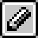
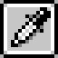
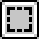
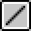
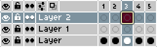
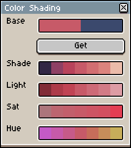

# Программное обеспечение

##  Aseprite 

Можно купить в стиме, скачать с зелёного сайта или попросить у кого-то архив с программой.

**Aseprite** — это профессиональный редактор пиксель арта. Подавляющее большинство художников использует именно его. Огромный плюс aseptite по сравнению с другими редакторами — её простота и специализация именно на пиксель арте.

---

### Основные инструменты

| Изображение                                    | Инструмент | Горячая клавиша | Описание                                                                                                                              |
| ---------------------------------------------- | ---------- | --------------- | ------------------------------------------------------------------------------------------------------------------------------------- |
|   | Карандаш   | B               | Основной инструмент рисования. Рисует пиксель. В левом верхнем углу можно увеличить размер карандаша, а также поменять вид карандаша. |
|   | Ластик     | E               | Удаляет отдельные пиксели. Также можно настраивать размер                                                                             |
|  | Пипетка    | I               | Берёт цвет с холста                                                                                                                   |
|  | Заливка    | G               | Закрашивает область одного цвета                                                                                                      |
|  | Выделение  | M               | Выделяет часть спрайта для перемещения, копирования или трансформации                                                                 |
|     | Палочка    | W               | Выделяет область с похожим цветом                                                                                                     |
|     | Линия      | L               | Рисует линию. Если зажать Shift - линии будут более прямыми.                                                                          |

---

### Вкладка "Edit":

- **Заменитель цвета (`Shift` + `R`)** — меняет один цвет (ЛКМ) на другой (ПКМ) по всему изображению или в выделении.
- **Горизонтальное отзеркаливание (`Shift` + `H`)** — отражает изображение или выделение слева направо.
- **Вертикальное отзеркаливание (`Shift` + `V`)** — отражает изображение или выделение сверху вниз.
- **Вставить текст (`T`)** — добавляет пиксельный текст прямо на холст
- **Контур (`Shift` + `O`)** — автоматически создаёт обводку вокруг выбранной области. 

--- 
### Вкладки "Sprite":

- **Режим цвета** — позволяет переключаться между RGB, индексированным и градациями серого.
- **Размер спрайта** — меняет размер всего изображения. Можно заблокировать соотношения, чтобы они оставались одинаковыми.
- **Размер холста** — увеличивает или уменьшает холст, **не растягивая** изображение.
- **Вращение холста** — позволяет поворачивать холст на 180 градусов и на 90 по и против часовой стрелки.
- **Обрезка** — урезает холст под размер спрайта.

--- 
### Слои и анимация

В Aseprite анимация и работа со слоями тесно связаны.

Чтобы открыть **окно анимации (таймлайн)** — нажмите `Tab`.

Слои работают как прозрачные плёнки, наложенные друг на друга. Их можно включать, выключать, перемещать и блокировать.

- `Shift + N` — создать новый слой (layer).
- `Alt + N` — создать новый кадр.
- `Ctrl + Shift + N` — новая группа слоёв.

- Глаз — при нажатии скрывает слой.
- Замок — при закрытом замке слой закрепляется на месте. Нельзя выполнить никакие действия с слоем.
- Кадры — одиночные и связанные кадры. Одиночные идут друг за другом, связанные - зацикливание кадра.

--- 
### Скрипты 

Aseprite поддерживает **Lua-скрипты**. Скрипты можно найти во вкладке «Файл». Для добавления скриптов файл со скриптом с расширением `lua` нужно переместить в нужную папку. Её можно найти, нажав `Open Scripts Folder` (`Aseprite ▶ File ▶ Scripts ▶ Open Scripts Folder`).

**Полезные скрипты:**

- [**Русификатор**](https://community.aseprite.org/t/russian-language-aseprite/1851) — нет же смысла объяснять, что он делает?🙂
- **[More Color Shading Options](https://community.aseprite.org/t/script-more-color-shading-options/3668)** — создаёт палитру из выбранного цвета: с изменением трёх ползунков и с изменением каждого из них по отдельности. Не стоит полностью на него полагаться, однако он может стать полезным инструментом.

Другие скрипты вы можете искать в [специальном сайте](https://community.aseprite.org/c/scripts).

--- 

## Resprite

Если вам кажется, что в вашей жизни не хватает страданий, и вы решили порисовать на мобильном устройстве, то resripte – это то, что вам нужно. Это бесплатный аналог aseprite для смартфонов.

Программа копирует инструменты и особенности aseprite, поэтому нет смысла описывать их снова.