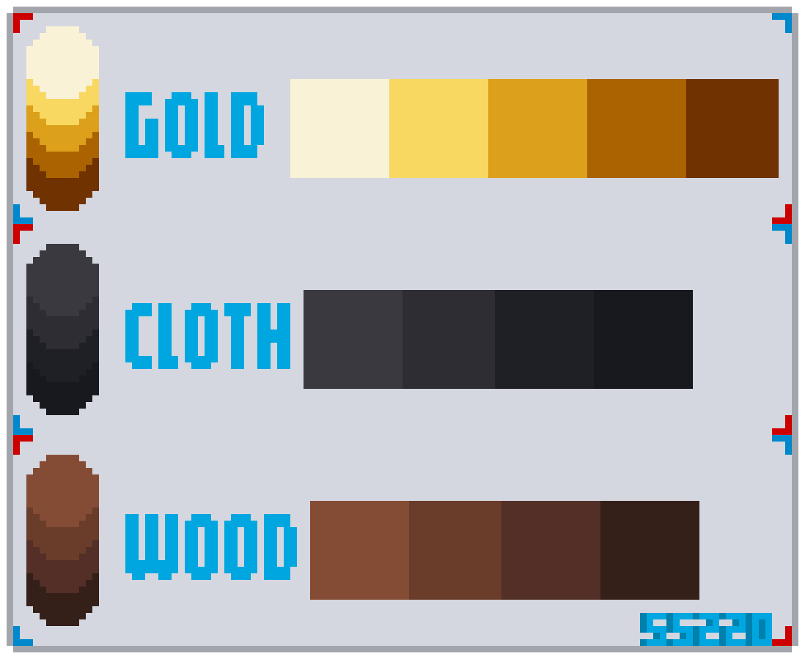
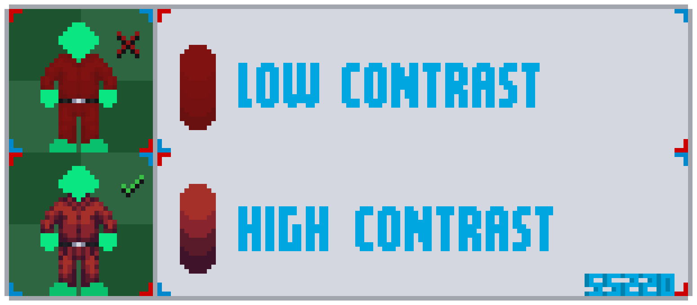

# Визуальный стиль
В этом разделе мы кратко пройдёмся по теоретическим разделам этого обучения, чтобы у вас сформировался стиль спрайтов SS220.

---

## Цветовая палитра
**Палитра** — это набор цветов, которые мы используем в спрайте. В основном, для каждого основного цвета у нас 4-5 оттенка (в зависимости от материала, из которого состоит ваш спрайт).

1. **Блик** — самая светлая точка на объекте, где свет отражается максимально. В основном используется для глянцевых поверхностей.
2. **Свет** — освещённая часть объекта. 
3. **Основной** — основной оттенок, от которого образуются другие оттенки. Он находится между освещённой частью и тенью.
4. **Полутень** — переходный оттенок от базового к тени. 
5. **Тень** — самая тёмная часть спрайта, на который не попадает прямой свет.

---

**Контрастность** — это **разница между светлыми и тёмными участками**. Чем больше эта разница — тем **сильнее контраст**, тем заметнее форма, глубина и объём. При создании спрайта стоит учитывать, что игрок будет видеть спрайт отдалённо, поэтому важно **правильно** создать контраст между оттенками. **Слишком высокий** контраст может **выглядеть неестественно** для мягких материалов — например, для ткани.

---

## Свето-тень
[**Свето-тень** (шейдинг / shading)](shading.md) — один из инструментов для создания **объёма** и **материальности** в пиксель арте. Разные материала отражают свет по-разному и важно учитывать это при подборе палитры и рисовании спрайтов. Ниже пройдёмся кратко по материалам и особенностям их шейдинга.

| Материал    | Особенности шейдинга                                                                                                                                                      |
| ----------- | ------------------------------------------------------------------------------------------------------------------------------------------------------------------------- |
| **Металл**  | Сильные блики, **высокий контраст**, резкие переходы между светом и тенью. Часто используются световые линии и холодные тени.                                             |
| **Пластик** | Более мягкий, чем металл. **Умеренный контраст**, блики есть, но они **размытые**. Освещение должно быть гладким.                                                         |
| **Ткань**   | Свет рассеивается. **Плавные тени**, **мягкий шейдинг**, без бликов. Поверхность обычно матовая.                                                                          |
| **Дерево**  | Зависит от обработки: — **Сырое**: матовое, мягкие тени, без блика. — **Лакированное**: ближе к пластику или даже к металлу. — Часто имеет текстуру волокон.  |
| **Стекло**  | Полупрозрачное. **Яркие блики**, часто по краям. Можно добавлять засветки и бликовые линии.                                                                               |

Первое, что нужно сделать для создания объема спрайта — это определить источник света.

---

## Проекция 3/4
В Space Station 14 в стилистике SS220 источник света в основном расположен  верху структуры/объекта, который мы рисуем. Мы, в частности своём, стараемся придерживаться вида 3/4. 
В этом стиле мы видим у объекта лишь верхнюю грань и лицевую, которые чётко разделены ребром (его так же называют "угол 3/4"). В основном для ребра используется оттенок "блик"

