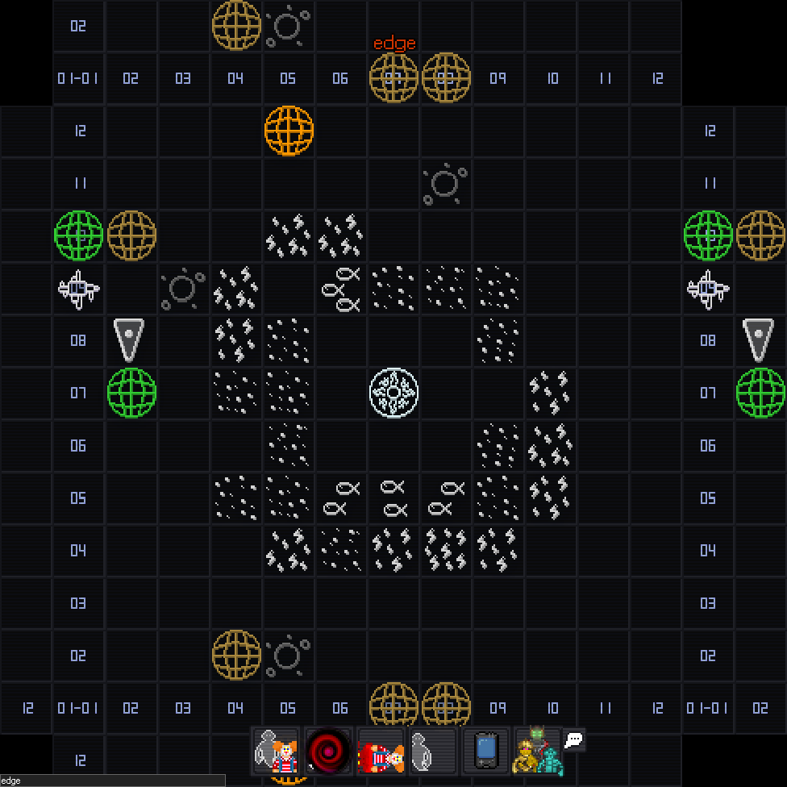

# Описание идеи

## Преамбула
Данная идея описывает реализацию и переиспользование фич из эпика MIXnikita в "основной" игре, чтобы не фокусировать большое количество усилий на разработке одного гейммода.

Основная идея заключается в адаптации экспедиционного отдела из билда SS13 "Infinity" (Сиерра). При этом будет решена одна из основных его проблем - довольно сырой процесс исследования самой планеты. В раунде будет исследоваться только одна планета, и основное внимание будет уделено именно самому процессу её исследования.

Первоначальная реализация не будет использовать overmap (вторая фича из эпика MIXnikita), но в дальнейшем она будет добавлена с делением по секторам, и планета будет находиться в отдалённом от станции секторе.

Данная идея не предпологает замены экспедиций утилизаторов и является самостоятельным отделом с самостоятельными механиками и задачами, основные совпадения между этими двумя фичами по большей части тематические.

Это не касатеся обломков и астероидов -- в будущем они могут быть перенесены на сектора в overmap, а магнит будет удалён. Так же их можно будет расширить используя алгоритмы генерации реализованные для генерации планеты.

<figure markdown>
  
  <figcaption>Overmap билда SS13 Shiptest</figcaption>
</figure>

## Описание
Будет добавлен новый экспедиционный отдел, имеющих небольшой собственный отсек на станции, док, и шаттл аналогичный Харону с билда SS13 Infinity. Отдел узко специализирован на исследовании и осваивании [**случайно генерируемой в начале раунда планеты**](planet-gen.md) и не замещает собой экспедиции утилизаторов. Он остоит из 4 членов экипажа - лидера экспедиции, двух обычных исследователей и медика. Отдел подчиняется РД, но обособлен от РнД во всех остальных отношениях.

<figure markdown>
  
  <figcaption>Шаттл Харон с билда Infinity</figcaption>
</figure>

Отдел будет заниматься исследованием планеты если не весь раунд, то большую его часть. Так же исследователи не могут быть раундстартовыми антагонистами, так как другие исследователи будут слишком уязвимы перед ними и скорее всего потеряют значительную часть контента из-за того что у антагонистов не будет должного противодействия в лице СБ.

Основным геймплеем отдела являются:

- Исследовательская рутина - поэтапное исследование планеты с помощью аппаратуры разделённое на тиры (основываясь на первичном исследовании заказывается более сложная и дорогая аппаратура для дальшейшего исследования), строительство инфраструктуры (энергообеспечение исследовательской апаратуры, антенна связи и т.п.). Так же включает в себя исследование природных аномалий (подробнее в диздоке генератора планеты).
- Исследование процедурно генерируемого комплекса с [**процедурно генерируемой историей**](backstory-gen), исследуемой через документы комплекса. Отчасти копирует механику IO из CM-SS13 - для упрощения поиска одни документы будут указывать на местонахождение других. Часть документов будет представлена ввиде зашифрованных дискет, требующих расшифровки с помощью терминала на станции.
- Исследование истории комплекса подоразумевает логический конец - это может быть как богатства, секретная документация об экспериментах, так и мидраундовй антаг. Исследование подаразумевает и мелкие награды, как пример - артефакт, находящийся в хранилище под паролем. 
- Интеграция с целями станции - захват живой фауны для зоопарка, сбор ДНК для хранилища и т.п.

## Прочие ссылки
[**Генерация бэкстори**](backstory-gen)  
[**Генерация планеты**](planet-gen.md)